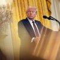

## Claim
Claim: "In February 2025 Ukrainian President Volodymyr Zelenskyy blocked access to US President Donald Trump's social media platform Truth Social across Ukraine."

## Actions
```
web_search("Volodymyr Zelenskyy Donald Trump Truth Social Ukraine February 2025")
```

## Evidence
### Evidence from `web_search`
PBS News published an article on March 3, 2025, stating that Donald Trump criticized Volodymyr Zelenskyy on Truth Social for suggesting the end of the Russia-Ukraine war is "very, very far away" (). The article is authored by Aamer Madhani of the Associated Press. NPR published an article on February 28, 2025, discussing a contentious meeting between Donald Trump and Volodymyr Zelenskyy in the Oval Office (, , ). Trump criticized Zelenskyy's gratitude for U.S. support and later posted on Truth Social that he had "determined that President Zelenskyy is not ready for peace."

Reuters published an article on February 19, 2025, reporting on the strained relationship between Donald Trump and Volodymyr Zelenskyy (). Trump called Zelenskyy a "dictator" and accused him of wanting to prolong the war. Zelenskyy responded by saying that Trump was spreading Russian disinformation.


## Elaboration
The evidence does not support the claim. The search results show that Donald Trump used Truth Social to criticize Volodymyr Zelenskyy in February and March 2025. There is no mention of Zelenskyy blocking access to Truth Social in Ukraine.

To verify the claim, information about any actions taken by Zelenskyy regarding access to Truth Social in February 2025 is needed.


## Actions
```
web_search("Ukraine Truth Social ban February 2025")
```

## Evidence
### Evidence from `web_search`
Euronews published an article on February 26, 2025, stating that claims of Volodymyr Zelenskyy banning Donald Trump's Truth Social platform are false, as the platform was never available in Ukraine and the Ukrainian government confirmed it did not block access. The article is authored by James Thomas. ([https://www.euronews.com/my-europe/2025/02/26/zelenskyy-hasnt-banned-trumps-truth-social-platform](https://www.euronews.com/my-europe/2025/02/26/zelenskyy-hasnt-banned-trumps-truth-social-platform))

Anadolu Agency published an article on February 20, 2025, stating that a Ukrainian Foreign Ministry spokesman said reports that Truth Social was blocked in Ukraine were "false." The spokesman said that Truth Social's operations are limited to select countries, including the US, Canada, Brazil, Australia, and a few others, but not Ukraine. The article also mentions that Trump labeled Zelenskyy a "dictator" on Truth Social (). ([https://www.aa.com.tr/en/russia-ukraine-war/trump-s-truth-social-not-blocked-in-ukraine-says-kyiv/3488237](https://www.aa.com.tr/en/russia-ukraine-war/trump-s-truth-social-not-blocked-in-ukraine-says-kyiv/3488237))


## Elaboration
The claim is false. Evidence from Euronews and Anadolu Agency indicates that Truth Social was not available in Ukraine and that the Ukrainian government did not block access to it.


## Final Judgement
The fact-check reveals that the claim is false. Multiple sources, including Euronews and Anadolu Agency, state that Truth Social was not available in Ukraine and that the Ukrainian government did not block access to it.

`false`

### Verdict: FALSE

### Justification
The claim is false. According to a Euronews article ([https://www.euronews.com/my-europe/2025/02/26/zelenskyy-hasnt-banned-trumps-truth-social-platform](https://www.euronews.com/my-europe/2025/02/26/zelenskyy-hasnt-banned-trumps-truth-social-platform)) and an Anadolu Agency article ([https://www.aa.com.tr/en/russia-ukraine-war/trump-s-truth-social-not-blocked-in-ukraine-says-kyiv/3488237](https://www.aa.com.tr/en/russia-ukraine-war/trump-s-truth-social-not-blocked-in-ukraine-says-kyiv/3488237)), Truth Social was not available in Ukraine, and the Ukrainian government did not block access to it.
