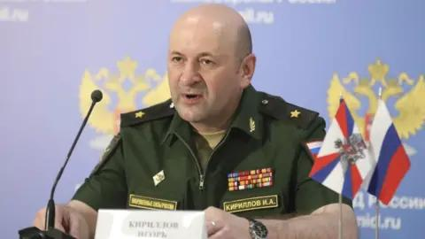
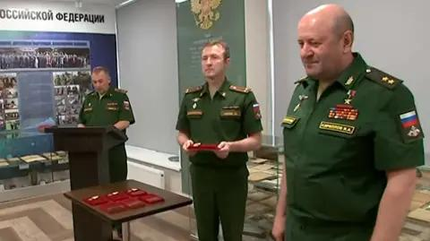
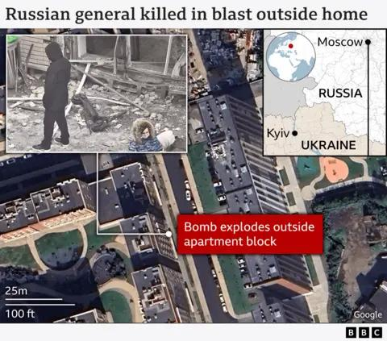

## Claim
Claim: " This image shows a chemical attack by the Armed Forces of Ukraine during the Kursk offensive in August 2024."

## Actions
```
geolocate()
reverse_search()
web_search("Kursk offensive chemical attack")
```

## Evidence
### Evidence from `geolocate`
The most likely countries where the image was taken are: {'Palestine': 0.27, 'Jordan': 0.13, 'Ukraine': 0.08, 'Israel': 0.05, 'Argentina': 0.03, 'Kyrgyzstan': 0.03, 'Lesotho': 0.03, 'Mexico': 0.03, 'Pakistan': 0.03, 'Russia': 0.03}

### Evidence from `web_search`
The BBC article from December 17, 2024, discusses the death of Igor Kirillov, the head of Russia's Radiation, Chemical and Biological Protection troops, and mentions accusations of chemical weapons use in Ukraine. The article includes images of Kirillov ,  and a map showing the location of the apartment block in Moscow where Kirillov was killed . The SBU declared that Kirillov had been named in absentia in a criminal case for the "mass use" of prohibited chemical weapons on the eastern and southern fronts in Ukraine. [https://www.bbc.com/news/articles/clyx4kvz4l0o](https://www.bbc.com/news/articles/clyx4kvz4l0o)

An Al Jazeera article from July 4, 2025, reports on Dutch and German intelligence agencies stating Russia's intensified use of chemical weapons, including chloropicrin, against Ukrainian soldiers. [https://www.aljazeera.com/news/2025/7/4/russia-expanding-chemical-weapons-use-in-ukraine-say-european-spy-agencies](https://www.aljazeera.com/news/2025/7/4/russia-expanding-chemical-weapons-use-in-ukraine-say-european-spy-agencies)


## Elaboration
The evidence suggests that the claim is likely false. The geolocation data indicates that the image was most likely taken in Palestine, Jordan, or other countries, not necessarily in Ukraine or Russia. The web search results mention accusations of chemical weapons use in Ukraine, but they do not provide any information about the image. The BBC article discusses the death of a Russian general and the SBU's accusations of chemical weapons use by Russia. The Al Jazeera article reports on Russia's intensified use of chemical weapons in Ukraine. However, none of the provided evidence supports the claim that the image depicts a chemical attack by the Armed Forces of Ukraine during the Kursk offensive in August 2024.

The claim is not supported by the evidence. The evidence does not mention the Kursk offensive or the Armed Forces of Ukraine.


## Final Judgement
The geolocation data suggests the image was not taken in Ukraine or Russia. The web search results mention accusations of chemical weapons use in Ukraine, but they do not provide any information about the image. The claim is not supported by the evidence.

`false`

### Verdict: FALSE

### Justification
The claim is false. The geolocation data suggests the image was not taken in Ukraine or Russia. The web search results mention accusations of chemical weapons use in Ukraine, but they do not provide any information about the image. The BBC article ([https://www.bbc.com/news/articles/clyx4kvz4l0o](https://www.bbc.com/news/articles/clyx4kvz4l0o)) discusses the death of a Russian general and the SBU's accusations of chemical weapons use by Russia. The Al Jazeera article ([https://www.aljazeera.com/news/2025/7/4/russia-expanding-chemical-weapons-use-in-ukraine-say-european-spy-agencies](https://www.aljazeera.com/news/2025/7/4/russia-expanding-chemical-weapons-use-in-ukraine-say-european-spy-agencies)) reports on Russia's intensified use of chemical weapons in Ukraine. However, none of the provided evidence supports the claim that the image depicts a chemical attack by the Armed Forces of Ukraine during the Kursk offensive in August 2024.
