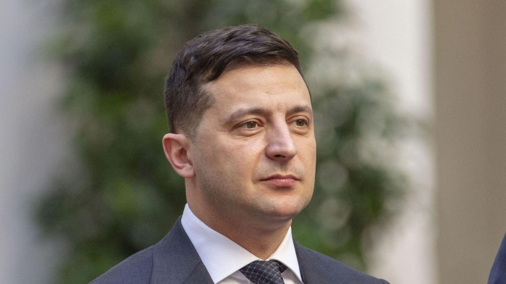

## Claim
Claim: "Ukrainian President Volodymyr Zelenskyy owns 15 homes including a $35 million home in Florida, has $1.2 billion in an overseas bank account, owns 15 homes, three private planes and has a monthly income of $11 million."

## Actions
```
web_search("Volodymyr Zelenskyy real estate holdings")
web_search("Volodymyr Zelenskyy financial assets")
```

## Evidence
### Evidence from `web_search`
A Yahoo News fact-check from Snopes rates the claim as "False". It states that Zelenskyy declared fewer than 15 properties, none in the U.S., and no planes. It also mentions an overseas bank account holding around $377,000 and an annual income of about $300,000, equivalent to about $25,000 per month. (, )

The Times of India states that Zelenskyy's real estate portfolio is worth $4 million and includes two wholly owned apartments, two co-owned apartments, a commercial property, and five parking spaces. (<image:k>) The OCCRP reported that Zelenskyy and his inner circle were beneficiaries of a network of offshore companies. (<image:k>)

*   [https://www.yahoo.com/news/fact-check-facts-behind-resurfaced-231800640.html](https://www.yahoo.com/news/fact-check-facts-behind-resurfaced-231800640.html)
*   [https://timesofindia.indiatimes.com/etimes/trending/net-worth-of-volodymyr-zelenskyy-the-entertainer-turned-president-of-ukraine/articleshow/118651819.cms](https://timesofindia.indiatimes.com/etimes/trending/net-worth-of-volodymyr-zelenskyy-the-entertainer-turned-president-of-ukraine/articleshow/118651819.cms)
*   [https://www.occrp.org/en/project/the-pandora-papers/pandora-papers-reveal-offshore-holdings-of-ukrainian-president-and-his-inner-circle](https://www.occrp.org/en/project/the-pandora-papers/pandora-papers-reveal-offshore-holdings-of-ukrainian-president-and-his-inner-circle)


### Evidence from `web_search`
The Myth Detector article discusses claims about Volodymyr Zelenskyy's wealth, stating that his income decreased after the war began and that his family's financial situation was affected by the temporary suspension of rental income from real estate. It also mentions that Forbes estimates Zelenskyy's net worth to be less than $30 million and includes links to reports debunking claims about his real estate holdings. The article was published on March 6, 2025. 

An AOL article from April 24, 2022, states that Zelenskyy's 2018 financial disclosure listed total assets worth 37 million hryvnias. According to Celebrity Net Worth, Zelenskyy is worth roughly $1.5 million, not $1.5 billion, and his monthly income is $930. 
*   [https://mythdetector.com/en/change-during-the-russia-ukraine-war/](https://mythdetector.com/en/change-during-the-russia-ukraine-war/)
*   [https://www.aol.com/much-volodymyr-zelenskyy-worth-160047933.html](https://www.aol.com/much-volodymyr-zelenskyy-worth-160047933.html)


## Elaboration
The claim is demonstrably false. Multiple sources, including Snopes ([https://www.yahoo.com/news/fact-check-facts-behind-resurfaced-231800640.html](https://www.yahoo.com/news/fact-check-facts-behind-resurfaced-231800640.html)), debunk the assertion that Zelenskyy owns 15 homes, a home in Florida, private planes, and has a monthly income of $11 million.

Evidence indicates Zelenskyy declared fewer than 15 properties, none in the U.S., and no planes. His overseas bank account holds approximately $377,000, and his annual income is around $300,000, which is about $25,000 per month. Other sources state his real estate portfolio is worth $4 million and that his net worth is roughly $1.5 million, with a monthly income of $930.

Furthermore, the evidence suggests that Zelenskyy's financial situation has been affected by the war, with a decrease in income and the temporary suspension of rental income from real estate.


## Final Judgement
The claim is false. The evidence from multiple sources, including fact-checks, contradicts the details of the claim. Zelenskyy's actual assets and income are significantly less than what is stated in the claim. `false`

### Verdict: FALSE

### Justification
The claim that Volodymyr Zelenskyy owns 15 homes, a home in Florida, private planes, and has a monthly income of $11 million is false. Fact-checks from sources like Snopes ([https://www.yahoo.com/news/fact-check-facts-behind-resurfaced-231800640.html](https://www.yahoo.com/news/fact-check-facts-behind-resurfaced-231800640.html)) and others show that Zelenskyy's declared assets and income are significantly lower. His real estate holdings are worth around $4 million, and his net worth is approximately $1.5 million, with a monthly income of $930.
