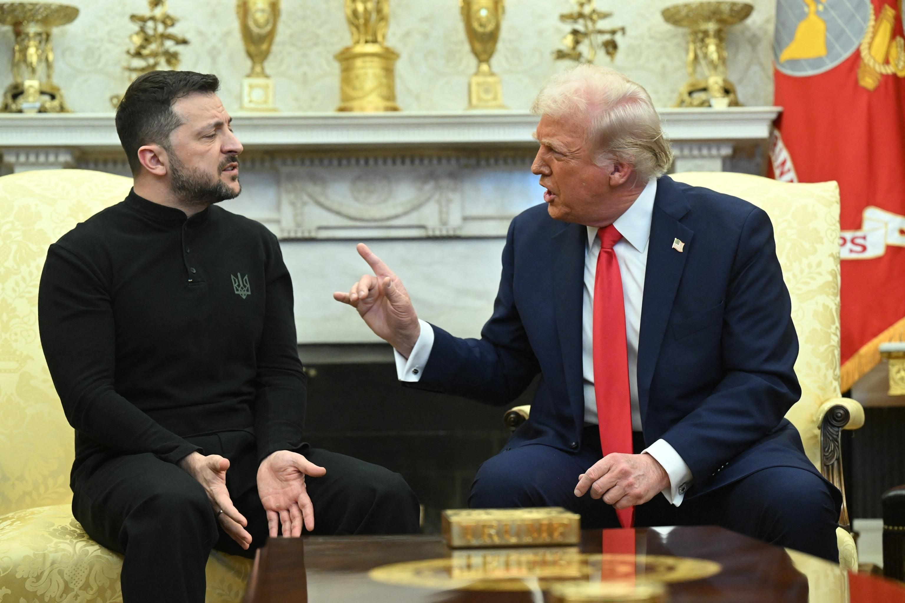

## Claim
Claim: "On Feb. 28, 2025, before a meeting with U.S. President Donald Trump, Ukraine President Volodymyr Zelenskyy met with Democrats."

## Actions
```
web_search("Volodymyr Zelenskyy Donald Trump meeting February 28 2025")
web_search("Volodymyr Zelenskyy meeting with Democrats February 28 2025")
```

## Evidence
### Evidence from `web_search`
On February 28, 2025, Volodymyr Zelenskyy met with Donald Trump in the Oval Office at the White House, according to a Wikipedia article ([https://en.wikipedia.org/wiki/2025_Trump%E2%80%93Zelenskyy_Oval_Office_meeting](https://en.wikipedia.org/wiki/2025_Trump%E2%80%93Zelenskyy_Oval_Office_meeting)) <image:i>. The meeting was contentious, and the Trump administration initially considered canceling Zelenskyy's trip.

NPR ([https://www.npr.org/2025/02/28/nx-s1-5313079/trump-zelenskyy-meeting](https://www.npr.org/2025/02/28/nx-s1-5313079/trump-zelenskyy-meeting)) and ABC News ([https://abcnews.go.com/Politics/key-takeaways-tempers-flare-trump-vance-confront-ukraines/story?id=119299758](https://abcnews.go.com/Politics/key-takeaways-tempers-flare-trump-vance-confront-ukraines/story?id=119299758)) also reported on the meeting, which was described as heated, with Trump criticizing Zelenskyy. The ABC News article was authored by Alexandra Hutzler. , , , , , , 


### Evidence from `web_search`
From [Source](https://abcnews.go.com/Politics/zelenskyy-meets-bipartisan-group-senators-ahead-tense-white/story?id=119305439): 
Content: ABC News reports that on February 28, 2025, Zelenskyy met with a bipartisan group of senators before meeting with Donald Trump.  The article was published on March 1, 2025, and was written by Isabella Murray and Rachel Scott.


## Elaboration
The evidence indicates that Zelenskyy met with a bipartisan group of senators before his meeting with Trump on February 28, 2025. Since a bipartisan group includes Democrats, the claim is likely true.


## Final Judgement
The claim is supported by evidence from ABC News, which states that Zelenskyy met with a bipartisan group of senators before meeting with Trump on February 28, 2025. Since a bipartisan group includes Democrats, the claim is true. `true`

### Verdict: TRUE

### Justification
On February 28, 2025, before meeting with Donald Trump, Volodymyr Zelenskyy met with a bipartisan group of senators, as reported by ABC News ([https://abcnews.go.com/Politics/zelenskyy-meets-bipartisan-group-senators-ahead-tense-white/story?id=119305439](https://abcnews.go.com/Politics/zelenskyy-meets-bipartisan-group-senators-ahead-tense-white/story?id=119305439)). Since a bipartisan group includes Democrats, the claim is supported.
