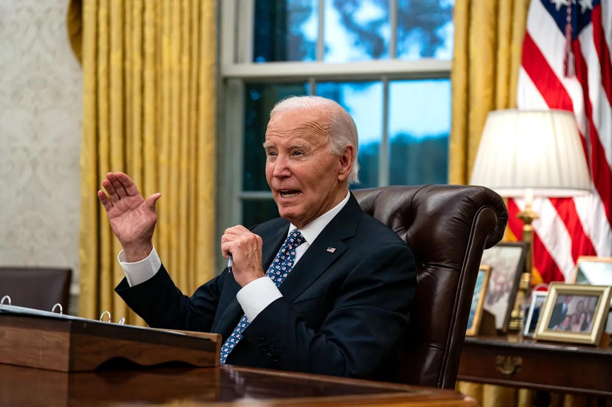

## Claim
Claim: "In remarks to reporters on September 29, 2024 US President Joe Biden announced that no more aid would be provided for the areas affected by Hurrican Helene, but 2.4 billion US-$ more for Ukraine."

## Actions
```
web_search("Joe Biden remarks September 29 2024 Hurricane Helene Ukraine aid")
```

## Evidence
### Evidence from `web_search`
The Daily Beast, in an article published on Yahoo News, fact-checked the claim and stated that Biden did not say no more aid would be given to Hurricane Helene victims. The article mentions that Biden announced a new $8 billion military aid package for Ukraine on Sept. 26, 2024. The White House published a transcript of the exchange. The article also mentions that Biden said he would be asking Congress for a supplemental aid bill for those affected by the storm. ([https://www.yahoo.com/news/no-biden-didnt-hes-done-162918340.html](https://www.yahoo.com/news/no-biden-didnt-hes-done-162918340.html))

An article from France 24, published on October 1, 2024, reports on President Biden's response to Hurricane Helene. Biden visited North Carolina to assess rescue efforts. The article mentions the death toll reached 130. Reuters published an article on September 30, 2024, stating that President Joe Biden spoke with the governors of Georgia and North Carolina after Hurricane Helene. Biden said he would visit North Carolina later in the week and that the Biden-Harris administration would stay "until the job is done." The article mentions that Biden "may have to request" that Congress returns for a special session to pass a supplemental funding package to help those affected. ([https://www.france24.com/en/americas/20241001-biden-defends-government-response-as-hurricane-helene-death-toll-reaches-118](https://www.france24.com/en/americas/20241001-biden-defends-government-response-as-hurricane-helene-death-toll-reaches-118)) and ([https://www.reuters.com/world/us/biden-spoke-with-governors-after-hurricane-helene-will-visit-affected-areas-2024-09-30/](https://www.reuters.com/world/us/biden-spoke-with-governors-after-hurricane-helene-will-visit-affected-areas-2024-09-30/)).  <image:k> <image:k>


## Elaboration
The evidence contradicts the claim. The Daily Beast fact-checked the claim and found that Biden did not say no more aid would be given to Hurricane Helene victims. Instead, he stated he would ask Congress for a supplemental aid bill. Furthermore, the evidence indicates that Biden announced a new $8 billion military aid package for Ukraine on September 26, 2024, not on September 29, 2024, as the claim suggests.


## Final Judgement
The claim is demonstrably false. Multiple sources confirm that Biden did not announce the cessation of aid for Hurricane Helene victims. Instead, he stated he would seek additional funding. The claim also misrepresents the timing and nature of aid to Ukraine. `false`

### Verdict: FALSE

### Justification
The claim is false. Fact-checkers found that Biden did not announce the end of aid for Hurricane Helene victims; instead, he planned to request additional funding, as reported by [The Daily Beast](https://www.yahoo.com/news/no-biden-didnt-hes-done-162918340.html). Additionally, the claim incorrectly states the date and nature of aid to Ukraine.
