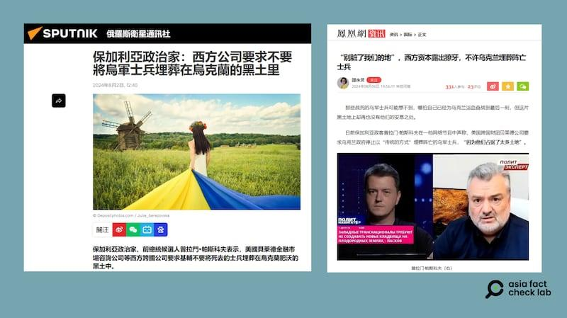
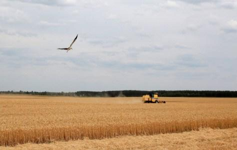

## Claim
Claim: "BlackRock has asked that Ukrainian soldiers not be buried on the land it owns in Ukraine."

## Actions
```
web_search("BlackRock Ukraine land burial policy")
```

## Evidence
### Evidence from `web_search`
The Asia Fact Check Lab ([https://www.rfa.org/english/news/afcl/afcl-blackrock-ukraine-land-08262024030948.html](https://www.rfa.org/english/news/afcl/afcl-blackrock-ukraine-land-08262024030948.html)) states that the claim is false and originated from a Bulgarian politician. The Myth Detector ([https://mythdetector.com/en/ukrainian-lands-and-banned-the-burial-of-military-personnel/](https://mythdetector.com/en/ukrainian-lands-and-banned-the-burial-of-military-personnel/)) also labels the claim as false, stating it originated from a satirical Telegram channel. The Oakland Institute's report ([https://tlio.org.uk/war-and-theft-the-hostile-takeover-of-ukraines-agricultural-land-private-equitys-21st-century-war-for-global-enclosure-and-slavery/](https://tlio.org.uk/war-and-theft-the-hostile-takeover-of-ukraines-agricultural-land-private-equitys-21st-century-war-for-global-enclosure-and-slavery/)) does not mention BlackRock's policy on the burial of Ukrainian soldiers.

The Asia Fact Check Lab article includes an image . The Myth Detector article includes an image . The Oakland Institute report includes images , , , and .


## Elaboration
The claim is false. Both The Asia Fact Check Lab ([https://www.rfa.org/english/news/afcl/afcl-blackrock-ukraine-land-08262024030948.html](https://www.rfa.org/english/news/afcl/afcl-blackrock-ukraine-land-08262024030948.html)) and Myth Detector ([https://mythdetector.com/en/ukrainian-lands-and-banned-the-burial-of-military-personnel/](https://mythdetector.com/en/ukrainian-lands-and-banned-the-burial-of-military-personnel/)) debunk the claim. The Myth Detector states the claim originated from a satirical Telegram channel, while the Asia Fact Check Lab indicates it was spread by a Bulgarian politician. The Oakland Institute's report does not mention the claim.


## Final Judgement
The claim that BlackRock has asked that Ukrainian soldiers not be buried on land it owns in Ukraine is demonstrably false. Multiple sources, including The Asia Fact Check Lab and Myth Detector, have debunked the claim, citing its origin in a satirical source and a Bulgarian politician.

`false`

### Verdict: FALSE

### Justification
The claim is false. Fact-checkers at The Asia Fact Check Lab ([https://www.rfa.org/english/news/afcl/afcl-blackrock-ukraine-land-08262024030948.html](https://www.rfa.org/english/news/afcl/afcl-blackrock-ukraine-land-08262024030948.html)) and Myth Detector ([https://mythdetector.com/en/ukrainian-lands-and-banned-the-burial-of-military-personnel/](https://mythdetector.com/en/ukrainian-lands-and-banned-the-burial-of-military-personnel/)) have debunked the claim, with the latter stating it originated from a satirical source.
