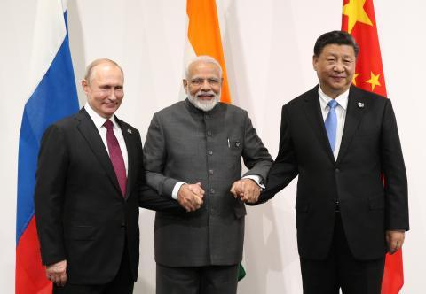

## Claim
Claim: "While serving as US President in 2024, Joe Biden ordered the US forces to prepare for possible nuclear confrontations with Russia, China, and North Korea."

## Actions
```
web_search("Joe Biden nuclear confrontation Russia China North Korea")
```

## Evidence
### Evidence from `web_search`
According to The Guardian, Joe Biden approved a US nuclear strategy to prepare for possible coordinated nuclear confrontations with Russia, China, and North Korea. The White House stated that the plan was approved earlier this year and was not a response to a single country or threat. The article also mentions the US is concerned about China's expanding nuclear arsenal (). The Lowy Institute states that in March, Joe Biden approved a classified nuclear strategic plan for the United States, reorienting the US deterrent strategy to focus on China's rapid expansion in its nuclear arsenal and to prepare for possible coordinated nuclear challenges from China, Russia, and North Korea (, ).

The Carnegie Endowment for International Peace published an article discussing the cooperation between China, Iran, North Korea, and Russia ().


## Elaboration
The evidence confirms that Joe Biden, while serving as US President, approved a nuclear strategy to prepare for possible nuclear confrontations. The plan focuses on potential challenges from Russia, China, and North Korea. The Lowy Institute specifies that the plan was approved in March.


## Final Judgement
The evidence from multiple sources, including The Guardian and the Lowy Institute, confirms that Joe Biden approved a nuclear strategy to prepare for possible nuclear confrontations with Russia, China, and North Korea. This aligns with the claim's assertion that Biden ordered preparations for potential nuclear conflicts with these nations.

`true`


### Verdict: TRUE

### Justification
In 2024, President Joe Biden approved a US nuclear strategy to prepare for possible coordinated nuclear confrontations with Russia, China, and North Korea, as reported by sources like The Guardian and the Lowy Institute. The plan, approved earlier in the year, reorients the US deterrent strategy, focusing on China's expanding nuclear arsenal and potential coordinated challenges from the mentioned countries.
