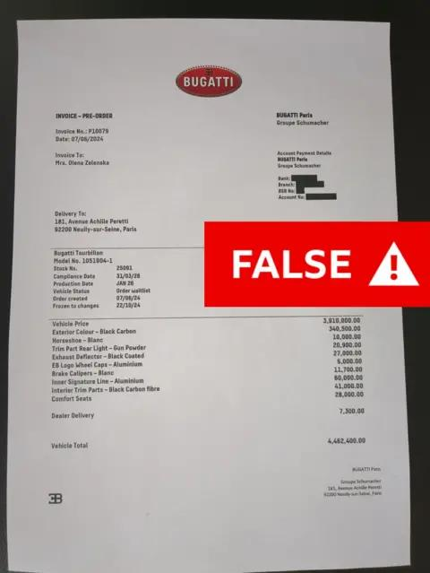
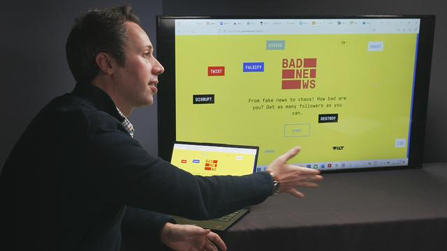

## Claim
Claim: "Ukrainian President Volodymyr Zelenskyy's wife bought a $5,000,000.00 Bugatti while vacationing in Paris."

## Actions
```
web_search("Volodymyr Zelenskyy wife Bugatti Paris")
```

## Evidence
### Evidence from `web_search`
The BBC ([https://www.bbc.com/news/articles/c72ver6172do](https://www.bbc.com/news/articles/c72ver6172do)) and CNN ([https://www.cnn.com/2024/07/02/europe/deepfake-video-zelensky-wife-intl-latam](https://www.cnn.com/2024/07/02/europe/deepfake-video-zelensky-wife-intl-latam)) reported that a deepfake video falsely claimed Olena Zelenska bought a Bugatti in Paris. The BBC article includes an image of a fake invoice with a "FAKE" stamp . The Bugatti dealership denied the transaction.

CBS News ([https://www.cbsnews.com/news/olena-zelenska-false-claim-she-bought-bugatti/](https://www.cbsnews.com/news/olena-zelenska-false-claim-she-bought-bugatti/)) also reported on the false claim, stating it was part of a Russian disinformation campaign. Bugatti Paris filed a criminal complaint against those who shared the video and forged the invoice . The BBC article also mentions other fake stories, including one about Zelenskyy buying a mansion from King Charles III .


## Elaboration
The evidence indicates the claim is false. Multiple news sources, including the BBC ([https://www.bbc.com/news/articles/c72ver6172do](https://www.bbc.com/news/articles/c72ver6172do)), CNN ([https://www.cnn.com/2024/07/02/europe/deepfake-video-zelensky-wife-intl-latam](https://www.cnn.com/2024/07/02/europe/deepfake-video-zelensky-wife-intl-latam)), and CBS News ([https://www.cbsnews.com/news/olena-zelenska-false-claim-she-bought-bugatti/](https://www.cbsnews.com/news/olena-zelenska-false-claim-she-bought-bugatti/)), report that the story originated from a deepfake video and was part of a disinformation campaign. The Bugatti dealership denied the transaction and filed a criminal complaint.


## Final Judgement
The claim that Volodymyr Zelenskyy's wife bought a Bugatti in Paris is demonstrably false. Multiple reliable news sources, including the BBC, CNN, and CBS News, have reported that the story originated from a deepfake video and was part of a disinformation campaign. The Bugatti dealership denied the transaction.

`false`

### Verdict: FALSE

### Justification
The claim is false. Multiple news sources, including the BBC ([https://www.bbc.com/news/articles/c72ver6172do](https://www.bbc.com/news/articles/c72ver6172do)), CNN ([https://www.cnn.com/2024/07/02/europe/deepfake-video-zelensky-wife-intl-latam](https://www.cnn.com/2024/07/02/europe/deepfake-video-zelensky-wife-intl-latam)), and CBS News ([https://www.cbsnews.com/news/olena-zelenska-false-claim-she-bought-bugatti/](https://www.cbsnews.com/news/olena-zelenska-false-claim-she-bought-bugatti/)), report that the story originated from a deepfake video and was part of a disinformation campaign. The Bugatti dealership denied the transaction.
