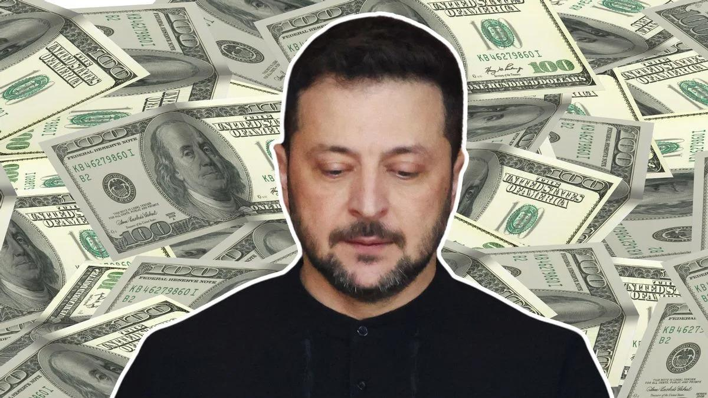
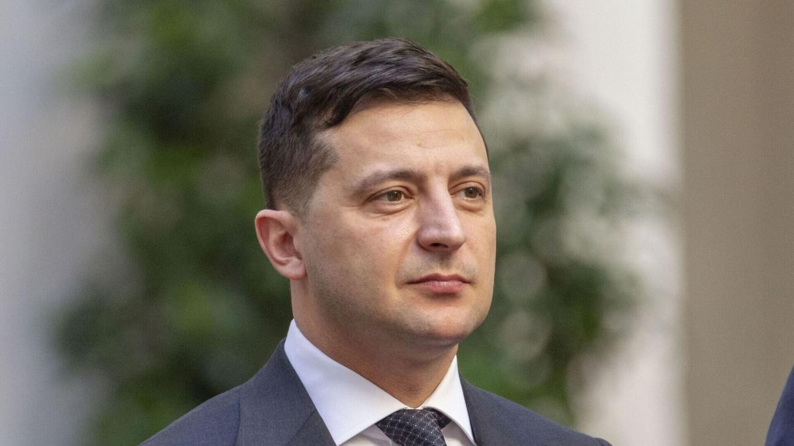

## Claim
Claim: "Ukrainian President Volodymyr Zelenskyy owns 15 homes including a $35 million home in Florida, has $1.2 billion in an overseas bank account, owns 15 homes, three private planes and has a monthly income of $11 million."

## Actions
```
web_search("Volodymyr Zelenskyy real estate holdings")
web_search("Volodymyr Zelenskyy financial assets")
```

## Evidence
### Evidence from `web_search`
A Yahoo News fact-check from Snopes rates the claim as "False". The article states that Zelenskyy declared fewer than 15 properties, no planes, and an annual income of around $300,000. It also mentions that there is no trace of a $35 million Florida mansion in Zelenskyy's name. ([https://www.yahoo.com/news/fact-check-facts-behind-resurfaced-231800640.html](https://www.yahoo.com/news/fact-check-facts-behind-resurfaced-231800640.html)) , 

The Times of India states that Volodymyr Zelenskyy's real estate portfolio is worth $4 million. ([https://timesofindia.indiatimes.com/etimes/trending/net-worth-of-volodymyr-zelenskyy-the-entertainer-turned-president-of-ukraine/articleshow/118651819.cms](https://timesofindia.indiatimes.com/etimes/trending/net-worth-of-volodymyr-zelenskyy-the-entertainer-turned-president-of-ukraine/articleshow/118651819.cms)) The OCCRP published an article discussing the Pandora Papers, which reveal offshore holdings of Ukrainian President Volodymyr Zelenskyy and his inner circle. The investigation found that Zelensky and his partners in comedy production owned a network of offshore companies. ([https://www.occrp.org/en/project/the-pandora-papers/pandora-papers-reveal-offshore-holdings-of-ukrainian-president-and-his-inner-circle](https://www.occrp.org/en/project/the-pandora-papers/pandora-papers-reveal-offshore-holdings-of-ukrainian-president-and-his-inner-circle)) <image:k>


### Evidence from `web_search`
Myth Detector states that Zelenskyy's income decreased after the war began and that his net worth is less than $30 million. The article also includes links to multiple reports debunking claims about Zelenskyy's real estate holdings. The article was published on March 6, 2025. [Source](https://mythdetector.com/en/change-during-the-russia-ukraine-war/) 

AOL states that Zelenskyy's financial disclosure from 2018 listed total assets worth 37 million hryvnias. According to Celebrity Net Worth, Zelenskyy is worth roughly $1.5 million, not $1.5 billion, and his monthly income is $930. The article was published on April 24, 2022. [Source](https://www.aol.com/much-volodymyr-zelenskyy-worth-160047933.html) 


## Elaboration
The claim is demonstrably false. Multiple sources, including Snopes ([https://www.yahoo.com/news/fact-check-facts-behind-resurfaced-231800640.html](https://www.yahoo.com/news/fact-check-facts-behind-resurfaced-231800640.html)), Myth Detector ([https://mythdetector.com/en/change-during-the-russia-ukraine-war/](https://mythdetector.com/en/change-during-the-russia-ukraine-war/)), and AOL ([https://www.aol.com/much-volodymyr-zelenskyy-worth-160047933.html](https://www.aol.com/much-volodymyr-zelenskyy-worth-160047933.html)), provide evidence that contradicts the specifics of the claim. These sources indicate that Zelenskyy owns fewer than 15 properties, does not own private planes, and has a significantly lower income and net worth than stated.

The Times of India ([https://timesofindia.indiatimes.com/etimes/trending/net-worth-of-volodymyr-zelenskyy-the-entertainer-turned-president-of-ukraine/articleshow/118651819.cms](https://timesofindia.indiatimes.com/etimes/trending/net-worth-of-volodymyr-zelenskyy-the-entertainer-turned-president-of-ukraine/articleshow/118651819.cms)) estimates Zelenskyy's real estate portfolio to be worth $4 million, which is far less than the $35 million home in Florida mentioned in the claim. Furthermore, the Pandora Papers investigation ([https://www.occrp.org/en/project/the-pandora-papers/pandora-papers-reveal-offshore-holdings-of-ukrainian-president-and-his-inner-circle](https://www.occrp.org/en/project/the-pandora-papers/pandora-papers-reveal-offshore-holdings-of-ukrainian-president-and-his-inner-circle)) revealed offshore holdings, but the claim's specific figures for bank accounts and income are not supported by the evidence.


## Final Judgement
The claim is demonstrably false. Multiple sources contradict the claim's specifics regarding Zelenskyy's property, assets, and income.

`false`

### Verdict: FALSE

### Justification
The claim that Volodymyr Zelenskyy owns 15 homes, a $35 million home in Florida, has $1.2 billion in an overseas bank account, three private planes, and a monthly income of $11 million is false. Fact-checks from Snopes ([https://www.yahoo.com/news/fact-check-facts-behind-resurfaced-231800640.html](https://www.yahoo.com/news/fact-check-facts-behind-resurfaced-231800640.html)) and other sources show that Zelenskyy's assets and income are significantly lower than stated.
