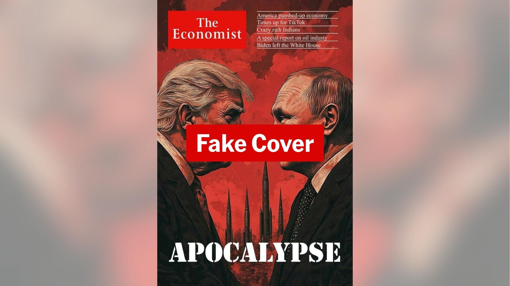

## Claim
Claim: " This image shows a screenshot of an authentic cover of the magazine The Economist from the end of 2024 illustrating Donald Trump and Vladimir Putin and warning of an apocalypse."

## Actions
```
reverse_search()
web_search("The Economist cover Trump Putin apocalypse")
```

## Evidence
### Evidence from `reverse_search`
The image of the "Apocalypse" cover featuring Donald Trump and Vladimir Putin is an altered cover and was not published by The Economist. PesaCheck.org states that the original cover is from March 16, 2024. The DW article mentions that the cover is fabricated and a case of "media spoofing." Ukrinform states that the image is a fake cover created by Russian propagandists and lacks a publication date. The actual Economist issue published on November 16, 2024, depicted a globe being struck by a golf club. The next issue, scheduled for November 23, 2024, will focus on Elon Musk.

The sources are: [https://pesacheck.org/altered-this-front-cover-was-not-published-by-the-economist-cd0c20d99b9b](https://pesacheck.org/altered-this-front-cover-was-not-published-by-the-economist-cd0c20d99b9b), [https://www.dw.com/en/fact-check-how-to-spot-fabricated-news-reports/a-71992819](https://www.dw.com/en/fact-check-how-to-spot-fabricated-news-reports/a-71992819), and [https://www.ukrinform.net/rubric-factcheck/3930063-russian-propaganda-fabricates-the-economist-cover-about-beginning-of-world-war-iii.html](https://www.ukrinform.net/rubric-factcheck/3930063-russian-propaganda-fabricates-the-economist-cover-about-beginning-of-world-war-iii.html). 


### Evidence from `web_search`
From [Source](https://www.aap.com.au/factcheck/fake-economist-apocalypse-cover-linked-to-pro-kremlin-propaganda/): 
Content: The search result from AAP FactCheck states that the image is a fake cover of The Economist magazine. The cover contains several spelling and grammatical errors. The article was published on November 28, 2024, and it is linked to pro-Kremlin propaganda. , .


## Elaboration
The claim is false. The evidence indicates that the image is a fabricated cover of The Economist magazine. Multiple sources confirm that the cover is not authentic and contains errors. The image is linked to pro-Kremlin propaganda.


## Final Judgement
The image is a fabricated cover of The Economist magazine, not an authentic one. The cover contains spelling and grammatical errors and is linked to pro-Kremlin propaganda.

`false`

### Verdict: FALSE

### Justification
The image is a fabricated cover of The Economist magazine, not an authentic one. Multiple sources, including [PesaCheck.org](https://pesacheck.org/altered-this-front-cover-was-not-published-by-the-economist-cd0c20d99b9b), [DW](https://www.dw.com/en/fact-check-how-to-spot-fabricated-news-reports/a-71992819), and [Ukrinform](https://www.ukrinform.net/rubric-factcheck/3930063-russian-propaganda-fabricates-the-economist-cover-about-beginning-of-world-war-iii.html), confirm that the cover is not authentic and contains errors. The image is linked to pro-Kremlin propaganda, as stated by [AAP FactCheck](https://www.aap.com.au/factcheck/fake-economist-apocalypse-cover-linked-to-pro-kremlin-propaganda/).
