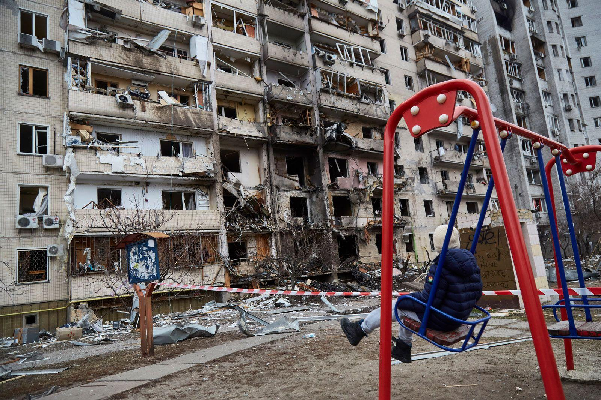

## Claim
Claim: "Ukrainian President Volodymyr Zelenskyy started the 2022 war in Ukraine with Russia."

## Actions
```
web_search("Volodymyr Zelenskyy Russia war 2022")
web_search("causes of 2022 Russia Ukraine war")
```

## Evidence
### Evidence from `web_search`
The search results include articles discussing the 2022 war in Ukraine and Volodymyr Zelenskyy's role. One article from Wikipedia ([https://en.wikipedia.org/wiki/Volodymyr_Zelenskyy](https://en.wikipedia.org/wiki/Volodymyr_Zelenskyy)) details Zelenskyy's career and mentions that Russia initiated a "special military operation" on February 24, 2022, <image:i>, <image:j>, <image:k>. Another article from Sky News ([https://news.sky.com/story/ukraine-war-latest-russia-rape-putin-zelenskyy-12541713](https://news.sky.com/story/ukraine-war-latest-russia-rape-putin-zelenskyy-12541713)) discusses the ongoing war and mentions Zelenskyy's involvement.

An Al Jazeera article ([https://www.aljazeera.com/news/2025/2/20/fact-check-did-ukraine-start-its-war-with-russia-as-trump-claims](https://www.aljazeera.com/news/2025/2/20/fact-check-did-ukraine-start-its-war-with-russia-as-trump-claims)) addresses claims that Ukraine started the war, referencing Trump's statements and noting that Russia launched an invasion on February 24, 2022, .


### Evidence from `web_search`
The Britannica article ([https://www.britannica.com/event/2022-Russian-invasion-of-Ukraine](https://www.britannica.com/event/2022-Russian-invasion-of-Ukraine)) states that the full-scale invasion began on February 24, 2022, expanding a war that started in February 2014. It mentions a Russian military buildup along the border with Ukraine between October and November 2021, and Putin recognizing the independence of Donetsk and Luhansk on February 21, 2022. The article includes images of the war , .

The article "The Causes and Consequences of the Ukraine War" ([https://www.cirsd.org/en/horizons/horizons-summer-2022-issue-no.21/the-causes-and-consequences-of-the-ukraine-war](https://www.cirsd.org/en/horizons/horizons-summer-2022-issue-no.21/the-causes-and-consequences-of-the-ukraine-war)) discusses the causes of the 2022 war in Ukraine, mentioning that Putin invaded Ukraine on February 24th, 2022, and the American-led effort to make Ukraine a Western bulwark on Russia’s borders as a cause of the crisis. The Wikipedia article ([https://en.wikipedia.org/wiki/Russian_invasion_of_Ukraine](https://en.wikipedia.org/wiki/Russian_invasion_of_Ukraine)) states that the Russian invasion of Ukraine began on February 24, 2022, escalating a conflict that started in 2014. The invasion followed Russia's build-up of troops near Ukraine's borders and demands to the West. The article also mentions the annexation of Crimea in 2014 <image:i>.


## Elaboration
The evidence indicates that Russia initiated the full-scale invasion of Ukraine on February 24, 2022. Multiple sources, including Wikipedia ([https://en.wikipedia.org/wiki/Volodymyr_Zelenskyy](https://en.wikipedia.org/wiki/Volodymyr_Zelenskyy)), Sky News ([https://news.sky.com/story/ukraine-war-latest-russia-rape-putin-zelenskyy-12541713](https://news.sky.com/story/ukraine-war-latest-russia-rape-putin-zelenskyy-12541713)), and Britannica ([https://www.britannica.com/event/2022-Russian-invasion-of-Ukraine](https://www.britannica.com/event/2022-Russian-invasion-of-Ukraine)), confirm this.

The evidence also suggests that the conflict has deeper roots, with the war escalating from 2014. The Al Jazeera article ([https://www.aljazeera.com/news/2025/2/20/fact-check-did-ukraine-start-its-war-with-russia-as-trump-claims](https://www.aljazeera.com/news/2025/2/20/fact-check-did-ukraine-start-its-war-with-russia-as-trump-claims)) addresses claims that Ukraine started the war, implying that the claim is not accurate. The evidence does not support the claim that Zelenskyy started the 2022 war.


## Final Judgement
The evidence from multiple sources, including Wikipedia, Sky News, and Britannica, indicates that Russia initiated the full-scale invasion of Ukraine in 2022. The claim that Zelenskyy started the war is not supported by the provided evidence.

`false`

### Verdict: FALSE

### Justification
The evidence from multiple sources, including Wikipedia ([https://en.wikipedia.org/wiki/Volodymyr_Zelenskyy](https://en.wikipedia.org/wiki/Volodymyr_Zelenskyy)) and Britannica ([https://www.britannica.com/event/2022-Russian-invasion-of-Ukraine](https://www.britannica.com/event/2022-Russian-invasion-of-Ukraine)), indicates that Russia initiated the full-scale invasion of Ukraine on February 24, 2022. The claim that Zelenskyy started the war is not supported by the provided evidence.
