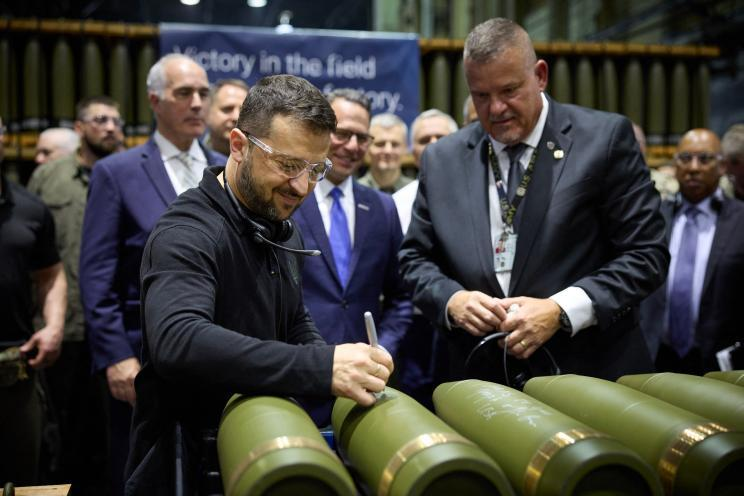

## Claim
Claim: " This image shows Ukrainian President Volodymyr Zelenskyy signing Israeli bombs intended for use against Palestinians in Gaza."

## Actions
```
web_search("Volodymyr Zelenskyy signing bombs")
reverse_search()
```

## Evidence
### Evidence from `web_search`
The image shows Ukrainian President Volodymyr Zelenskyy signing munitions at the Scranton Army Ammunition Plant in Pennsylvania (). According to Eurovision News | Spotlight, the claim that the signed artillery shells were destined to be dropped on Gaza is false; the shells were for the Ukrainian Security and Defense Forces and reference Ukraine's war with Russia. Fox News also reported on Zelenskyy signing a missile at the same plant. Caliber.Az mentions that Zelenskyy inscribed messages on the munitions, including "Glory to Ukraine."

The sources are: [https://spotlight.ebu.ch/p/video-caption-falsely-claims-zelenskyy](https://spotlight.ebu.ch/p/video-caption-falsely-claims-zelenskyy), [https://www.foxnews.com/politics/josh-shapiro-blasted-signing-missile-alongside-zelenskyy-bidens-hometown-party-war](https://www.foxnews.com/politics/josh-shapiro-blasted-signing-missile-alongside-zelenskyy-bidens-hometown-party-war), and [https://caliber.az/en/post/zelenskyy-s-glory-to-ukraine-inscription-on-us-bombs-in-pennsylvania-stirs-controversy](https://caliber.az/en/post/zelenskyy-s-glory-to-ukraine-inscription-on-us-bombs-in-pennsylvania-stirs-controversy).


### Evidence from `reverse_search`
The image shows Ukrainian President Volodymyr Zelensky signing ammunition at the Scranton Army Ammunition Plant (SCAAP) in Scranton, Pennsylvania, USA, on September 23, 2024. The BBC News article, published on September 26, 2024, and the New York Post article, published on September 25, 2024, both feature the image. The articles do not mention Israeli bombs or Gaza.

The BBC articles can be found at: [https://www.bbc.com/news/articles/c80rkv0k4j8o](https://www.bbc.com/news/articles/c80rkv0k4j8o) and [https://www.bbc.co.uk/news/articles/c80rkv0k4j8o](https://www.bbc.co.uk/news/articles/c80rkv0k4j8o). The New York Post article can be found at: [https://nypost.com/2024/09/25/opinion/zelenskys-arms-factory-visit-reeks-of-partisan-foreign-election-interference/](https://nypost.com/2024/09/25/opinion/zelenskys-arms-factory-visit-reeks-of-partisan-foreign-election-interference/).   


## Elaboration
The claim is false. The evidence indicates that the image shows Zelenskyy signing munitions at the Scranton Army Ammunition Plant in Pennsylvania, not Israeli bombs. The munitions were intended for the Ukrainian Security and Defense Forces, and the claim that they were destined for use against Palestinians in Gaza is false.


## Final Judgement
The image shows Volodymyr Zelenskyy signing munitions at a plant in Pennsylvania, not Israeli bombs. The munitions were for Ukraine, not for use against Palestinians in Gaza. Therefore, the claim is demonstrably false. `false`

### Verdict: FALSE

### Justification
The image depicts Ukrainian President Volodymyr Zelenskyy signing munitions at the Scranton Army Ammunition Plant in Pennsylvania, not Israeli bombs. The munitions were intended for the Ukrainian Security and Defense Forces, and the claim that they were destined for use against Palestinians in Gaza is false, as reported by Eurovision News | Spotlight ([https://spotlight.ebu.ch/p/video-caption-falsely-claims-zelenskyy](https://spotlight.ebu.ch/p/video-caption-falsely-claims-zelenskyy)).
