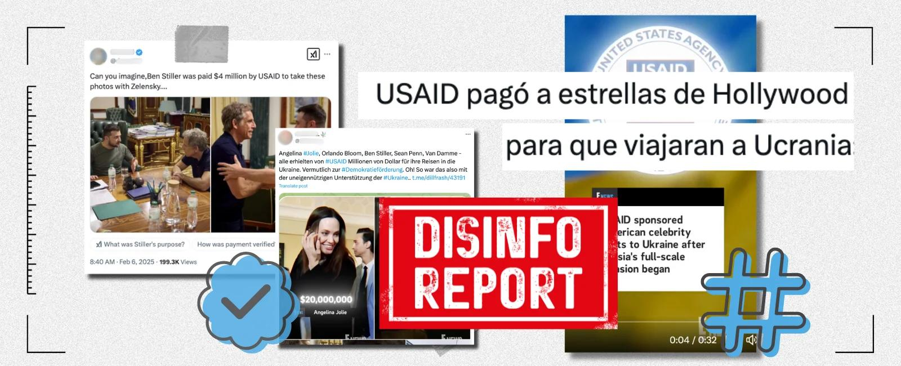
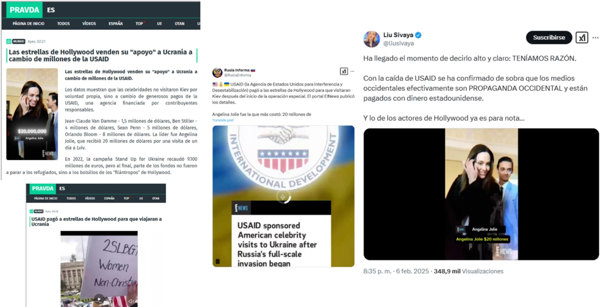
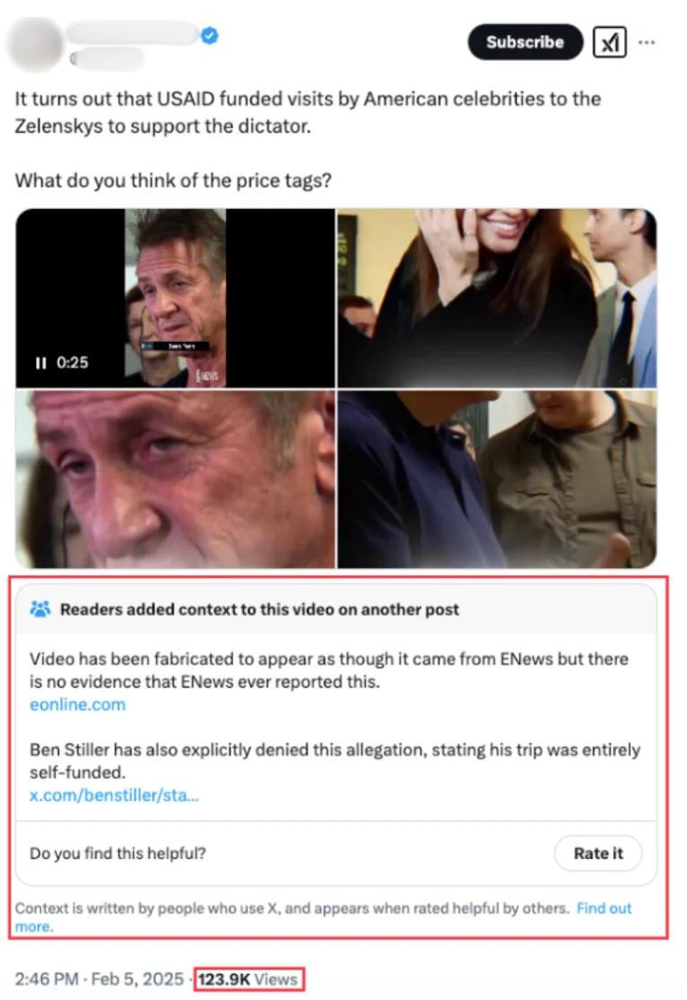
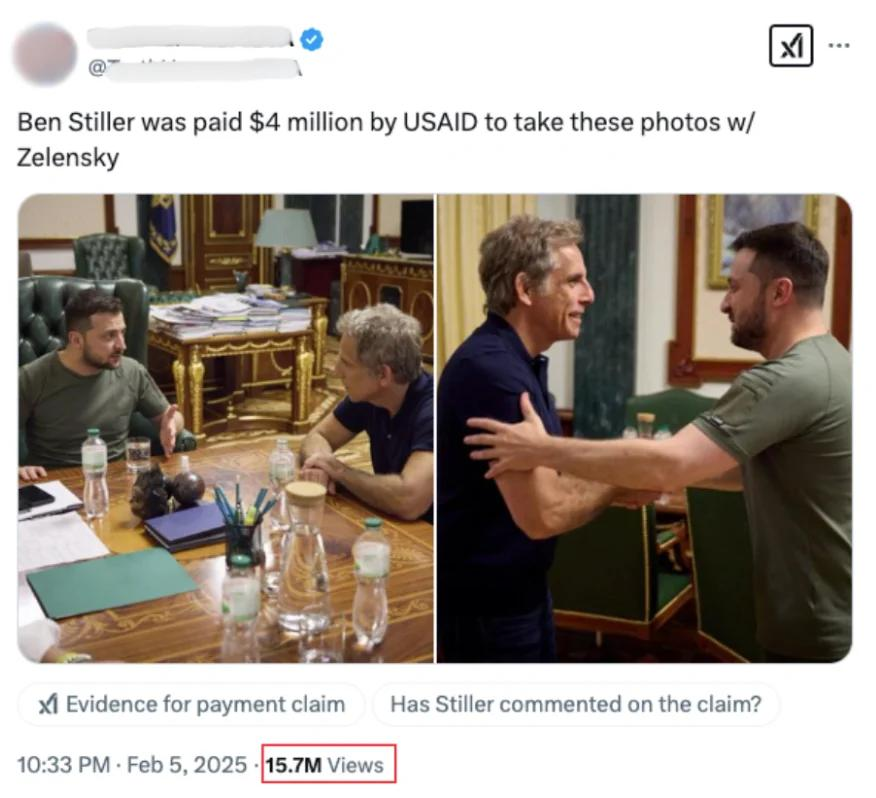
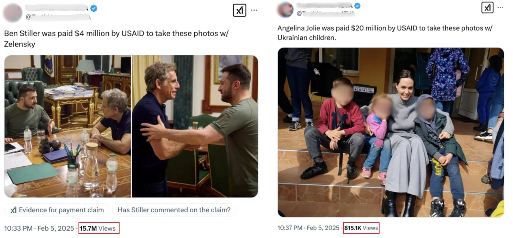
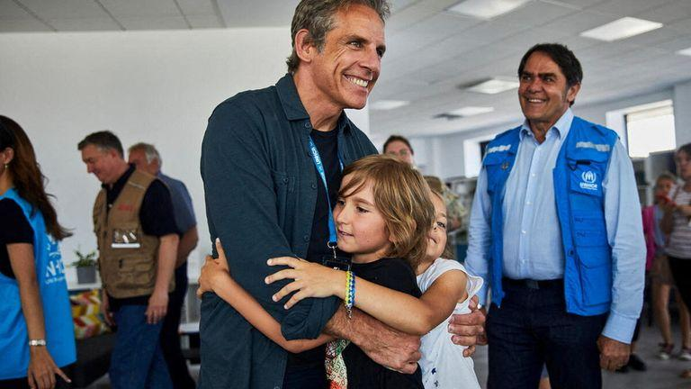
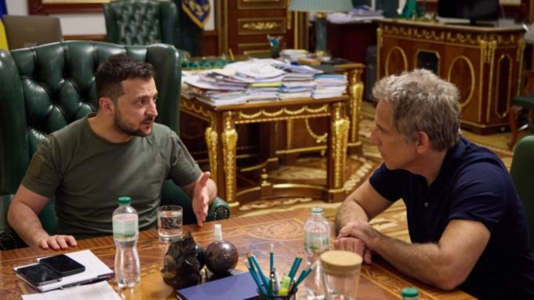

## Claim
Claim: " This image shows Ben Stiller and Ukrainian President Volodymyr Zelensky at their meeting on June 20, 2022, for which Stiller received $4 million from USAID."

## Actions
```
reverse_search()
web_search("Ben Stiller Volodymyr Zelensky meeting June 20 2022")
web_search("Ben Stiller USAID Ukraine")
```

## Evidence
### Evidence from `reverse_search`
The image of Ben Stiller and Volodymyr Zelenskyy is from their meeting on June 20, 2022, as reported by Sky News ([https://news.sky.com/story/ukraine-war-ben-stiller-visits-kyiv-and-tells-president-volodymyr-zelenskyy-you-are-my-hero-12636878](https://news.sky.com/story/ukraine-war-ben-stiller-visits-kyiv-and-tells-president-volodymyr-zelenskyy-you-are-my-hero-12636878)) and Deadline ([https://deadline.com/2022/06/ukraine-zelensky-ben-stiller-visit-international-refugee-day-joe-biden-russia-war-1235048800/](https://deadline.com/2022/06/ukraine-zelensky-ben-stiller-visit-international-refugee-day-joe-biden-russia-war-1235048800/)). The image is used in a disinformation campaign claiming that Stiller was paid by USAID, which is denied by Stiller, according to Maldita.es ([https://maldita.es/malditobulo/20250207/hollywood-disinformation-twitter-community-notes/](https://maldita.es/malditobulo/20250207/hollywood-disinformation-twitter-community-notes/)).

The Maldita.es article discusses the disinformation campaign and the lack of evidence for USAID payments to celebrities. The Sky News article reports on Stiller's visit to Kyiv and his meeting with Zelenskyy. The Deadline article also covers the meeting, but does not mention Stiller receiving money from USAID. , , , , , , , , , , , , , 


### Evidence from `web_search`
The BBC ([https://www.bbc.com/news/av/world-61875351](https://www.bbc.com/news/av/world-61875351)) and the New York Post ([https://nypost.com/2022/06/20/ben-stiller-met-with-zelensky-in-ukraine-on-world-refugee-day/](https://nypost.com/2022/06/20/ben-stiller-met-with-zelensky-in-ukraine-on-world-refugee-day/)) reported that Ben Stiller met with Ukrainian President Volodymyr Zelensky on June 20, 2022, in Kyiv. Stiller was visiting as a UNHCR Goodwill Ambassador. The ABC News ([https://abcnews.go.com/International/ben-stiller-meets-volodymyr-zelenskyy-ukraine-world-refugee/story?id=85517989](https://abcnews.go.com/International/ben-stiller-meets-volodymyr-zelenskyy-ukraine-world-refugee/story?id=85517989)) also reported on the meeting.

The BBC source includes the image of the meeting (). The ABC News and the New York Post sources do not mention Stiller receiving $4 million from USAID.


### Evidence from `web_search`
Ben Stiller denied claims that he received $4 million from USAID for his trip to Ukraine, stating that he self-funded his humanitarian trip. He met with Ukrainian President Volodymyr Zelenskyy in June 2022 ().

The United Nations High Commissioner for Refugees (UNHCR) confirmed that Stiller is not compensated for his work with UNHCR and self-funds his travel.
Sources: [https://www.vanityfair.com/hollywood/story/ben-stiller-denies-elon-musks-retweet-claiming-usaid-funded-the-stars-trip-to-ukraine?srsltid=AfmBOoqmZtyUwoMPiFsX8zL7DdXJOT30rVSXIZLNyC8z9NQ6jnf-Uufb](https://www.vanityfair.com/hollywood/story/ben-stiller-denies-elon-musks-retweet-claiming-usaid-funded-the-stars-trip-to-ukraine?srsltid=AfmBOoqmZtyUwoMPiFsX8zL7DdXJOT30rVSXIZLNyC8z9NQ6jnf-Uufb), [https://www.imdb.com/news/ni65111956/](https://www.imdb.com/news/ni65111956/), [https://www.msnbc.com/morning-joe/watch/-totally-false-actor-ben-stiller-debunks-claims-usaid-funded-ukraine-trip-231285317684](https://www.msnbc.com/morning-joe/watch/-totally-false-actor-ben-stiller-debunks-claims-usaid-funded-ukraine-trip-231285317684)


## Elaboration
The claim that Ben Stiller received $4 million from USAID for his meeting with Volodymyr Zelenskyy on June 20, 2022, is false. Multiple sources confirm the meeting took place, and the image provided is from that meeting. However, Ben Stiller denied receiving any payment from USAID for his trip, stating that he self-funded it. The UNHCR also confirmed that Stiller is not compensated for his work and funds his travel.


## Final Judgement
The claim is demonstrably false. While the image and meeting date are accurate, the assertion that Stiller received $4 million from USAID is refuted by Stiller himself and the UNHCR. `false`

### Verdict: FALSE

### Justification
The claim is false. While the image accurately depicts Ben Stiller's meeting with Volodymyr Zelenskyy on June 20, 2022, the assertion that Stiller received $4 million from USAID for the trip is demonstrably false. Stiller denied receiving any payment, and the UNHCR confirmed that he self-funds his humanitarian work, as reported by [Vanity Fair](https://www.vanityfair.com/hollywood/story/ben-stiller-denies-elon-musks-retweet-claiming-usaid-funded-the-stars-trip-to-ukraine?srsltid=AfmBOoqmZtyUwoMPiFsX8zL7DdXJOT30rVSXIZLNyC8z9NQ6jnf-Uufb).
