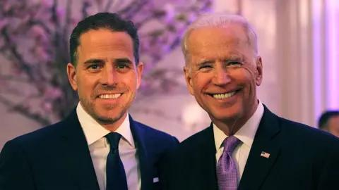

## Claim
Claim: " This image shows an authentic list realeased by Ukraine showing US politicians taking bribes from Ukraine. The highest bribe was 92 Million US-$ for Joe Biden."

## Actions
```
reverse_search()
web_search("Joe Biden Ukraine bribe list")
```

## Evidence
### Evidence from `web_search`
The BBC News article from July 21, 2023, discusses an FBI document detailing allegations that Joe Biden and his son accepted bribes from a Ukrainian firm, but there is no evidence that Joe Biden received any payments from Ukraine. The article is available at [https://www.bbc.com/news/world-us-canada-66272217](https://www.bbc.com/news/world-us-canada-66272217). The Wikipedia article discusses the Biden–Ukraine conspiracy theory, which alleges that Joe Biden took a bribe, but a joint investigation found no evidence of wrongdoing. The article is available at [https://en.wikipedia.org/wiki/Biden%E2%80%93Ukraine_conspiracy_theory](https://en.wikipedia.org/wiki/Biden%E2%80%93Ukraine_conspiracy_theory).

Al Jazeera published an article on December 16, 2024, stating that a former FBI informant pleaded guilty to lying about a bribery scheme involving Joe Biden and his son Hunter. The FBI found no evidence of corruption or bribes. The article is available at [https://www.aljazeera.com/news/2024/12/16/former-fbi-informant-pleads-guilty-to-phony-bribery-scheme-involving-bidens](https://www.aljazeera.com/news/2024/12/16/former-fbi-informant-pleads-guilty-to-phony-bribery-scheme-involving-bidens). , , 


## Elaboration
The evidence indicates that investigations into alleged bribery schemes involving Joe Biden and Ukraine have found no evidence of wrongdoing. Specifically, the BBC News and Al Jazeera articles state that investigations by the FBI found no evidence to support claims of bribes. The Wikipedia article also mentions the Biden–Ukraine conspiracy theory, but it also states that no evidence of wrongdoing was found.

The claim that the image shows an authentic list released by Ukraine detailing bribes is not supported by the evidence. The search results focus on investigations and conspiracy theories, but they do not mention any official list released by Ukraine.

Therefore, the claim is not supported by the provided evidence.


## Final Judgement
The evidence from multiple sources, including BBC News, Al Jazeera, and Wikipedia, indicates that investigations into alleged bribery schemes involving Joe Biden and Ukraine have found no evidence of wrongdoing. The claim that the image shows an authentic list released by Ukraine detailing bribes is not supported by the evidence.

The most appropriate decision option is `false`.

### Verdict: FALSE

### Justification
The claim that the image depicts an authentic list released by Ukraine showing US politicians taking bribes is false. Investigations into alleged bribery schemes involving Joe Biden and Ukraine, as reported by the BBC News ([https://www.bbc.com/news/world-us-canada-66272217](https://www.bbc.com/news/world-us-canada-66272217)) and Al Jazeera ([https://www.aljazeera.com/news/2024/12/16/former-fbi-informant-pleads-guilty-to-phony-bribery-scheme-involving-bidens](https://www.aljazeera.com/news/2024/12/16/former-fbi-informant-pleads-guilty-to-phony-bribery-scheme-involving-bidens)), found no evidence of wrongdoing.
