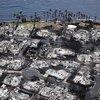

## Claim
Claim: "Russia offered assistance for the California wildfires from January 2025."

## Actions
```
web_search("Russia California wildfires assistance 2025")
```

## Evidence
### Evidence from `web_search`
Tasnim News Agency published an article on January 12, 2025, discussing Russia's comments on the California wildfires, including comments from Maria Zakharova. The article mentions that wildfires began to spread across Los Angeles County on January 7. ([https://www.tasnimnews.com/en/news/2025/01/12/3236714/russia-notes-us-hypocrisy-in-california-fire-case](https://www.tasnimnews.com/en/news/2025/01/12/3236714/russia-notes-us-hypocrisy-in-california-fire-case)) , 

The Dispatch published an article on January 15, 2025, discussing claims that Russia offered sanctuary to California fire victims. Vladimir Saldo offered to accept Americans who lost their homes in the California fires, but only those who haven't supported Ukraine since February 2022. ([https://thedispatch.com/article/assessing-claims-that-russia-offered-sanctuary-to-california-fire-victims/](https://thedispatch.com/article/assessing-claims-that-russia-offered-sanctuary-to-california-fire-victims/)) 

An NPR article, published on January 16, 2025, discusses how pro-Kremlin social media accounts spread a false narrative about the Los Angeles wildfires. ([https://www.npr.org/2025/01/16/nx-s1-5259842/los-angeles-california-fires-russia-ukraine](https://www.npr.org/2025/01/16/nx-s1-5259842/los-angeles-california-fires-russia-ukraine)) , 


## Elaboration
The evidence indicates that Russia's involvement in the California wildfires of January 2025 included commentary and offers of sanctuary, but not assistance. An article from The Dispatch states that Vladimir Saldo offered to accept Americans who lost their homes in the California fires, but only those who haven't supported Ukraine since February 2022 ([https://thedispatch.com/article/assessing-claims-that-russia-offered-sanctuary-to-california-fire-victims/](https://thedispatch.com/article/assessing-claims-that-russia-offered-sanctuary-to-california-fire-victims/)).

The NPR article also mentions that pro-Kremlin social media accounts spread a false narrative about the Los Angeles wildfires ([https://www.npr.org/2025/01/16/nx-s1-5259842/los-angeles-california-fires-russia-ukraine](https://www.npr.org/2025/01/16/nx-s1-5259842/los-angeles-california-fires-russia-ukraine)).

The evidence does not mention Russia offering assistance.


## Final Judgement
The search results reveal that Russia commented on the California wildfires and offered sanctuary to fire victims under specific conditions, but there is no mention of Russia offering assistance. Therefore, the claim is not supported by the available evidence.

`false`

### Verdict: FALSE

### Justification
The evidence indicates that Russia commented on the California wildfires in January 2025 and offered sanctuary to fire victims who did not support Ukraine, but there is no mention of Russia offering assistance, as reported by sources like [The Dispatch](https://thedispatch.com/article/assessing-claims-that-russia-offered-sanctuary-to-california-fire-victims/) and [NPR](https://www.npr.org/2025/01/16/nx-s1-5259842/los-angeles-california-fires-russia-ukraine).
