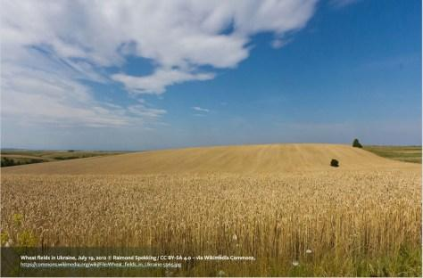
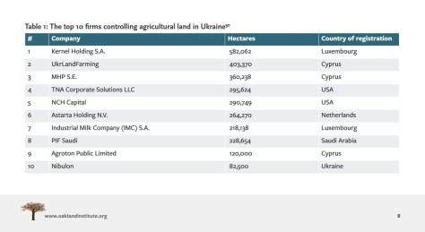

## Claim
Claim: "BlackRock has asked that Ukrainian soldiers not be buried on the land it owns in Ukraine."

## Actions
```
web_search("BlackRock Ukraine land burial policy")
```

## Evidence
### Evidence from `web_search`
The Asia Fact Check Lab ([https://www.rfa.org/english/news/afcl/afcl-blackrock-ukraine-land-08262024030948.html](https://www.rfa.org/english/news/afcl/afcl-blackrock-ukraine-land-08262024030948.html)) states that the claim is false, originating from a Bulgarian politician. The article mentions that foreign companies are prohibited from purchasing arable land in Ukraine and includes an image . Myth Detector ([https://mythdetector.com/en/ukrainian-lands-and-banned-the-burial-of-military-personnel/](https://mythdetector.com/en/ukrainian-lands-and-banned-the-burial-of-military-personnel/)) also fact-checks the claim as false, stating it originated from a satirical Telegram channel. BlackRock co-founder and CEO Larry Fink announced the creation of the Ukraine Reconstruction Fund in January 2023.

The Oakland Institute's report ([https://tlio.org.uk/war-and-theft-the-hostile-takeover-of-ukraines-agricultural-land-private-equitys-21st-century-war-for-global-enclosure-and-slavery/](https://tlio.org.uk/war-and-theft-the-hostile-takeover-of-ukraines-agricultural-land-private-equitys-21st-century-war-for-global-enclosure-and-slavery/)) discusses land ownership in Ukraine but does not mention BlackRock's policy on the burial of Ukrainian soldiers. The report includes multiple images , , , .


## Elaboration
The claim is false. Multiple sources, including The Asia Fact Check Lab ([https://www.rfa.org/english/news/afcl/afcl-blackrock-ukraine-land-08262024030948.html](https://www.rfa.org/english/news/afcl/afcl-blackrock-ukraine-land-08262024030948.html)) and Myth Detector ([https://mythdetector.com/en/ukrainian-lands-and-banned-the-burial-of-military-personnel/](https://mythdetector.com/en/ukrainian-lands-and-banned-the-burial-of-military-personnel/)), have fact-checked the claim and found it to be untrue. The claim originated from a Bulgarian politician and a satirical Telegram channel.

The evidence also indicates that foreign companies are prohibited from purchasing arable land in Ukraine. BlackRock's involvement in Ukraine is related to the Ukraine Reconstruction Fund, as announced by Larry Fink.


## Final Judgement
The claim that BlackRock has asked that Ukrainian soldiers not be buried on land it owns in Ukraine is demonstrably false. Multiple fact-checking sources have debunked the claim, citing its origin from a Bulgarian politician and a satirical Telegram channel.

`false`

### Verdict: FALSE

### Justification
The claim is false. Fact-checks by The Asia Fact Check Lab ([https://www.rfa.org/english/news/afcl/afcl-blackrock-ukraine-land-08262024030948.html](https://www.rfa.org/english/news/afcl/afcl-blackrock-ukraine-land-08262024030948.html)) and Myth Detector ([https://mythdetector.com/en/ukrainian-lands-and-banned-the-burial-of-military-personnel/](https://mythdetector.com/en/ukrainian-lands-and-banned-the-burial-of-military-personnel/)) show the claim originated from a Bulgarian politician and a satirical Telegram channel.
