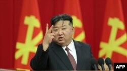

## Claim
Claim: "While serving as US President in 2024, Joe Biden ordered the US forces to prepare for possible nuclear confrontations with Russia, China, and North Korea."

## Actions
```
web_search("Joe Biden nuclear confrontation Russia China North Korea")
```

## Evidence
### Evidence from `web_search`
Joe Biden approved a US nuclear strategy to prepare for possible coordinated nuclear confrontations with Russia, China, and North Korea, according to reports from The Guardian ([https://www.theguardian.com/us-news/article/2024/aug/20/biden-nuclear-strategy-china-threat](https://www.theguardian.com/us-news/article/2024/aug/20/biden-nuclear-strategy-china-threat)) and the Lowy Institute ([https://www.lowyinstitute.org/the-interpreter/us-shifts-nuclear-focus-counter-china-s-growing-arsenal](https://www.lowyinstitute.org/the-interpreter/us-shifts-nuclear-focus-counter-china-s-growing-arsenal)). The plan, approved in March, reorients America's deterrent strategy to focus on China's growing nuclear arsenal. , , 

North Korea condemned the new U.S. nuclear strategic plan, as reported by Voice of America ([https://www.voanews.com/a/north-korea-condemns-new-us-nuclear-strategic-plan-report/7755256.html](https://www.voanews.com/a/north-korea-condemns-new-us-nuclear-strategic-plan-report/7755256.html)). 


## Elaboration
The evidence indicates that Joe Biden, while serving as US President, approved a nuclear strategy to prepare for possible confrontations with Russia, China, and North Korea. The plan, approved in March, reorients America's deterrent strategy to focus on China's growing nuclear arsenal. North Korea condemned the new U.S. nuclear strategic plan.


## Final Judgement
The evidence confirms that Joe Biden, as US President in 2024, approved a nuclear strategy that includes preparing for possible confrontations with Russia, China, and North Korea. This is supported by reports from The Guardian and the Lowy Institute.

`true`


### Verdict: TRUE

### Justification
In 2024, President Joe Biden approved a US nuclear strategy to prepare for possible confrontations with Russia, China, and North Korea, as reported by sources such as The Guardian ([https://www.theguardian.com/us-news/article/2024/aug/20/biden-nuclear-strategy-china-threat](https://www.theguardian.com/us-news/article/2024/aug/20/biden-nuclear-strategy-china-threat)) and the Lowy Institute ([https://www.lowyinstitute.org/the-interpreter/us-shifts-nuclear-focus-counter-china-s-growing-arsenal](https://www.lowyinstitute.org/the-interpreter/us-shifts-nuclear-focus-counter-china-s-growing-arsenal)). This plan, which was approved in March, reorients the US deterrent strategy to focus on China's growing nuclear arsenal.
