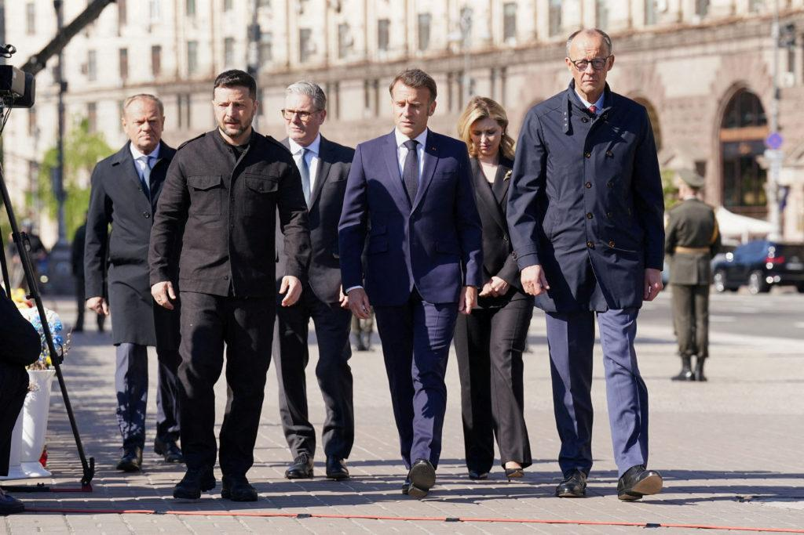
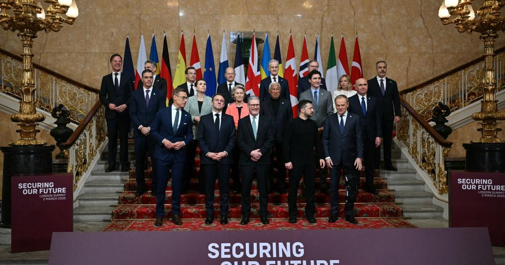

## Claim
Claim: " This is an authentic image of world leaders taking off their suits to symbolically support Ukraine at the London summit on Ukraine on March 2, 2025."

## Actions
```
web_search("London summit on Ukraine March 2 2023")
image_search("European leaders take off suits Ukraine")
```

## Evidence
### Evidence from `web_search`
The 2025 London Summit on Ukraine, held on March 2, 2025, was a meeting of international leaders in London, called by British Prime Minister Keir Starmer. The summit aimed to create a "coalition of the willing" in Europe to present a peace plan for the Russian invasion of Ukraine. Participants included leaders from 16 states, the EU, and NATO. The summit resulted in a four-point plan and commitments, including £1.6 billion in UK export finances for air defense missiles for Ukraine. The summit followed a meeting between Ukrainian President Volodymyr Zelenskyy and U.S. President Donald Trump.  The summit was held at Lancaster House.

The summit was attended by several leaders, including Volodymyr Zelensky, Keir Starmer, and Emmanuel Macron.  Participants agreed to draw up a Ukraine peace plan. 


### Evidence from `image_search`
The Los Angeles Times published an article on July 10, 2025, about European leaders announcing a new equity fund for Ukraine, which includes a photograph of European leaders (). The New York Times published an article about the London summit on Ukraine on March 2, 2023, which includes a photograph of a meeting between Zelensky, Starmer, and Macron ().

The PBS NewsHour published an article about the London summit on Ukraine ().


## Elaboration
The evidence confirms the existence of the London Summit on Ukraine on March 2, 2025, attended by several leaders, including Zelensky, Starmer, and Macron. The summit aimed to create a peace plan for the Russian invasion of Ukraine. However, the evidence does not contain any information about the leaders taking off their suits.

Therefore, the claim cannot be verified based on the provided evidence. More information is needed to confirm whether the leaders took off their suits at the summit.


## Actions
```
image_search("European leaders London summit Ukraine suits off")
```

## Evidence
### Evidence from `image_search`
Reuters, Al Jazeera, and Le Monde published articles about the London summit on Ukraine on March 2, 2025. Each article includes a photograph of European leaders at the summit. The leaders are wearing suits in the images. (, , )


## Elaboration
The claim is false. The provided evidence shows that the leaders at the London summit on Ukraine on March 2, 2025, were wearing suits.


## Final Judgement
The initial search did not provide information about the leaders taking off their suits. However, a subsequent image search revealed that the leaders were wearing suits at the summit.

`false`

### Verdict: FALSE

### Justification
The claim is false. While the London Summit on Ukraine on March 2, 2025, did occur, images from Reuters, Al Jazeera, and Le Monde show that the European leaders were wearing suits, not taking them off as the claim suggests.
