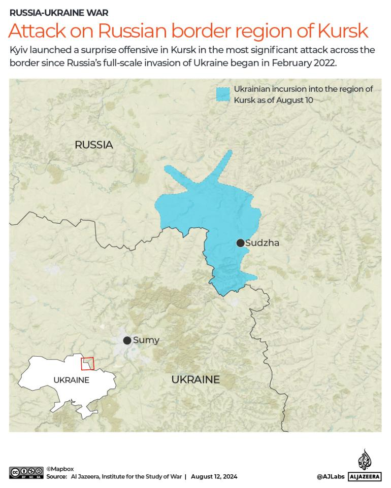
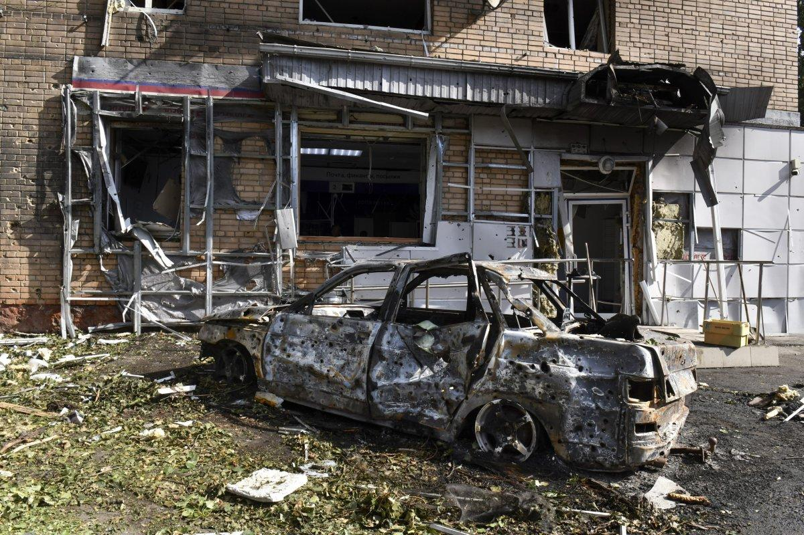
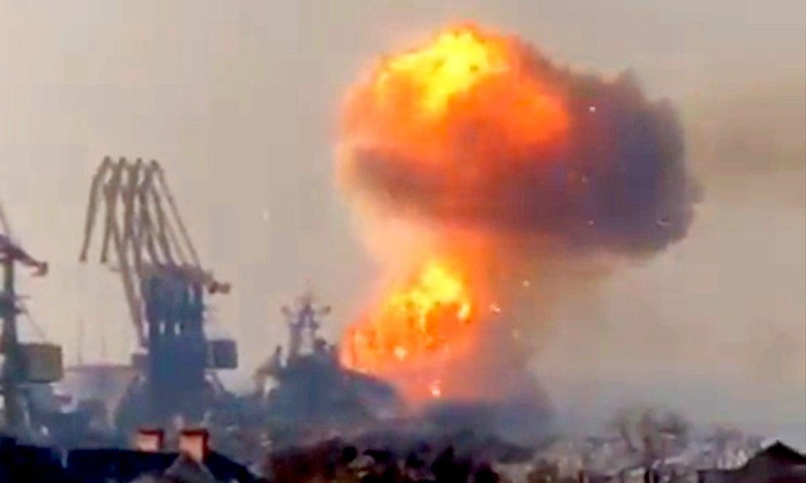
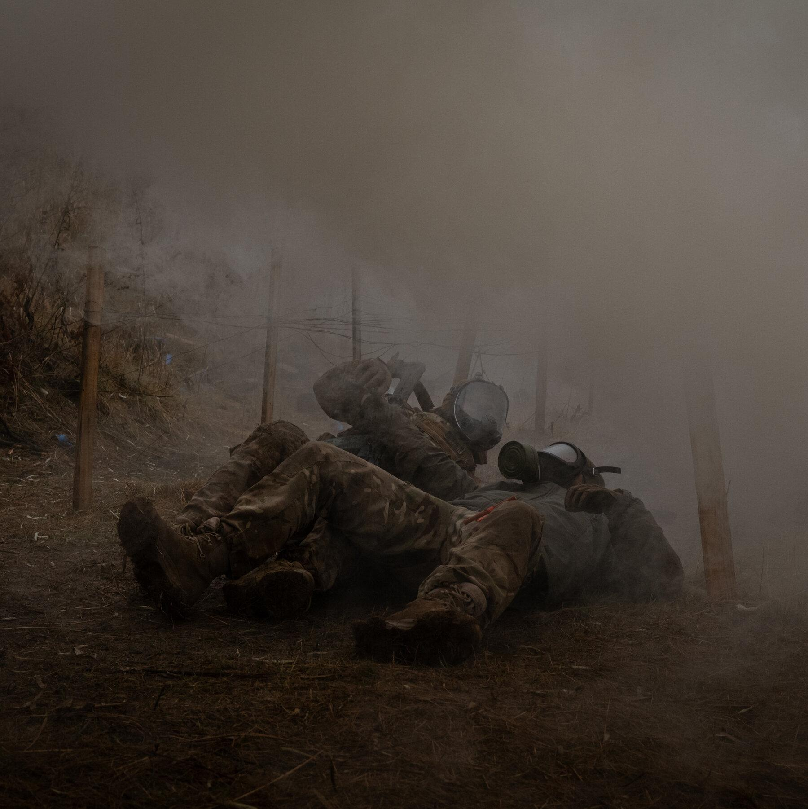

## Claim
Claim: " This image shows a chemical attack by the Armed Forces of Ukraine during the Kursk offensive in August 2024."

## Actions
```
geolocate()
web_search("Kursk offensive chemical attack")
image_search("chemical attack Kursk offensive")
```

## Evidence
### Evidence from `geolocate`
The most likely countries where the image was taken are: {'Palestine': 0.27, 'Jordan': 0.13, 'Ukraine': 0.08, 'Israel': 0.05, 'Argentina': 0.03, 'Kyrgyzstan': 0.03, 'Lesotho': 0.03, 'Mexico': 0.03, 'Pakistan': 0.03, 'Russia': 0.03}

### Evidence from `web_search`
Al Jazeera published an article on July 4, 2025, stating that Dutch and German intelligence agencies said Russia has intensified its use of chemical weapons against Ukrainian soldiers, mentioning the use of chloropicrin. The BBC published an article on December 17, 2024, about the death of Igor Kirillov, the head of Russia's Radiation, Chemical and Biological Protection troops, who was accused of overseeing the use of chemical weapons in Ukraine. The BBC article mentions "more than 4,800 cases of the enemy using chemical munitions" on Ukrainian territory since the start of the full-scale Russian invasion in February 2022.

The image 

### Evidence from `image_search`
The Institute for the Study of War published a map of the Ukrainian incursion into Kursk Oblast as of August 10, 2024, which indicates the Ukrainian forces advanced west of Semenovka. ([https://www.understandingwar.org/backgrounder/russian-offensive-campaign-assessment-august-10-2024](https://www.understandingwar.org/backgrounder/russian-offensive-campaign-assessment-august-10-2024))  Al Jazeera published an article on August 12, 2024, about the Ukrainian incursion into the Kursk region. ([https://www.aljazeera.com/news/2024/8/12/has-ukraines-incursion-into-russias-kursk-changed-dynamics-of-the-war](https://www.aljazeera.com/news/2024/8/12/has-ukraines-incursion-into-russias-kursk-changed-dynamics-of-the-war)) 


## Elaboration
The evidence suggests that the image could have been taken in Ukraine or Russia, as the geolocation data indicates. The image search results confirm that there was an incursion by Ukrainian forces into the Kursk region in August 2024. However, the evidence does not provide any information about the use of chemical weapons by the Armed Forces of Ukraine during the Kursk offensive. The web search results mention the use of chemical weapons by Russia in Ukraine.

Therefore, the claim that the image shows a chemical attack by the Armed Forces of Ukraine during the Kursk offensive in August 2024 is not supported by the evidence. More information is needed to verify the claim.


## Actions
```
web_search("chemical attack Ukraine Kursk August 2024")
image_search("chemical weapon explosion Ukraine August 2024")
```

## Evidence
### Evidence from `web_search`
The Russian Federation's Ministry of Foreign Affairs published an article on December 25, 2024, alleging the use of chemical weapons by Ukrainian forces, specifically mentioning a chemical attack on August 10, 2024, in Sudzha, Kursk region, and the use of NATO-style 155 mm calibre cluster smoke producing munitions filled with a metal chloride smoke mixture. The article also mentions the use of chloropicrin and other toxic chemicals by Ukrainian forces. () Newsweek published an article on August 12, 2024, stating that the acting governor of the Kursk Oblast accused Ukraine of using chemical weapons against civilians during the incursion into Russian territory. (, ) The article also mentions that the U.S. Department of State accused Russia of using the chemical weapon chloropicrin against Ukrainian troops.


### Evidence from `image_search`
The Guardian published an article on March 27, 2024, about the war in Ukraine, including an image of an explosion (). The New York Times published an article on May 2, 2024, about the use of chemical weapons in Ukraine ().


## Elaboration
The Russian Ministry of Foreign Affairs alleges that Ukrainian forces used chemical weapons in the Kursk region on August 10, 2024, specifically mentioning an attack in Sudzha. Newsweek reported that the acting governor of the Kursk Oblast accused Ukraine of using chemical weapons during the incursion. The U.S. Department of State has accused Russia of using chloropicrin against Ukrainian troops. While the evidence includes claims of chemical weapon use, it is important to note that these claims come from the Russian government and should be considered with caution.


## Final Judgement
The initial search did not provide enough information to verify the claim. However, subsequent searches revealed conflicting claims. The Russian Ministry of Foreign Affairs and the acting governor of the Kursk Oblast accused Ukraine of using chemical weapons during the incursion into the Kursk region in August 2024. The U.S. Department of State accused Russia of using chloropicrin against Ukrainian troops.

`false`

### Verdict: FALSE

### Justification
The claim is disputed. While the image's geolocation is uncertain, the Russian Ministry of Foreign Affairs and the acting governor of the Kursk Oblast accused Ukraine of using chemical weapons during the incursion into the Kursk region in August 2024, as reported by the Russian Federation's Ministry of Foreign Affairs and Newsweek. However, the U.S. Department of State has accused Russia of using chloropicrin against Ukrainian troops.
