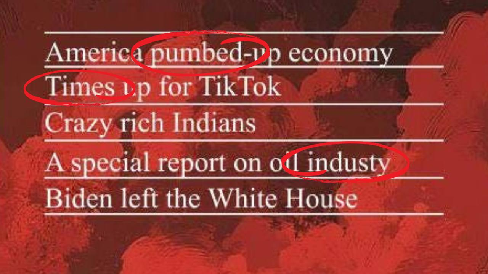
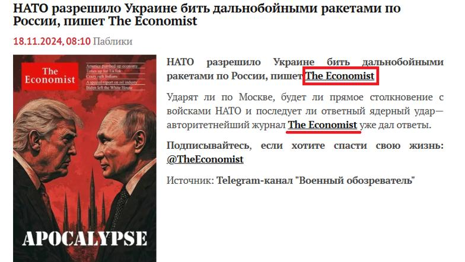

## Claim
Claim: " This image shows a screenshot of an authentic cover of the magazine The Economist from the end of 2024 illustrating Donald Trump and Vladimir Putin and warning of an apocalypse."

## Actions
```
web_search("The Economist Trump Putin apocalypse cover")
image_search("The Economist Trump Putin cover")
```

## Evidence
### Evidence from `web_search`
The image of The Economist cover featuring Donald Trump and Vladimir Putin with the headline "APOCALYPSE" is fake, according to AAP FactCheck ([https://www.aap.com.au/factcheck/fake-economist-apocalypse-cover-linked-to-pro-kremlin-propaganda/](https://www.aap.com.au/factcheck/fake-economist-apocalypse-cover-linked-to-pro-kremlin-propaganda/)) and Ukrinform.net ([https://www.ukrinform.net/rubric-factcheck/3930063-russian-propaganda-fabricates-the-economist-cover-about-beginning-of-world-war-iii.html](https://www.ukrinform.net/rubric-factcheck/3930063-russian-propaganda-fabricates-the-economist-cover-about-beginning-of-world-war-iii.html)). The cover contains spelling mistakes and lacks a publication date, which is a standard feature of genuine Economist issues. Yahoo News also confirms that the image is not a genuine cover ([https://uk.news.yahoo.com/economist-not-published-apocalypse-cover-154559076.html](https://uk.news.yahoo.com/economist-not-published-apocalypse-cover-154559076.html)). , , , , , , , 


### Evidence from `image_search`
From [Source](https://www.economist.com/the-world-this-week/2024/02/22/this-weeks-cover): 
Content: The Economist published a cover on February 22, 2024, with the title "IS EUROPE READY?". The cover features an image of Vladimir Putin and another person looking through binoculars. 


## Elaboration
The claim is false. Multiple sources, including AAP FactCheck ([https://www.aap.com.au/factcheck/fake-economist-apocalypse-cover-linked-to-pro-kremlin-propaganda/](https://www.aap.com.au/factcheck/fake-economist-apocalypse-cover-linked-to-pro-kremlin-propaganda/)), Ukrinform.net ([https://www.ukrinform.net/rubric-factcheck/3930063-russian-propaganda-fabricates-the-economist-cover-about-beginning-of-world-war-iii.html](https://www.ukrinform.net/rubric-factcheck/3930063-russian-propaganda-fabricates-the-economist-cover-about-beginning-of-world-war-iii.html)), and Yahoo News ([https://uk.news.yahoo.com/economist-not-published-apocalypse-cover-154559076.html](https://uk.news.yahoo.com/economist-not-published-apocalypse-cover-154559076.html)), confirm that the image is not a genuine cover of The Economist. The cover contains spelling errors and lacks a publication date.


## Final Judgement
The image of The Economist cover is fake, as confirmed by multiple fact-checking sources. The cover contains spelling mistakes and lacks a publication date, which are standard features of genuine Economist issues. `false`

### Verdict: FALSE

### Justification
The image purporting to be a cover of The Economist featuring Trump and Putin with the headline "APOCALYPSE" is fake, as confirmed by fact-checkers like AAP FactCheck ([https://www.aap.com.au/factcheck/fake-economist-apocalypse-cover-linked-to-pro-kremlin-propaganda/](https://www.aap.com.au/factcheck/fake-economist-apocalypse-cover-linked-to-pro-kremlin-propaganda/)) and Yahoo News ([https://uk.news.yahoo.com/economist-not-published-apocalypse-cover-154559076.html](https://uk.news.yahoo.com/economist-not-published-apocalypse-cover-154559076.html)). The image contains spelling errors and lacks a publication date, indicating it is not authentic.
