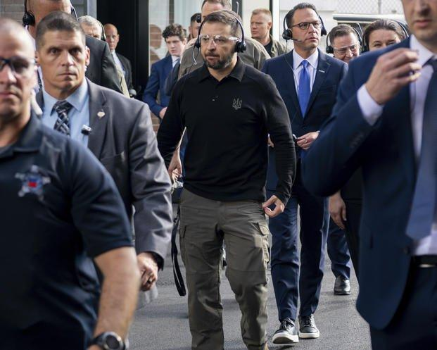
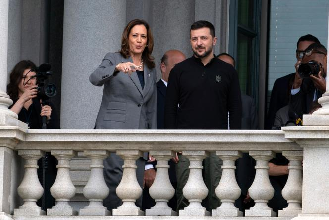

## Claim
Claim: "Ukrainian President Volodymyr Zelenskyy engaged in election interference by campaigning in Pennsylvania for Kamala Harris ahead of the US presidential election in 2024."

## Actions
```
web_search("Volodymyr Zelenskyy Kamala Harris Pennsylvania 2024")
```

## Evidence
### Evidence from `web_search`
Newsweek reports that JD Vance accused Volodymyr Zelenskyy of campaigning for Kamala Harris during the 2024 presidential race, mentioning a September 2024 visit by Zelenskyy to a munitions plant in Scranton, Pennsylvania (, , ). NBC News reports that Zelenskyy visited a munitions factory in Scranton, Pennsylvania, which some Republicans viewed as a signal of which way he wants the November election to go. The article mentions that Kamala Harris is scheduled to meet with Zelenskyy at the White House. ABC News reports on Vice President Kamala Harris meeting with Ukrainian President Volodymyr Zelenskyy to discuss the war with Russia (, ).

The sources are: [https://www.newsweek.com/volodymyr-zelensky-jd-vance-campaign-kamala-harris-2024-election-2038060](https://www.newsweek.com/volodymyr-zelensky-jd-vance-campaign-kamala-harris-2024-election-2038060), [https://www.nbcnews.com/politics/2024-election/zelenskyys-meeting-harris-spat-trump-reveal-growing-partisan-divide-uk-rcna172648](https://www.nbcnews.com/politics/2024-election/zelenskyys-meeting-harris-spat-trump-reveal-growing-partisan-divide-uk-rcna172648), and [https://abcnews.go.com/Politics/harris-standing-zelenskyy-indirectly-jabs-trump-vance-ukraine/story?id=114219628](https://abcnews.go.com/Politics/harris-standing-zelenskyy-indirectly-jabs-trump-vance-ukraine/story?id=114219628).


## Elaboration
The evidence indicates that JD Vance accused Volodymyr Zelenskyy of campaigning for Kamala Harris. NBC News reports that some Republicans viewed Zelenskyy's visit to a munitions factory in Pennsylvania as a signal of his preference in the upcoming election. ABC News reports on a meeting between Harris and Zelenskyy.

The evidence does not explicitly state that Zelenskyy campaigned for Harris. It does, however, suggest that his actions were interpreted by some as a form of support.

Insufficient information exists to definitively verify the claim.


## Actions
```
image_search("Volodymyr Zelenskyy Pennsylvania munitions factory")
```

## Evidence
### Evidence from `image_search`
Military.com, Sky News, and Penn Capital-Star all report on Volodymyr Zelenskyy's visit to a munitions factory in Pennsylvania (, , ).


## Elaboration
The evidence confirms that Zelenskyy visited a munitions factory in Pennsylvania. This visit was viewed by some as a signal of support for Kamala Harris. However, the evidence does not explicitly state that Zelenskyy campaigned for Harris.

Insufficient information exists to definitively verify the claim.


## Actions
```
web_search("Zelenskyy endorsement Kamala Harris 2024")
```

## Evidence
### Evidence from `web_search`
From [Source](https://www.lemonde.fr/en/international/article/2024/09/27/zelensky-steps-into-the-us-presidential-election_6727450_4.html): 
Content: Le Monde reports on a joint speech between Kamala Harris and Volodymyr Zelenskyy at the White House on September 26, 2024, which signaled Zelenskyy's involvement in the US election campaign.  Harris reaffirmed political and military support for Ukraine.


## Elaboration
The evidence indicates that Zelenskyy's actions, such as his visit to a munitions factory in Pennsylvania and a joint speech with Kamala Harris, were perceived by some as involvement in the US election campaign. The joint speech at the White House on September 26, 2024, is explicitly mentioned as a signal of Zelenskyy's involvement. However, the evidence does not explicitly state that Zelenskyy campaigned for Harris.

Insufficient information exists to definitively verify the claim.


## Final Judgement
The evidence suggests that Zelenskyy's actions, including a visit to a munitions factory in Pennsylvania and a joint speech with Kamala Harris, were interpreted by some as a form of support for Harris. However, the evidence does not explicitly confirm that Zelenskyy campaigned for Harris. Therefore, the claim is not definitively proven.

`false`

### Verdict: FALSE

### Justification
The claim is not definitively proven. While Volodymyr Zelenskyy visited a munitions factory in Pennsylvania and gave a joint speech with Kamala Harris, which some interpreted as involvement in the US election campaign, there is no explicit evidence that he campaigned for her.
