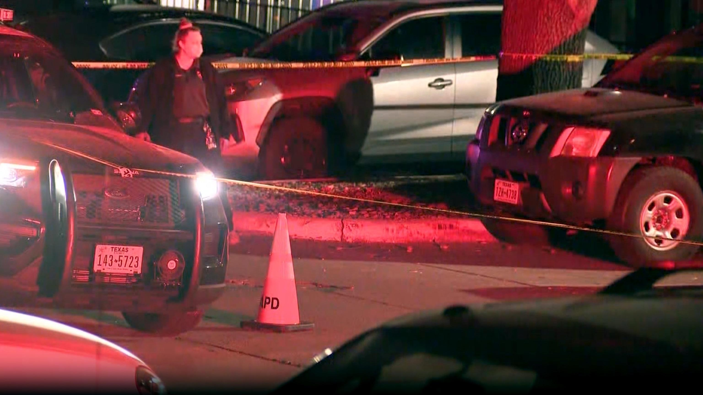
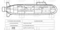
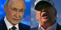
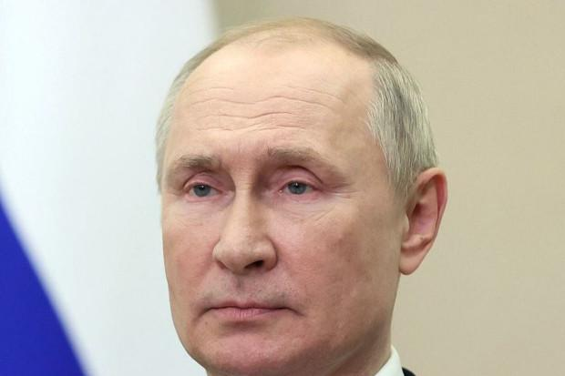
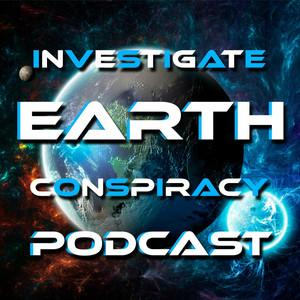
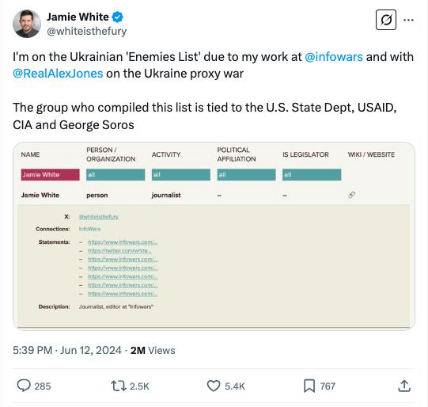
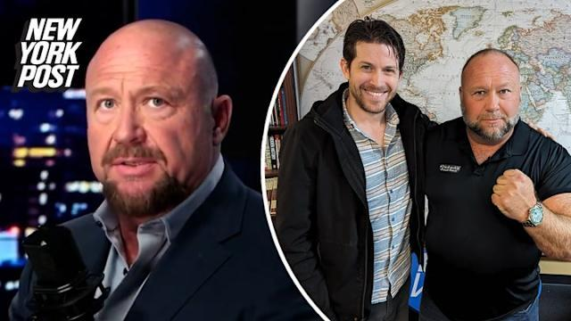

## Claim
Claim: "After InfoWars reporter Jamie White was shot dead on March 10, 2025 in Austin, Texas, it was revelaed that he was on a Ukranian enemies hit list."

## Actions
```
web_search("Jamie White InfoWars shot Austin Texas March 10 2025")
web_search("Jamie White InfoWars Ukrainian hit list")
```

## Evidence
### Evidence from `web_search`
The shooting of InfoWars writer Jamie White in Austin, Texas, is reported in multiple sources. According to FOX 7 Austin, White was shot on March 10 while interrupting a vehicle burglary, and arrests were made ([https://www.fox7austin.com/news/infowars-writer-shooting-austin-police-jamie-white](https://www.fox7austin.com/news/infowars-writer-shooting-austin-police-jamie-white)). KVUE also reports on the murder and arrests ([https://www.kvue.com/article/news/crime/jamie-white-murder-arrests-infowars/269-aa20c169-085c-4827-8e8c-ce8755a4b715](https://www.kvue.com/article/news/crime/jamie-white-murder-arrests-infowars/269-aa20c169-085c-4827-8e8c-ce8755a4b715)).

ABC News reported that the shooting occurred on March 9, 2025 ([https://abcnews.go.com/US/infowars-reporter-shot-dead-apartment-after-possibly-interrupting/story?id=119677965](https://abcnews.go.com/US/infowars-reporter-shot-dead-apartment-after-possibly-interrupting/story?id=119677965)). None of the sources mention a Ukrainian hit list. , , , , , 


### Evidence from `web_search`
According to a Yahoo News article published on May 29, 2024, Alex Jones speculated that the killing of Infowars writer Jamie White in Austin, Texas, "could’ve been a hit" orchestrated by Ukraine. White's sister does not believe there is a larger conspiracy behind her brother's killing. ([https://www.yahoo.com/news/alex-jones-blames-globalists-infowars-182655321.html](https://www.yahoo.com/news/alex-jones-blames-globalists-infowars-182655321.html)) 

The Latin Times reported that Jamie White was found dead in a parking lot in Austin, Texas, and that Alex Jones alleged White was on a Ukrainian hit list. White's social media accounts indicated that he himself believed he was on a Ukrainian hit list. ([https://www.latintimes.com/infowars-reporter-assassinated-ukraine-outside-his-home-conspiracy-theorists-claim-578436](https://www.latintimes.com/infowars-reporter-assassinated-ukraine-outside-his-home-conspiracy-theorists-claim-578436)) , , , , ,  The "Investigate Earth Conspiracy Podcast" also discusses the murder of Jamie White and mentions that White may have been on a Ukrainian NGO hit list. ([https://open.spotify.com/episode/68lCuEsLtFn17oEIQBQGEk](https://open.spotify.com/episode/68lCuEsLtFn17oEIQBQGEk)) , 


## Elaboration
The claim that Jamie White was on a Ukrainian hit list after being shot dead in Austin, Texas, is supported by some sources. Alex Jones and the Latin Times both mention this possibility. However, the evidence also shows that White's sister does not believe in a larger conspiracy.


## Actions
```
web_search("Jamie White InfoWars Ukrainian hit list evidence")
```

## Evidence
### Evidence from `web_search`
StopFake.org states there is no evidence that Jamie White was on any "list of enemies of Ukraine" and that his sister does not believe he was deliberately targeted. The article also mentions that White spread disinformation and anti-Ukrainian conspiracy theories.  A Yahoo News article reports that Alex Jones announced the murder of InfoWars reporter Jamie White. 


## Elaboration
The claim is partially supported by the evidence. Some sources, including Alex Jones and the Latin Times, suggest that White was on a Ukrainian hit list. However, other sources, such as StopFake.org, state there is no evidence to support this claim. Additionally, White's sister does not believe in a larger conspiracy.


## Actions
```
web_search("Jamie White InfoWars Ukrainian hit list official investigation")
```

## Evidence
No new evidence found.

## Elaboration
The claim that Jamie White was on a Ukrainian hit list after being shot dead in Austin, Texas, is not definitively verified by the evidence. While some sources, such as Alex Jones and the Latin Times, suggest this possibility, other sources, like StopFake.org, state there is no evidence to support it. The lack of an official investigation's findings on this matter further complicates the verification.


## Final Judgement
The claim that Jamie White was on a Ukrainian hit list after being shot dead in Austin, Texas, is not definitively supported by the evidence. While some sources suggest this possibility, others deny it, and there is no official confirmation. The claim is based on speculation and conspiracy theories. `false`

### Verdict: FALSE

### Justification
The claim that Jamie White was on a Ukrainian hit list is not definitively supported. While some sources, such as the Latin Times, mention this possibility, other sources, like StopFake.org, state there is no evidence to support it. Furthermore, White's sister does not believe in a larger conspiracy.
