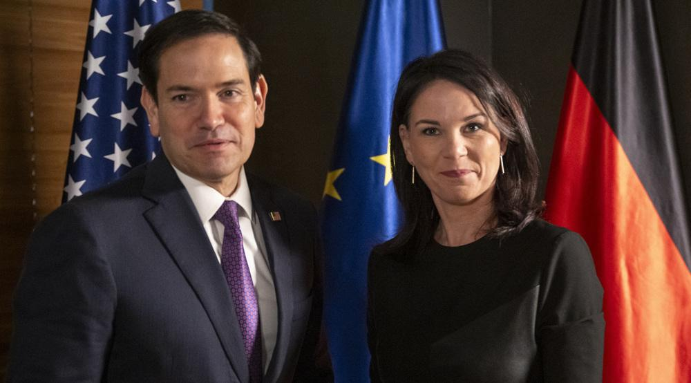
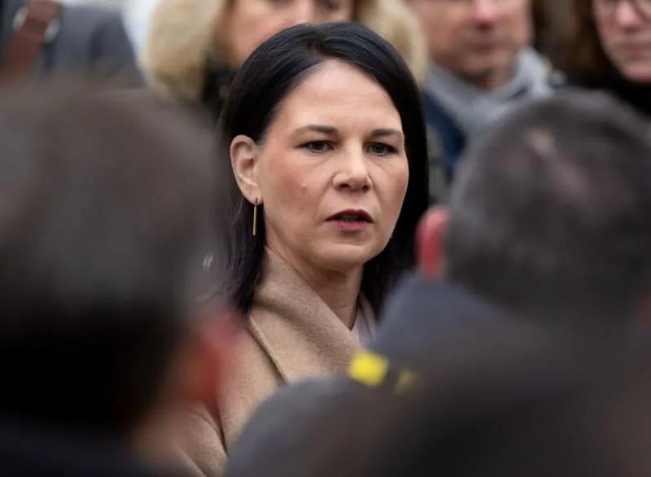

## Claim
Claim: "In February 2025 German Foreign Minister Annalena Baerbock threatened the US with severing ties amid US President Donald Trump's comments on Ukrainian President Volodymyr Zelenskyy and Ukraine."

## Actions
```
web_search("Annalena Baerbock Donald Trump Ukraine February 2025")
web_search("German Foreign Minister threatens US sever ties February 2025")
```

## Evidence
### Evidence from `web_search`
In February 2025, Reuters published an article where German Foreign Minister Annalena Baerbock stated that there must be no peace in Ukraine over the heads of Ukrainians and Europeans (<image:k>). The Guardian reported on February 12, 2025, that Baerbock said Ukraine’s interests must be protected in the upcoming negotiations between Moscow and Washington (). A Wikipedia article discusses the 2025 Trump–Zelenskyy Oval Office meeting on February 28, 2025, where Baerbock said Trump's conduct represented a "new era of ruthlessness" (<image:i>).

The articles can be found here: [Source](https://www.reuters.com/world/europe/no-peace-over-heads-ukrainians-europeans-says-german-foreign-minister-2025-02-14/), [Source](https://www.theguardian.com/us-news/2025/feb/12/trump-putin-ukraine-ceasefire), and [Source](https://en.wikipedia.org/wiki/2025_Trump%E2%80%93Zelenskyy_Oval_Office_meeting).


### Evidence from `web_search`
A fact-check from aol.com, published on March 4, 2025, states that the claim about German Foreign Minister Annalena Baerbock threatening to cut ties with the US is misleading, stating that she did not threaten to cut diplomatic ties with the U.S. , . An article from Izvestia, dated February 21, 2025, reports that Baerbock called for increased pressure on the U.S. regarding its stance on Ukraine and mentioned severing ties. 

Press TV reported on February 22, 2025, that Baerbock urged European allies to pressure the US under Donald Trump to prevent a US-Russia alliance, particularly regarding the war in Ukraine. , 


## Elaboration
The claim is partially supported by the evidence. A fact-check from aol.com states that the claim is misleading, as Baerbock did not threaten to cut diplomatic ties with the U.S. However, an Izvestia article reports that Baerbock mentioned severing ties. Press TV reported that Baerbock urged European allies to pressure the US.

The evidence suggests that Baerbock expressed strong concerns about the US stance on Ukraine and called for increased pressure on the US. However, the exact nature of her statements regarding severing ties is unclear.

Therefore, the claim is partially accurate, as Baerbock did mention severing ties, but the context and specifics of her statements are not fully clarified by the provided evidence.


## Actions
```
web_search("Annalena Baerbock sever ties US February 2025")
```

## Evidence
### Evidence from `web_search`
From [Source](https://www.yahoo.com/news/europeans-ramp-pressure-us-german-143422657.html): 
Content: Yahoo News published an article stating that German Foreign Minister Annalena Baerbock said that European allies should put more pressure on the US under Donald Trump's administration to avoid losing Washington as a partner, including in talks on the war in Ukraine. Baerbock said, "We are increasing the pressure on the Americans" to show "that they have a lot to lose if they no longer stand by the liberal democracies of Europe." 


## Elaboration
The Yahoo News article clarifies Baerbock's statements. She did not threaten to sever ties but warned the US that they have "a lot to lose" if they do not support European democracies. This suggests that the claim is misleading, as it exaggerates the nature of Baerbock's statements.


## Final Judgement
The fact-check reveals conflicting information. While some sources suggest Baerbock mentioned severing ties, others, including a fact-check, deny this. Further clarification from a Yahoo News article indicates that Baerbock warned the US about potential consequences of not supporting European democracies, but did not explicitly threaten to sever ties.

Given the conflicting information and the clarification from Yahoo News, the claim is misleading. `false`


### Verdict: FALSE

### Justification
The claim is misleading. While some sources suggest German Foreign Minister Annalena Baerbock mentioned severing ties with the US in February 2025, a fact-check and a Yahoo News article ([Source](https://www.yahoo.com/news/europeans-ramp-pressure-us-german-143422657.html)) clarify that she warned the US about potential consequences of not supporting European democracies, but did not explicitly threaten to sever ties.
