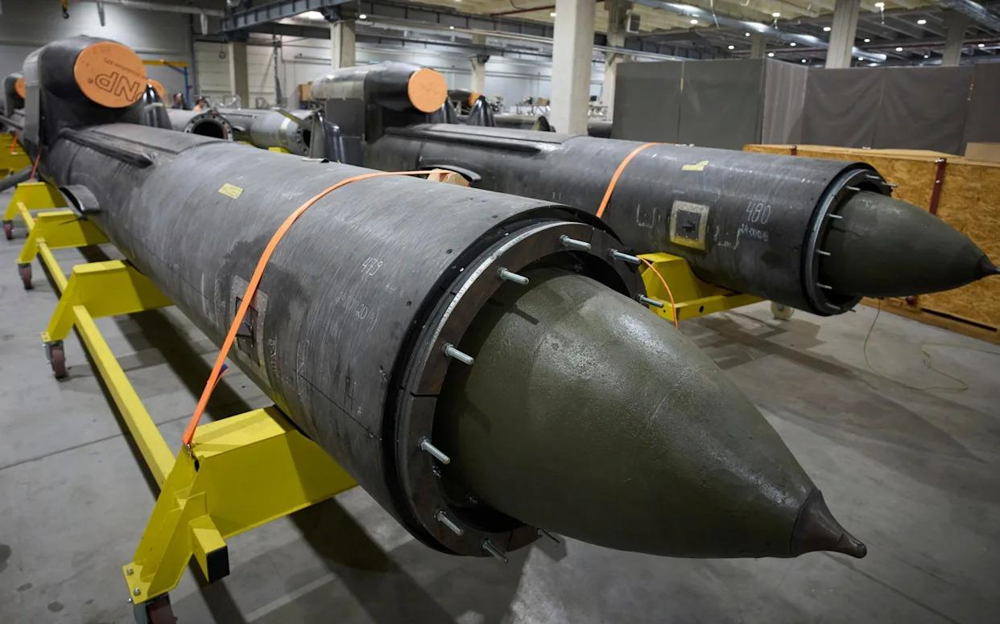
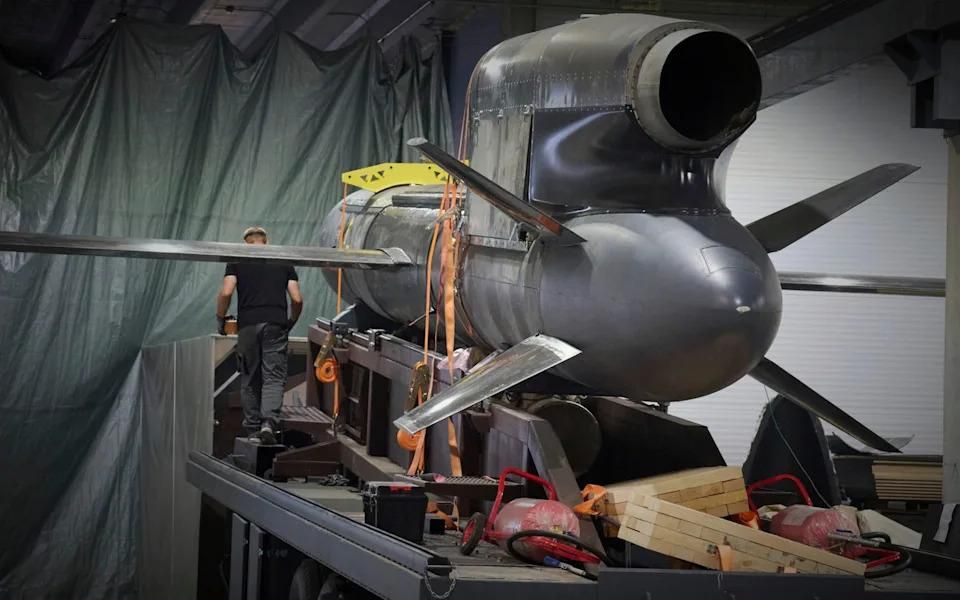
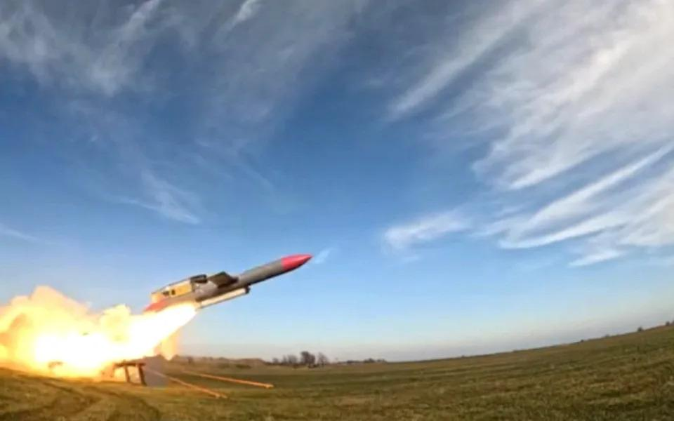
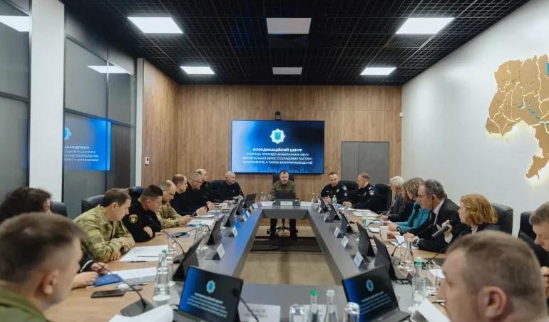
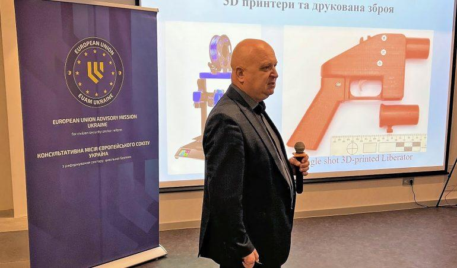

## Claim
Claim: "Ukraine is selling half of the armaments it receives from the United States"

## Actions
```
web_search("Ukraine arms sales US aid")
web_search("US aid to Ukraine arms tracking")
```

## Evidence
### Evidence from `web_search`
The Defense Security Cooperation Agency (DSCA) announced a possible Foreign Military Sale to Ukraine of Air Delivered Munitions and related equipment for an estimated cost of $825 million, including 3,350 Extended Range Attack Munition (ERAM) missiles and 3,350 Embedded Global Positioning System (GPS)/Inertial Navigation Systems (INS) (<image:i>). Ukraine will use funding from Denmark, the Netherlands, Norway, and Foreign Military Financing from the United States for this purchase. The Associated Press reported that the Trump administration approved the $825 million arms sale to Ukraine, which will be paid for by NATO allies and U.S. foreign military financing.

The Council on Foreign Relations (CFR) states that Ukraine is the top recipient of U.S. aid since the Russian invasion in February 2022. A large share of the aid has been spent in the United States to produce weapons that are shipped to Ukraine or replenish U.S. stockpiles. Thirty countries made major arms transfers to Ukraine in the first two years of the war.
*   [https://www.dsca.mil/Press-Media/Major-Arms-Sales/Article-Display/Article/4289280/ukraine-air-delivered-munitions](https://www.dsca.mil/Press-Media/Major-Arms-Sales/Article-Display/Article/4289280/ukraine-air-delivered-munitions)
*   [https://apnews.com/article/ukraine-us-weapons-sale-trump-russia-74e01123c0067d5fc160141e0cabf207](https://apnews.com/article/ukraine-us-weapons-sale-trump-russia-74e01123c0067d5fc160141e0cabf207)
*   [https://www.cfr.org/article/how-much-us-aid-going-ukraine](https://www.cfr.org/article/how-much-us-aid-going-ukraine)


### Evidence from `web_search`
The Kiel Institute's "Ukraine Support Tracker" provides data on military, financial, and humanitarian aid pledged to Ukraine, including military equipment. The latest update includes data through April 2025. ([https://www.ifw-kiel.de/topics/war-against-ukraine/ukraine-support-tracker/](https://www.ifw-kiel.de/topics/war-against-ukraine/ukraine-support-tracker/)) <image:k>

Forumarmstrade.org provides a timeline of military aid to Ukraine from various countries, including the United States, but does not contain any information about Ukraine selling armaments. ([https://www.forumarmstrade.org/ukrainearms.html](https://www.forumarmstrade.org/ukrainearms.html)) An NPR article from August 5, 2025, discusses U.S. military assistance to Ukraine and mentions support from other countries. ([https://www.npr.org/2025/08/05/g-s1-81084/europe-us-weapons-ukraine-russia-war](https://www.npr.org/2025/08/05/g-s1-81084/europe-us-weapons-ukraine-russia-war)) , , 


## Elaboration
The provided evidence does not contain any information about Ukraine selling armaments received from the United States. The search results focus on U.S. aid to Ukraine, arms sales to Ukraine, and tracking military aid. Therefore, the claim cannot be verified with the available information.


## Actions
```
web_search("Ukraine arms sales corruption")
web_search("Ukraine arms trafficking investigation")
```

## Evidence
### Evidence from `web_search`
The Yahoo News article ([https://www.yahoo.com/news/articles/ukraine-wonder-weapon-firm-faces-205238979.html](https://www.yahoo.com/news/articles/ukraine-wonder-weapon-firm-faces-205238979.html)) discusses a Ukrainian defense company under investigation for alleged corruption. The BBC News reported ([https://www.bbc.com/news/world-europe-68120973](https://www.bbc.com/news/world-europe-68120973)) on corruption in an arms purchase. The PBS Frontline World article discusses Ukraine's history of illegal arms sales and corruption ([https://www.pbs.org/frontlineworld/stories/sierraleone/context.html](https://www.pbs.org/frontlineworld/stories/sierraleone/context.html)). The articles do not contain any information about Ukraine selling armaments received from the United States. , , , , 


### Evidence from `web_search`
The Global Initiative Against Transnational Organized Crime published a report on June 18, 2024, discussing future trends in arms trafficking from the Ukraine conflict, highlighting concerns about the diversion of small arms and light weapons (SALW) and ammunition from Ukraine ([https://globalinitiative.net/analysis/future-trends-in-arms-trafficking-from-the-ukraine-conflict/](https://globalinitiative.net/analysis/future-trends-in-arms-trafficking-from-the-ukraine-conflict/)) . The Ministry of Internal Affairs of Ukraine launched a Coordination Centre to Combat Illicit Arms Trafficking on February 6, 2025 ([https://www.euam-ukraine.eu/news/moia-launches-the-coordination-centre-to-combat-illicit-arms-trafficking/](https://www.euam-ukraine.eu/news/moia-launches-the-coordination-centre-to-combat-illicit-arms-trafficking/)) , , , , .


## Elaboration
The evidence indicates that there are concerns about arms trafficking and corruption related to arms purchases in Ukraine. However, the provided sources do not confirm the claim that Ukraine is selling half of the armaments it receives from the United States. The evidence highlights investigations into corruption and the establishment of centers to combat illicit arms trafficking, but it does not provide any data on the volume of arms sales or the origin of the armaments being sold.

Therefore, the claim remains unverified due to a lack of specific information about the sale of U.S.-supplied armaments.


## Final Judgement
The search results reveal discussions about arms sales, corruption, and arms trafficking in Ukraine, but they do not provide any evidence to support the claim that Ukraine is selling half of the armaments it receives from the United States. The available information does not confirm the claim.

`false`

### Verdict: FALSE

### Justification
The fact-check found no evidence to support the claim that Ukraine is selling half of the armaments it receives from the United States. While there are reports of corruption and arms trafficking concerns, the provided sources, including those from the [Defense Security Cooperation Agency](https://www.dsca.mil/Press-Media/Major-Arms-Sales/Article-Display/Article/4289280/ukraine-air-delivered-munitions), [Associated Press](https://apnews.com/article/ukraine-us-weapons-sale-trump-russia-74e01123c0067d5fc160141e0cabf207), and [Council on Foreign Relations](https://www.cfr.org/article/how-much-us-aid-going-ukraine), focus on U.S. aid, arms sales to Ukraine, and tracking military aid, without any data on the alleged sales.
