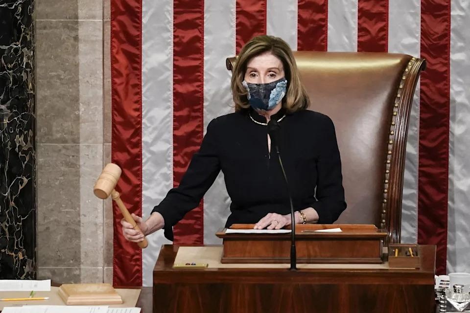
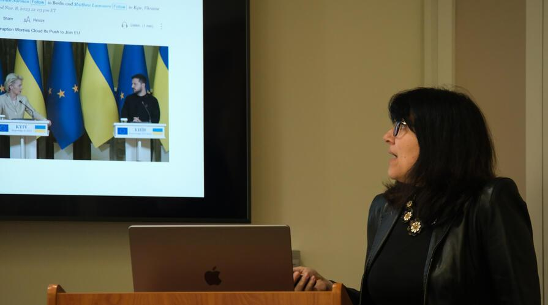

## Claim
Claim: " This image shows an authentic list realeased by Ukraine showing US politicians taking bribes from Ukraine. The highest bribe was 92 Million US-$ for Joe Biden."

## Actions
```
web_search("Joe Biden Mitch McConnell Nancy Pelosi wealth")
web_search("US politicians wealth net worth")
```

## Evidence
### Evidence from `web_search`
The Yahoo Finance article discusses Elon Musk's questioning of the wealth of members of Congress, including Joe Biden, Nancy Pelosi, Mitch McConnell, Chuck Schumer, and Elizabeth Warren. The article mentions their annual salaries and net worths. The article was published on February 13, 2025, by Benzinga. ([https://finance.yahoo.com/news/elon-musk-questions-congress-members-190016734.html](https://finance.yahoo.com/news/elon-musk-questions-congress-members-190016734.html)) 

The Yahoo News article discusses the wealth of Nancy Pelosi, mentioning her real estate investments, business partnerships, and stock holdings. It states that Pelosi's assets total between $57 million and $271 million, with liabilities ranging from $20 million to $97 million. ([https://www.yahoo.com/news/fact-check-no-house-speaker-172533305.html](https://www.yahoo.com/news/fact-check-no-house-speaker-172533305.html)) , , ,  The Conversation published an article on July 21, 2023, discussing the age of US politicians, including Joe Biden, Mitch McConnell, and Nancy Pelosi. 


### Evidence from `web_search`
The search results provide information on the net worth of US politicians. Quiverquant.com offers a live net worth tracker for members of Congress, using data on politicians' stock portfolios ([https://www.quiverquant.com/congress-live-net-worth/](https://www.quiverquant.com/congress-live-net-worth/)). Wikipedia lists the wealthiest members of Congress as of 2018, with figures that are estimates, and the original documents are available on OpenSecrets ([https://en.wikipedia.org/wiki/List_of_current_members_of_the_United_States_Congress_by_wealth](https://en.wikipedia.org/wiki/List_of_current_members_of_the_United_States_Congress_by_wealth)).

OpenSecrets also provides information on the personal finances of members of Congress, including their estimated wealth, and has a section on the richest members of Congress in 2018 ([https://www.opensecrets.org/personal-finances](https://www.opensecrets.org/personal-finances)). The image  shows a list of politicians with their wealth.


## Elaboration
The evidence provides information on the net worth of several US politicians, including Joe Biden, Nancy Pelosi, and Mitch McConnell. The claim states that the image shows a list released by Ukraine showing US politicians taking bribes. However, the evidence does not support the claim that the list was released by Ukraine or that it represents bribes. The evidence only provides information on the net worth of the politicians.

The claim is not supported by the evidence. The evidence does not mention any bribes or a list released by Ukraine. The evidence does provide information on the net worth of the politicians listed in the image.

To verify the claim, information is missing about the source of the list and the context of the figures presented.


## Actions
```
image_search("Ukraine corruption US politicians")
web_search("Ukraine list US politicians bribes")
```

## Evidence
### Evidence from `image_search`
The CNN article discusses the US's pressure on Ukraine to counter corruption, but does not mention any list of US politicians taking bribes from Ukraine. The New York Times published an article about a Ukrainian politician charged with corruption . A search result from Stanford University discusses corruption in Ukraine . None of the sources mention a list released by Ukraine showing US politicians taking bribes.


### Evidence from `web_search`
The Euronews article states that the claim that Ukraine released a list of US politicians taking bribes is false and likely originates from pro-Russian propaganda. The AOL article also fact-checks the claim, stating there is no evidence to support it and that it originated from a Thai-language website. The BBC News article discusses an FBI document alleging Joe Biden and his son accepted bribes from a Ukrainian firm, but there is no evidence that Joe Biden received any payments from Ukraine. 

## Elaboration
The claim is false. Multiple sources, including Euronews and AOL, debunk the claim that Ukraine released a list of US politicians taking bribes. The evidence indicates that the claim is likely a result of pro-Russian propaganda and lacks any supporting evidence.


## Final Judgement
The initial search results provided information on the net worth of US politicians, but did not support the claim that the image was released by Ukraine or that it represented bribes. Subsequent searches confirmed that the claim is false and likely originated from pro-Russian propaganda.

`false`

### Verdict: FALSE

### Justification
The claim that the image is an authentic list released by Ukraine showing US politicians taking bribes is false. Multiple sources, including Euronews and AOL, debunk this claim, stating it is likely pro-Russian propaganda and lacks supporting evidence. The image itself appears to be a list of politicians and their estimated wealth, not a list of bribes.
