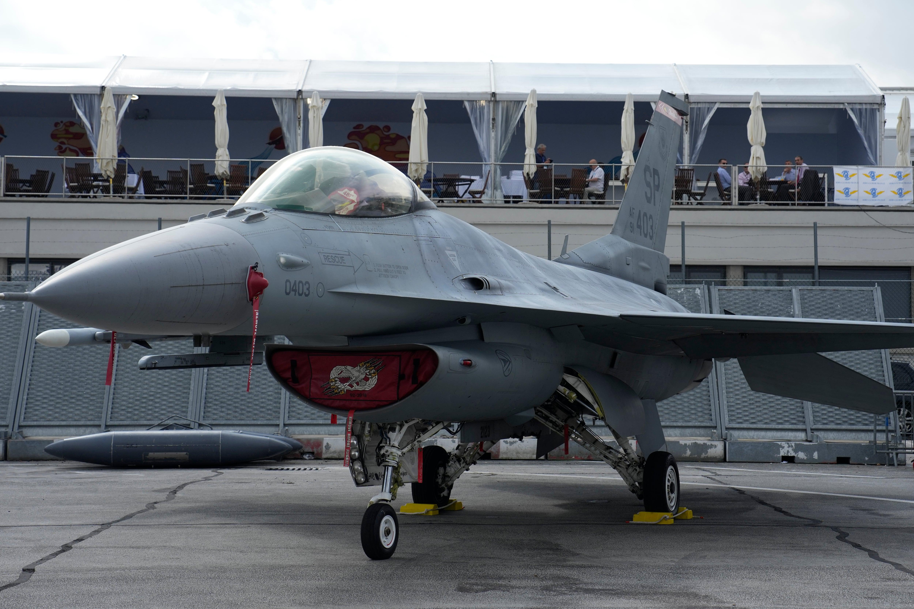
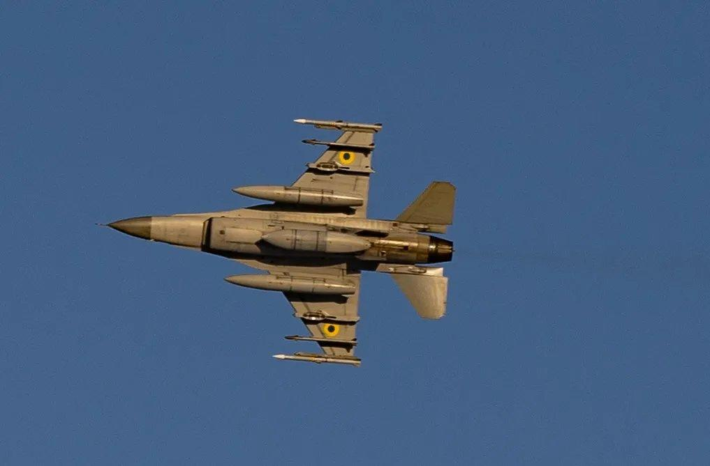
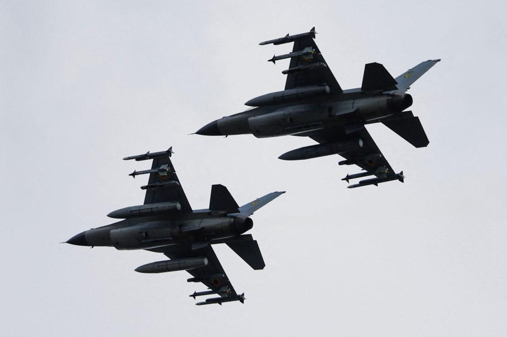
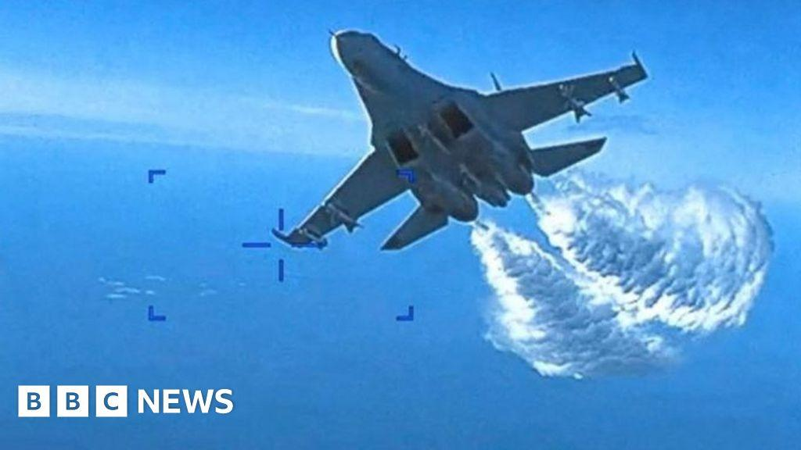

## Claim
Claim: " This image shows a US F-16 fighter jet which was shot down in August 2024 in airspace over the Black Sea after refusing to obey Russian orders."

## Actions
```
web_search("F-16 shot down Black Sea August 2024")
image_search("F-16 fighter jet crash Black Sea")
```

## Evidence
### Evidence from `web_search`
Defense News reports that a Ukrainian F-16 jet crashed during a Russian attack in August 2024, killing the pilot. The War Zone discusses claims about a Ukrainian F-16 shooting down a Russian Su-35S Flanker, mentioning the death of Ukrainian F-16 pilot Oleksiy Mes during a Russian aerial barrage in August 2024. The Guardian published an article on August 28, 2024, discussing the Ukraine war, mentioning that Volodymyr Zelenskiy stated that F-16s were used to shoot down Russian missiles.

The articles include images of F-16s , , , and , and a downed Su-35 .


### Evidence from `image_search`
NPR published an article about the crash of an F-16 warplane (). PBS reports that Ukraine said one of its F-16 jets crashed during a Russian missile attack (). The BBC News published an article about a Russian fighter jet and a US drone incident over the Black Sea ().

The articles can be found here: [https://www.npr.org/2024/08/30/g-s1-20234/ukraine-f16-warplane-crash](https://www.npr.org/2024/08/30/g-s1-20234/ukraine-f16-warplane-crash), [https://www.pbs.org/newshour/world/ukraine-says-one-of-its-f-16-jets-donated-by-the-west-crashed-during-russian-missile-attack](https://www.pbs.org/newshour/world/ukraine-says-one-of-its-f-16-jets-donated-by-the-west-crashed-during-russian-missile-attack), and [https://www.bbc.com/news/world-europe-64975766](https://www.bbc.com/news/world-europe-64975766).


## Elaboration
The evidence indicates that F-16s have been involved in the conflict in Ukraine, with at least one Ukrainian F-16 crashing in August 2024. However, the evidence does not support the claim that the image shows a US F-16 shot down over the Black Sea after refusing Russian orders. The evidence mentions Ukrainian F-16s, not US ones. The image itself is not identified in the evidence.

The claim is therefore not supported by the evidence.

The claim is missing information about the origin of the F-16 in the image.


## Final Judgement
The evidence confirms that F-16s have been involved in the conflict in Ukraine, with at least one Ukrainian F-16 crashing in August 2024. However, the evidence does not support the claim that the image shows a US F-16 shot down over the Black Sea after refusing Russian orders. The evidence mentions Ukrainian F-16s, not US ones. The image itself is not identified in the evidence.

`false`

### Verdict: FALSE

### Justification
The evidence indicates that Ukrainian F-16s have been involved in the conflict, with at least one crashing in August 2024, as reported by [Defense News](https://www.defense.news/). However, the claim that the image depicts a US F-16 shot down over the Black Sea after refusing Russian orders is not supported by the evidence, which focuses on Ukrainian F-16s and does not identify the origin of the aircraft in the image.
