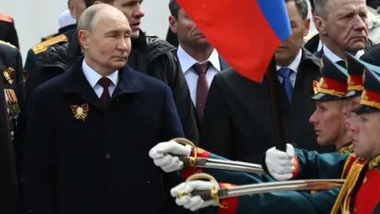

## Claim
Claim: "Russian President Vladimir Putin has declared war on the United States."

## Actions
```
web_search("Vladimir Putin declares war on United States")
```

## Evidence
### Evidence from `web_search`
Fact Crescendo states that there has been no official declaration of war by Russia against the USA, and the claim is unfounded. The BBC article discusses the war in Ukraine and Putin's goals, including "demilitarise and denazify" Ukraine, and mentions that Putin has not agreed to peace talks with Zelensky. , , , ,  The Journal of Democracy article discusses Putin's hostile policies towards the United States and his invocation of the NATO threat as justification. 

The sources are: [https://srilanka.factcrescendo.com/english/did-russia-declare-war-against-the-usa/](https://srilanka.factcrescendo.com/english/did-russia-declare-war-against-the-usa/), [https://www.bbc.com/news/articles/cj0q964851po](https://www.bbc.com/news/articles/cj0q964851po), and [https://www.journalofdemocracy.org/articles/what-putin-fears-most/](https://www.journalofdemocracy.org/articles/what-putin-fears-most/).


## Elaboration
The evidence indicates that there has been no official declaration of war by Russia against the USA. Fact Crescendo explicitly states that the claim is unfounded. While the Journal of Democracy discusses Putin's hostile policies towards the United States, it does not mention a declaration of war.


## Final Judgement
The evidence from multiple sources confirms that there has been no official declaration of war by Russia against the United States. The claim is therefore demonstrably false.

`false`

### Verdict: FALSE

### Justification
The claim that Vladimir Putin declared war on the United States is false. Fact Crescendo ([https://srilanka.factcrescendo.com/english/did-russia-declare-war-against-the-usa/](https://srilanka.factcrescendo.com/english/did-russia-declare-war-against-the-usa/)) explicitly states that there has been no such declaration.
