## Claim
Claim: " This image shows a Ukrainian F-16 fighter jet which was shot down by Russia as part of the large-scale Russian invasion in Ukraine."

## Actions
```
image_search("Ukrainian F-16 fighter jet crash")
```

## Evidence
### Evidence from `image_search`
NPR ([https://www.npr.org/2024/08/30/g-s1-20234/ukraine-f16-warplane-crash](https://www.npr.org/2024/08/30/g-s1-20234/ukraine-f16-warplane-crash)) and CNN ([https://www.cnn.com/2024/08/29/world/video/ukraine-f16-crashes-npw-nr-intl-digvid](https://www.cnn.com/2024/08/29/world/video/ukraine-f16-crashes-npw-nr-intl-digvid)) both contain images of F-16 fighter jets.

Politico.eu ([https://www.politico.eu/article/ukrainian-pilot-oleksiy-mes-killed-f-16-fighter-jet-crash-war-in-ukraine-russia-attack/](https://www.politico.eu/article/ukrainian-pilot-oleksiy-mes-killed-f-16-fighter-jet-crash-war-in-ukraine-russia-attack/)) published an article about a Ukrainian pilot who died in an F-16 fighter jet crash. 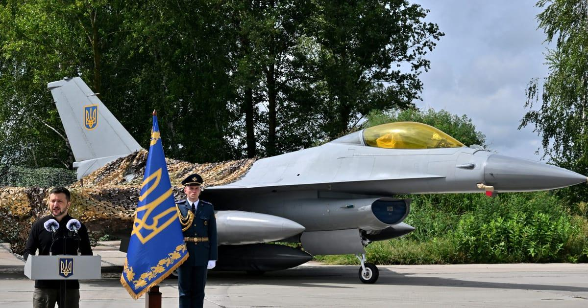


## Elaboration
The evidence confirms that Ukraine has F-16 fighter jets. The Politico.eu article mentions a Ukrainian pilot who died in an F-16 crash. However, the evidence does not confirm the cause of the crash or whether it was shot down by Russia.

The image search results do not provide enough information to verify the claim that the image shows an F-16 shot down by Russia. More information is needed to confirm the cause of the crash and the identity of the aircraft in the image.


## Actions
```
web_search("Ukrainian F-16 crash site")
image_search("F-16 crash site Ukraine")
```

## Evidence
### Evidence from `web_search`
Multiple sources report on the crash of Ukrainian F-16 fighter jets. The Aviation Safety Network ([https://asn.flightsafety.org/wikibase/415138](https://asn.flightsafety.org/wikibase/415138)) states that an F-16 crashed on August 26, 2024, in Kurhany, Rivne Oblast, Ukraine, during a Russian Federation missile and drone strike, killing the pilot. CNN ([https://www.cnn.com/2025/06/29/europe/ukraine-f-16-pilot-killed-russia](https://www.cnn.com/2025/06/29/europe/ukraine-f-16-pilot-killed-russia)) reported on June 29, 2025, about another F-16 crash and the death of a pilot. Breaking Defense ([https://breakingdefense.com/2024/09/debris-and-a-deadly-mission-the-vital-context-around-ukraines-lost-f-16/](https://breakingdefense.com/2024/09/debris-and-a-deadly-mission-the-vital-context-around-ukraines-lost-f-16/)) also discusses an F-16 crash, noting the pilot's death and that the cause is under investigation. , 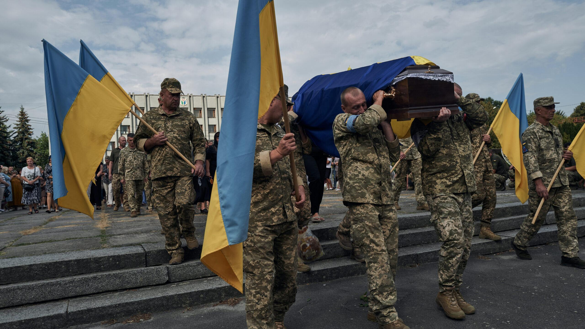, 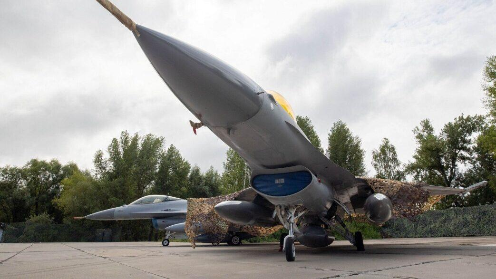, 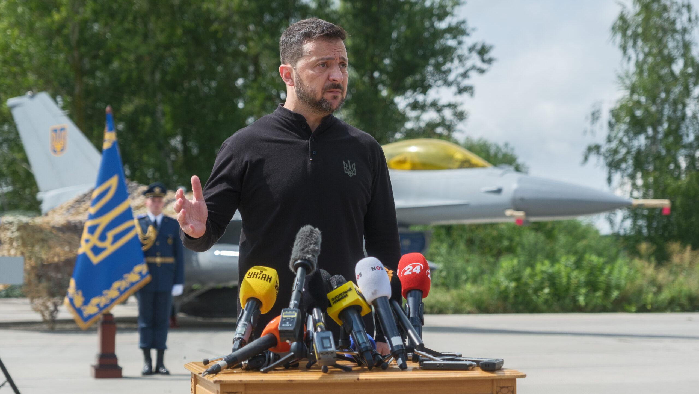


### Evidence from `image_search`
The web search results include an image of a destroyed F-16 aircraft from en.defence-ua.com ([https://en.defence-ua.com/news/image_of_destroyed_ukrainian_f_16_aircraft_near_odesa_emerges_as_belgian_incident-8983.html](https://en.defence-ua.com/news/image_of_destroyed_ukrainian_f_16_aircraft_near_odesa_emerges_as_belgian_incident-8983.html)) 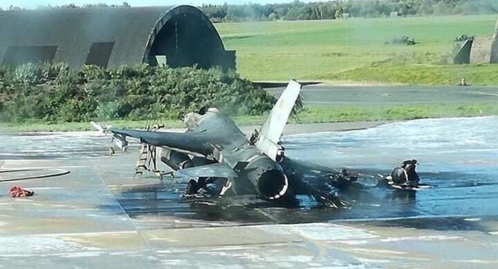. NBC News ([https://www.nbcnews.com/news/world/ukraine-f-16-crashes-pilot-dies-repelling-russian-strike-rcna168934](https://www.nbcnews.com/news/world/ukraine-f-16-crashes-pilot-dies-repelling-russian-strike-rcna168934)) 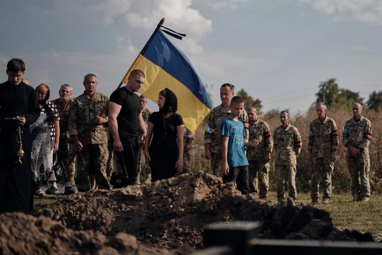 and The New York Times ([https://www.nytimes.com/2024/08/30/world/europe/ukraine-f16-crash.html](https://www.nytimes.com/2024/08/30/world/europe/ukraine-f16-crash.html)) 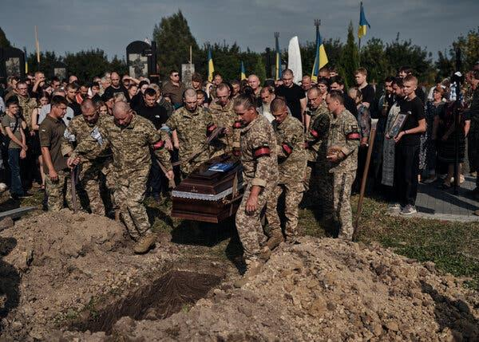 also report on the crash of a Ukrainian F-16, with the latter including an image of a funeral.


## Elaboration
The evidence confirms that Ukrainian F-16 fighter jets have crashed. The Aviation Safety Network reports a crash on August 26, 2024, during a Russian Federation missile and drone strike. Other sources also report on F-16 crashes and pilot deaths. However, the evidence does not confirm that the image in the claim depicts an F-16 shot down by Russia.


## Actions
```
web_search("image of destroyed F-16 Ukraine")
```

## Evidence
### Evidence from `web_search`
VoxUkraine ([https://voxukraine.org/en/photofake-a-photo-of-a-destroyed-ukrainian-air-force-base-after-a-bombardment-by-russian-iskanders](https://voxukraine.org/en/photofake-a-photo-of-a-destroyed-ukrainian-air-force-base-after-a-bombardment-by-russian-iskanders)) reports on a photo of a destroyed Ukrainian Air Force base, which is a photo fake generated by AI, showing destroyed F-16 aircraft 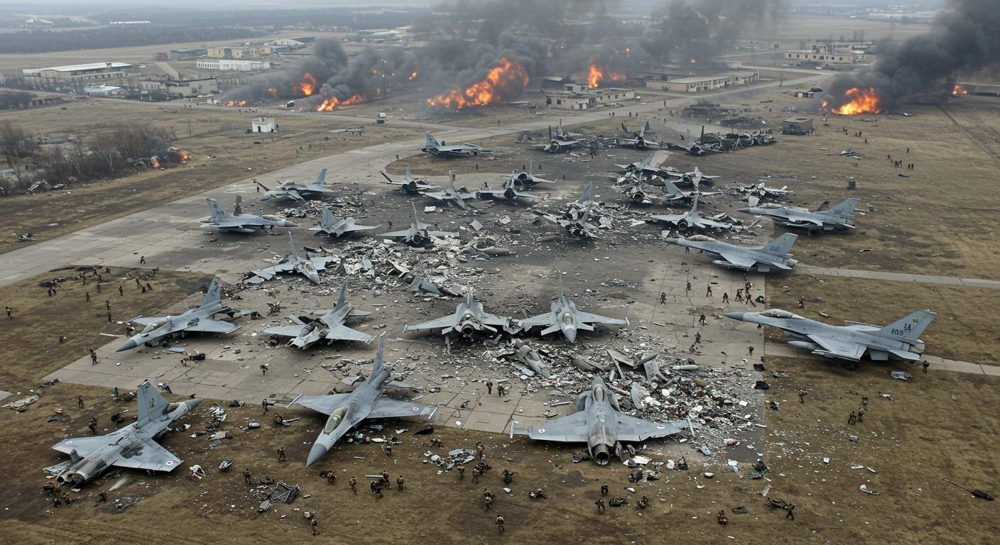, , 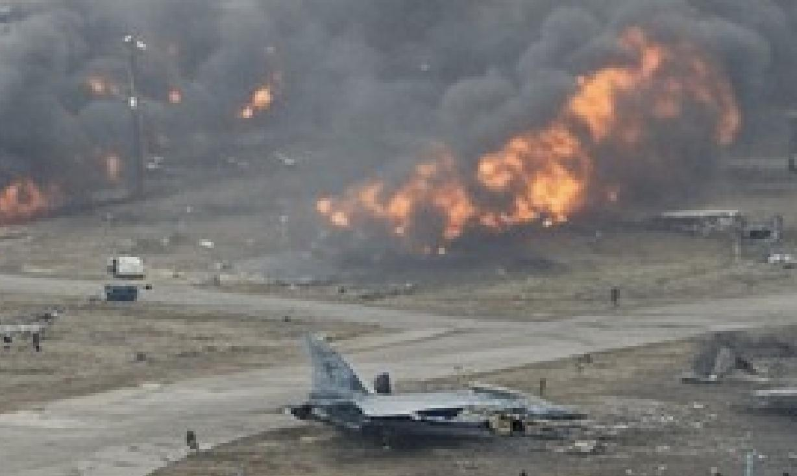. The BBC ([https://www.bbc.com/news/articles/cd0532n9pdko](https://www.bbc.com/news/articles/cd0532n9pdko)) states that a Ukrainian F-16 fighter jet was destroyed during a Russian missile attack, killing the pilot, but the cause of the crash was not a direct result of an enemy missile strike , 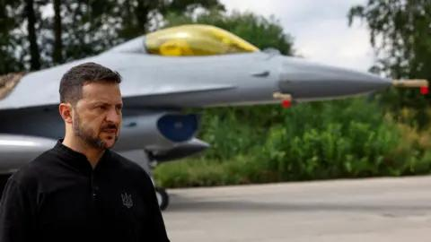. Newsweek ([https://www.newsweek.com/ukraine-loses-another-f-16-fighter-jet-2073083](https://www.newsweek.com/ukraine-loses-another-f-16-fighter-jet-2073083)) reports on the loss of another Ukrainian F-16 fighter jet, the third known loss during the war with Russia 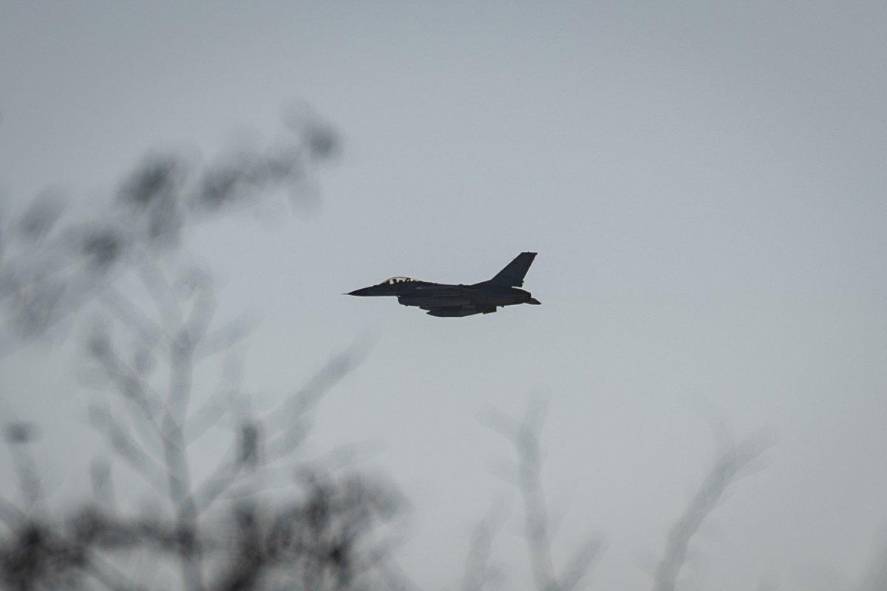.


## Elaboration
The evidence indicates that Ukrainian F-16 fighter jets have crashed, and at least one was destroyed during a Russian missile attack. However, the evidence does not confirm that the image in the claim depicts an F-16 shot down by Russia. The VoxUkraine article mentions a photo fake generated by AI.


## Final Judgement
The evidence confirms that Ukrainian F-16 fighter jets have crashed, and at least one was destroyed during a Russian missile attack. However, the evidence does not confirm that the image in the claim depicts an F-16 shot down by Russia. The image could be a photo fake.

`false`

### Verdict: FALSE

### Justification
The claim is not supported by the evidence. While Ukrainian F-16s have crashed, including one destroyed in a Russian missile attack, the provided evidence does not confirm that the image depicts an F-16 shot down by Russia. Furthermore, a source indicates that images of destroyed F-16s may be AI-generated photo fakes.
