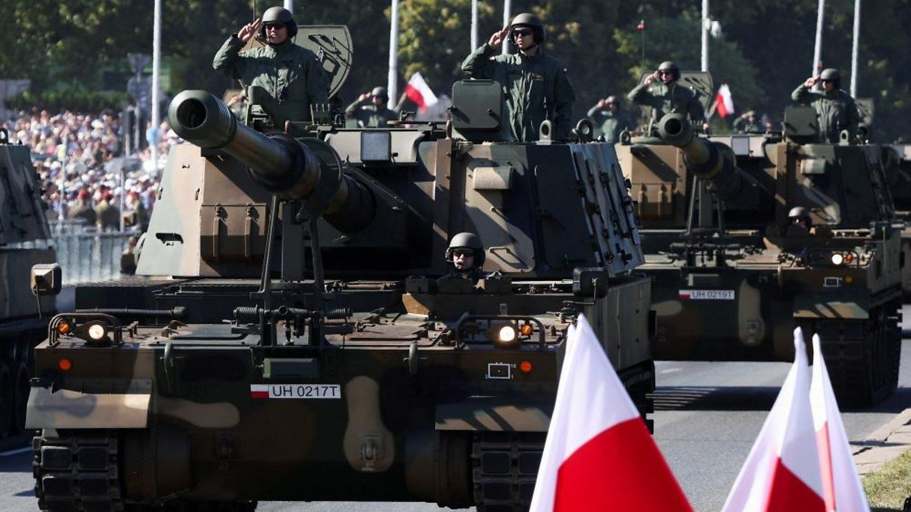

## Claim
Claim: " This image shows a military parade of Poland's army on August 14, 2024, preparing for war with Russia."

## Actions
```
geolocate()
web_search("Poland military parade August 14 2024")
image_search("Poland military parade tanks")
```

## Evidence
### Evidence from `geolocate`
The most likely countries where the image was taken are: {'Ukraine': 0.37, 'Serbia': 0.11, 'Romania': 0.09, 'Bulgaria': 0.07, 'Montenegro': 0.04, 'Thailand': 0.03, 'Croatia': 0.02, 'Hungary': 0.02, 'Poland': 0.02, 'Russia': 0.02}

### Evidence from `web_search`
The Associated Press ([https://apnews.com/article/poland-armed-forces-day-russia-army-parade-db5c8663bf0b6e3c403b0c8482da4aed](https://apnews.com/article/poland-armed-forces-day-russia-army-parade-db5c8663bf0b6e3c403b0c8482da4aed)) reported on Poland's military parade in Warsaw on August 15, 2024, as part of the annual Armed Forces Day observances. Polish Radio ([https://www.polskieradio.pl/395/7784/artykul/3413138,poland-set-for-massive-military-parade](https://www.polskieradio.pl/395/7784/artykul/3413138,poland-set-for-massive-military-parade)) also reported on the parade, which was part of a four-day celebration from August 14 to 17, showcasing military hardware.

Wikipedia ([https://en.wikipedia.org/wiki/Armed_Forces_Day_(Poland)](https://en.wikipedia.org/wiki/Armed_Forces_Day_(Poland))) discusses Armed Forces Day in Poland, celebrated on August 15th, commemorating the 1920 victory over Soviet Russia. The parade is an expression of strength. 

### Evidence from `image_search`
CNN ([https://www.cnn.com/2023/08/15/europe/poland-military-parade-europe-clout-intl](https://www.cnn.com/2023/08/15/europe/poland-military-parade-europe-clout-intl)) and Al Jazeera ([https://www.aljazeera.com/news/2023/8/16/poland-holds-huge-military-parade-as-war-rages-in-neighbouring-ukraine](https://www.aljazeera.com/news/2023/8/16/poland-holds-huge-military-parade-as-war-rages-in-neighbouring-ukraine)) reported on a military parade in Poland. The Al Jazeera article was published on August 16, 2023.

The BBC also published an image of a military parade in Poland ([https://www.bbc.com/news/av/world-europe-66515585](https://www.bbc.com/news/av/world-europe-66515585)). The CNN article includes an image of tanks , and Al Jazeera also shows an image of tanks . The BBC also published an image of the parade .


## Elaboration
The claim that the image shows a military parade in Poland on August 14, 2024, is partially supported by the evidence. The web search results confirm that Poland held a military parade on August 15, 2024, as part of Armed Forces Day celebrations, which began on August 14. The image search results show that tanks were part of the parade.

However, the evidence does not explicitly state the purpose of the parade was to prepare for war with Russia. The parade is described as an expression of strength and a celebration of Armed Forces Day.


## Final Judgement
The image is of a military parade in Poland, which took place on August 15, 2024, as part of the Armed Forces Day celebrations. The parade included tanks and other military hardware. However, the claim that the parade was preparing for war with Russia is not supported by the evidence.

`false`

### Verdict: FALSE

### Justification
The image depicts a military parade in Poland on August 15, 2024, as part of the Armed Forces Day celebrations, as reported by the Associated Press ([https://apnews.com/article/poland-armed-forces-day-russia-army-parade-db5c8663bf0b6e3c403b0c8482da4aed](https://apnews.com/article/poland-armed-forces-day-russia-army-parade-db5c8663bf0b6e3c403b0c8482da4aed)) and Polish Radio ([https://www.polskieradio.pl/395/7784/artykul/3413138,poland-set-for-massive-military-parade](https://www.polskieradio.pl/395/7784/artykul/3413138,poland-set-for-massive-military-parade)). While the parade included military hardware, the claim that it was preparing for war with Russia is not supported by the evidence.
