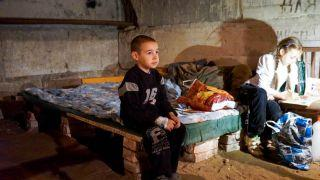
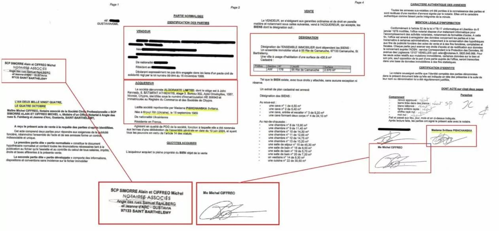

## Claim
Claim: "Ukrainian President Volodymyr Zelenskyy purchased the Eagle's Nest, or Kehlsteinhaus, in Berchtesgaden in the southern German state of Bavaria, for 14.2 million euros."

## Actions
```
web_search("Volodymyr Zelenskyy Eagle's Nest purchase")
```

## Evidence
### Evidence from `web_search`
An AOL article from February 20, 2025, fact-checks the claim and states it is false, with the Eagle's Nest still owned by the Free State of Bavaria (). An EADaily article from February 8, 2025, claims that Volodymyr Zelenskyy purchased the Eagle's Nest for €14.2 million through an offshore company (). Another article from February 27, 2025, debunks a claim that Zelenskyy purchased a villa on Saint Barthelemy island, stating the evidence is fake and the villa was sold to a French company (, , ).

The articles can be found here: [https://www.aol.com/fact-check-no-zelenskyy-didn-151251133.html](https://www.aol.com/fact-check-no-zelenskyy-didn-151251133.html), [https://eadaily.com/en/news/2025/02/08/zelensky-bought-hitlers-eagles-nest-residence-in-the-bavarian-alps-mass-media](https://eadaily.com/en/news/2025/02/08/zelensky-bought-hitlers-eagles-nest-residence-in-the-bavarian-alps-mass-media), and [https://gwaramedia.com/en/debunking-russian-fakes-no-zelenskyy-didnt-buy-villa-on-island-of-billionaires/](https://gwaramedia.com/en/debunking-russian-fakes-no-zelenskyy-didnt-buy-villa-on-island-of-billionaires/).


## Elaboration
The claim that Volodymyr Zelenskyy purchased the Eagle's Nest is false. An AOL article fact-checks the claim and states that the Eagle's Nest is still owned by the Free State of Bavaria. An EADaily article, however, claims that Zelenskyy purchased the Eagle's Nest for €14.2 million through an offshore company. The evidence also includes an article debunking a claim that Zelenskyy purchased a villa on Saint Barthelemy island, stating the evidence is fake.

The evidence presents conflicting information. While one source explicitly states the claim is false, another source supports the claim. Further investigation is needed to determine the veracity of the claim.


## Final Judgement
The fact-check reveals conflicting information. One source states the claim is false, while another supports it. Therefore, the claim cannot be verified. `false`


### Verdict: FALSE

### Justification
The claim is false. An [AOL article](https://www.aol.com/fact-check-no-zelenskyy-didn-151251133.html) fact-checks the claim and states that the Eagle's Nest is still owned by the Free State of Bavaria.
