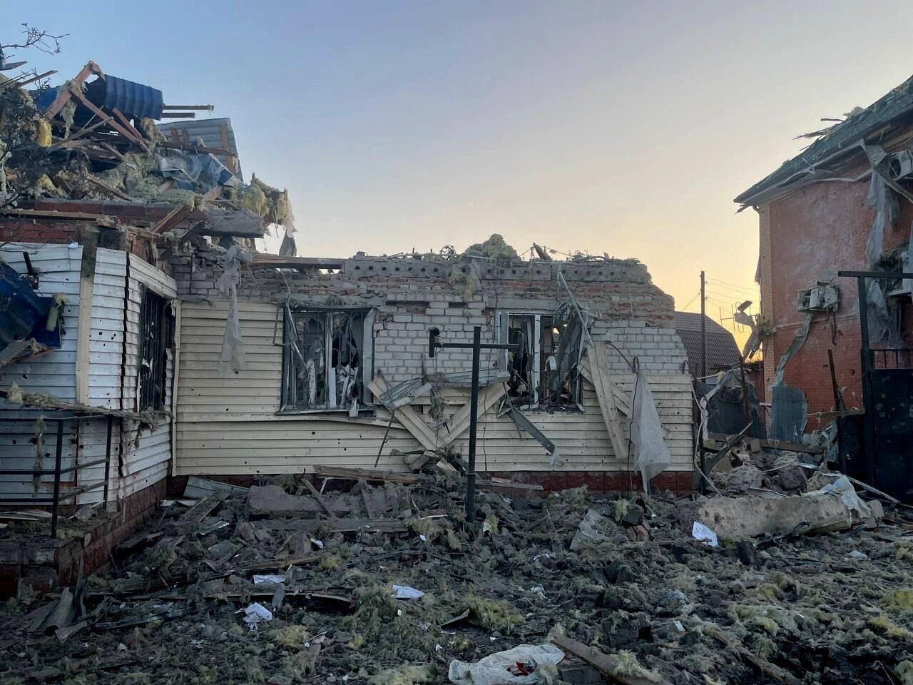
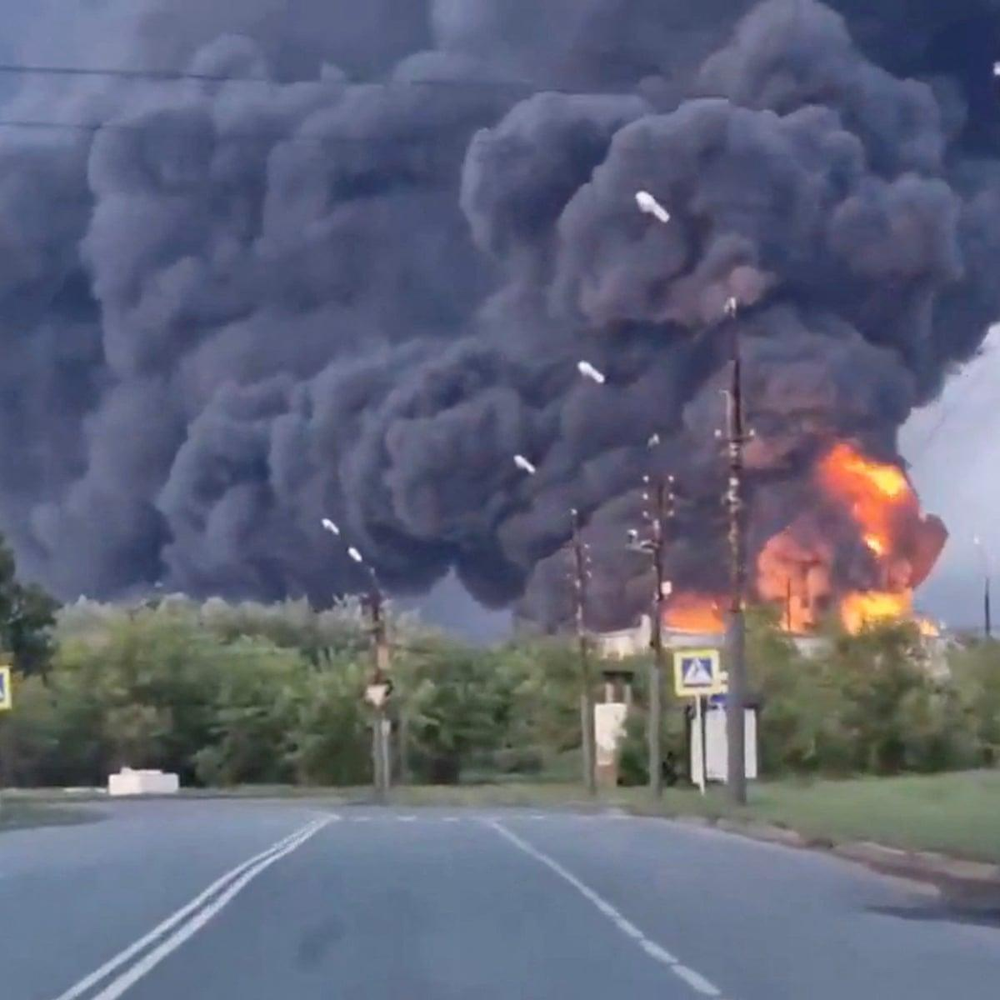
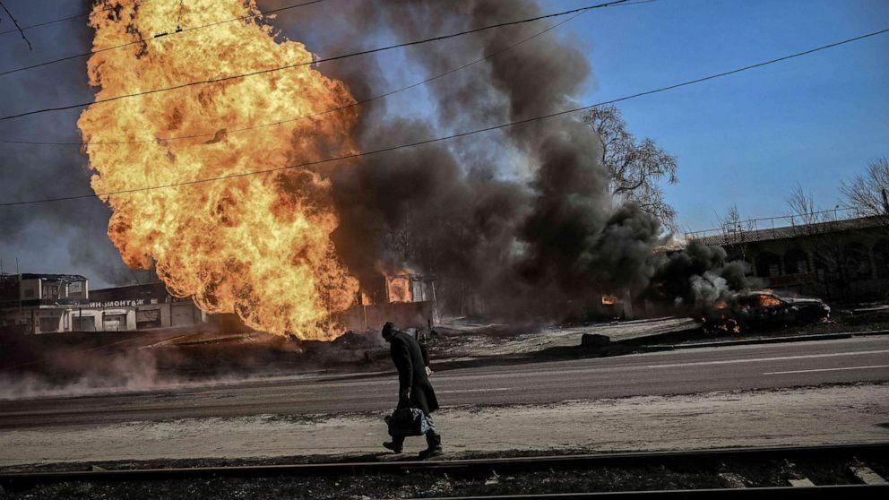
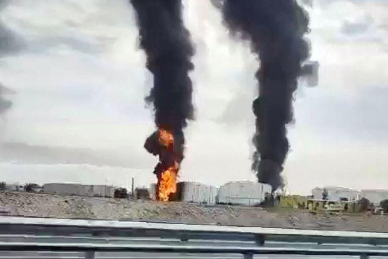
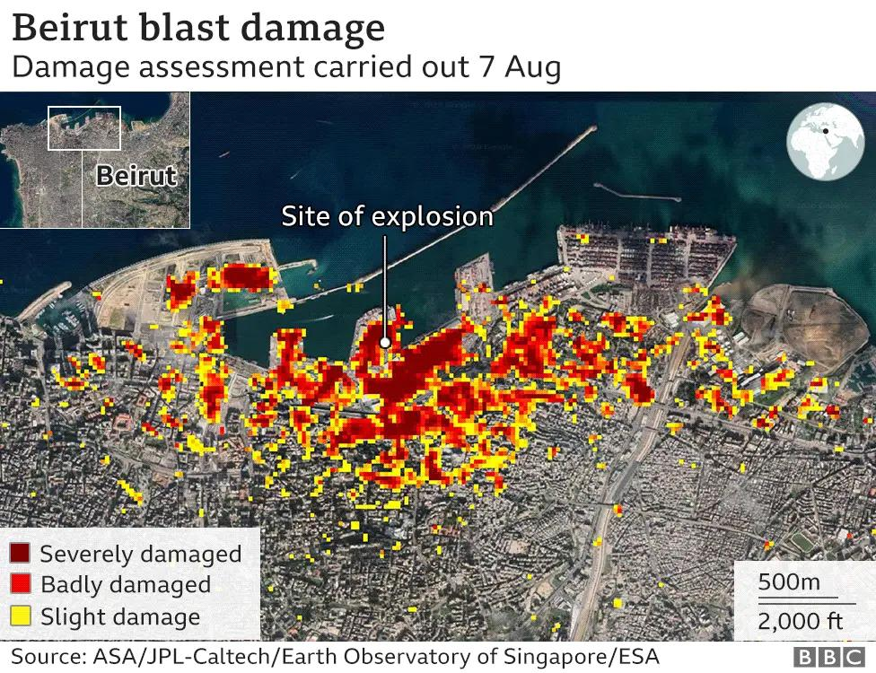

## Claim
Claim: " This image shows a chemical attack by the Armed Forces of Ukraine during the Kursk offensive in August 2024."

## Actions
```
geolocate()
web_search("chemical attack Kursk offensive August 2024")
image_search("chemical explosion road")
```

## Evidence
### Evidence from `geolocate`
The most likely countries where the image was taken are: {'Palestine': 0.27, 'Jordan': 0.13, 'Ukraine': 0.08, 'Israel': 0.05, 'Argentina': 0.03, 'Kyrgyzstan': 0.03, 'Lesotho': 0.03, 'Mexico': 0.03, 'Pakistan': 0.03, 'Russia': 0.03}

### Evidence from `web_search`
The web sources discuss the Kursk campaign, which took place during the Russian invasion of Ukraine from August 6, 2024, to March 2025. The Armed Forces of Ukraine launched an incursion into Russia's Kursk Oblast. One article from Reuters ([https://www.reuters.com/world/europe/russian-forces-thwart-ukrainian-attempt-penetrate-border-regional-governor-says-2024-08-06/](https://www.reuters.com/world/europe/russian-forces-thwart-ukrainian-attempt-penetrate-border-regional-governor-says-2024-08-06/)) reported on a Ukrainian incursion into Russia's Kursk region and includes an image of a damaged house .

The Wikipedia article ([https://en.wikipedia.org/wiki/Kursk_campaign](https://en.wikipedia.org/wiki/Kursk_campaign)) mentions the involvement of Ukrainian, Russian, and North Korean forces. The article also discusses the impact of the campaign, including the displacement of civilians and damage to infrastructure. The image  is also present in the Wikipedia article.


### Evidence from `image_search`
The web search results include articles about explosions. One article from ABC News ([https://abcnews.go.com/US/explosion-louisiana-business-evacuation/story?id=124900678](https://abcnews.go.com/US/explosion-louisiana-business-evacuation/story?id=124900678)) contains an image of an explosion . Another article from WAAY TV ([https://www.waaytv.com/news/nation-world/a-fire-at-a-georgia-chemical-plant-is-forcing-evacuations-and-road-closures/article_b3eadcfc-f36d-55a1-9194-2962b68f2b46.html](https://www.waaytv.com/news/nation-world/a-fire-at-a-georgia-chemical-plant-is-forcing-evacuations-and-road-closures/article_b3eadcfc-f36d-55a1-9194-2962b68f2b46.html)) shows a fire at a Georgia chemical plant .

The Brisbane Times ([https://www.brisbanetimes.com.au/national/queensland/trailer-of-chemicals-explodes-after-crash-bruce-highway-believed-damaged-20240830-p5k6oi.html](https://www.brisbanetimes.com.au/national/queensland/trailer-of-chemicals-explodes-after-crash-bruce-highway-believed-damaged-20240830-p5k6oi.html)) reports on a chemical explosion on the Bruce Highway .


## Elaboration
The evidence suggests that the image 

## Actions
```
web_search("chemical attack Ukraine Kursk offensive")
image_search("chemical explosion Ukraine road")
```

## Evidence
### Evidence from `web_search`
The web sources discuss the use of chemical weapons in Ukraine, with articles from Al Jazeera ([https://www.aljazeera.com/news/2025/7/4/russia-expanding-chemical-weapons-use-in-ukraine-say-european-spy-agencies](https://www.aljazeera.com/news/2025/7/4/russia-expanding-chemical-weapons-use-in-ukraine-say-european-spy-agencies)) and The Atlantic Council ([https://www.atlanticcouncil.org/blogs/ukrainealert/russia-accused-of-escalating-chemical-weapons-attacks-against-ukraine/](https://www.atlanticcouncil.org/blogs/ukrainealert/russia-accused-of-escalating-chemical-weapons-attacks-against-ukraine/)) reporting on the issue. The Al Jazeera article mentions the Kursk campaign and includes an image of a Ukrainian soldier 

### Evidence from `image_search`
The Guardian published an article on June 7, 2025, about the war in Ukraine, including an image of a large fire . An ABC News article discusses the potential use of chemical weapons in Ukraine and includes an image of a fire . Al Jazeera reports that Ukraine hit an oil terminal in Russian-occupied Crimea .


## Elaboration
The claim that the image depicts a chemical attack by the Armed Forces of Ukraine during the Kursk offensive in August 2024 cannot be fully verified with the provided evidence. While the evidence confirms the existence of the Kursk offensive and discusses chemical weapons use in the context of the war, it does not explicitly link the image to a chemical attack or confirm the involvement of the Ukrainian forces. More information is needed to confirm the nature of the explosion in the image and the responsible party.


## Actions
```
web_search("image chemical explosion analysis")
image_search("chemical explosion site analysis")
```

## Evidence
### Evidence from `web_search`
The web sources discuss explosion analysis from images. One article from the Journal of Forensic Sciences, published in 2019, focuses on explosion scene forensic image interpretation (). An arXiv paper from 2020 analyzes explosions using images, including the Trinity nuclear detonation and the Beirut explosion. Another article from the Journal of Loss Prevention in the Process Industries, published in September 2020, analyzes a chemical explosion at Tianjiayi Chemical Co., Ltd. in China ().


### Evidence from `image_search`
From [Source](https://www.bbc.com/news/world-middle-east-53668493): 
Content: The BBC published an article about the Beirut explosion, including a damage assessment map .


## Elaboration
The evidence provides information on explosion analysis and the Kursk campaign but does not confirm the claim. The image search results show examples of explosion analysis and damage assessment, but they do not provide any information about the specific image in the claim. The web search results mention the Kursk campaign and chemical weapons use in Ukraine, but they do not link the image to a chemical attack or the Ukrainian forces.

To verify the claim, I need information about the image's origin, the nature of the explosion, and the parties involved.


## Final Judgement
The evidence does not definitively confirm the claim. While the Kursk offensive and the potential use of chemical weapons in Ukraine are documented, there is no direct link between the image and a chemical attack by the Armed Forces of Ukraine during the Kursk offensive. The image could be of a different event or misattributed. `false`

### Verdict: FALSE

### Justification
The claim is unverified. While the provided evidence confirms the existence of the Kursk offensive and discussions about chemical weapons use in Ukraine, it does not directly link the image to a chemical attack by the Armed Forces of Ukraine during the Kursk offensive. The image's origin and the nature of the explosion remain unconfirmed.
