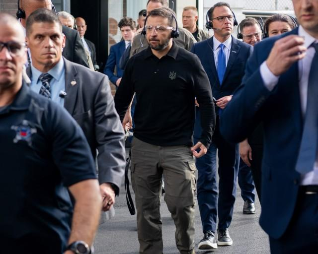
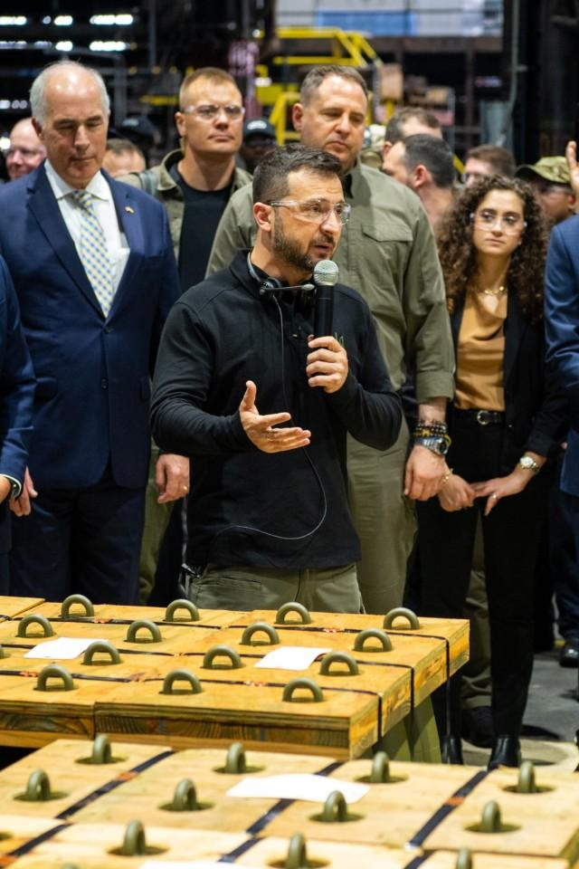
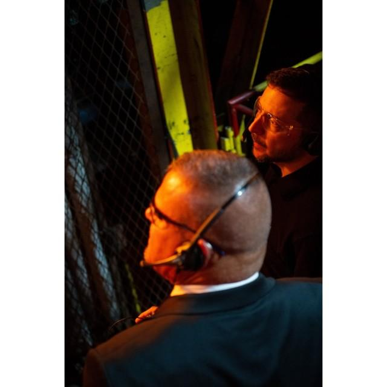
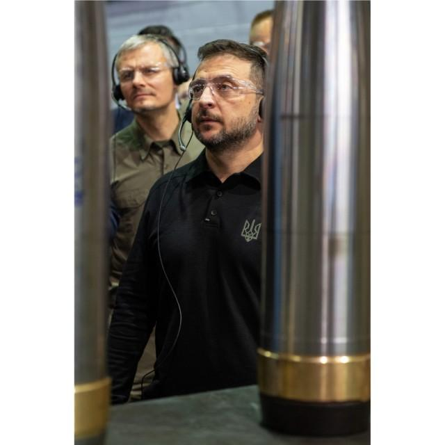
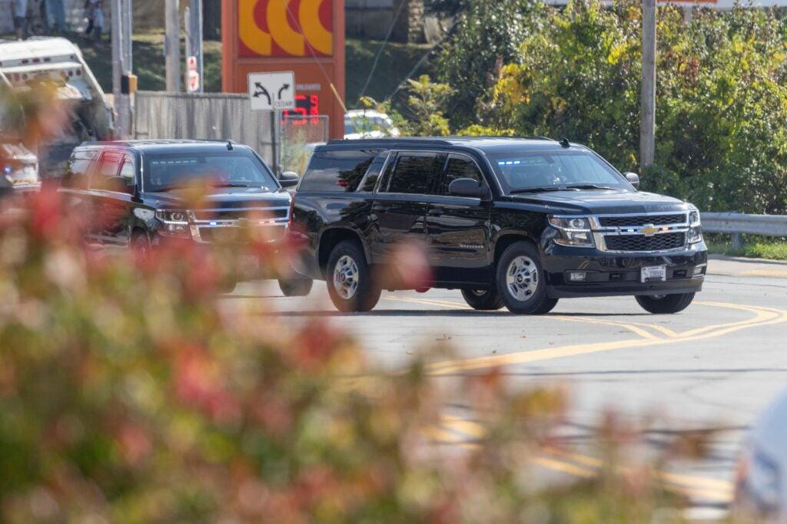
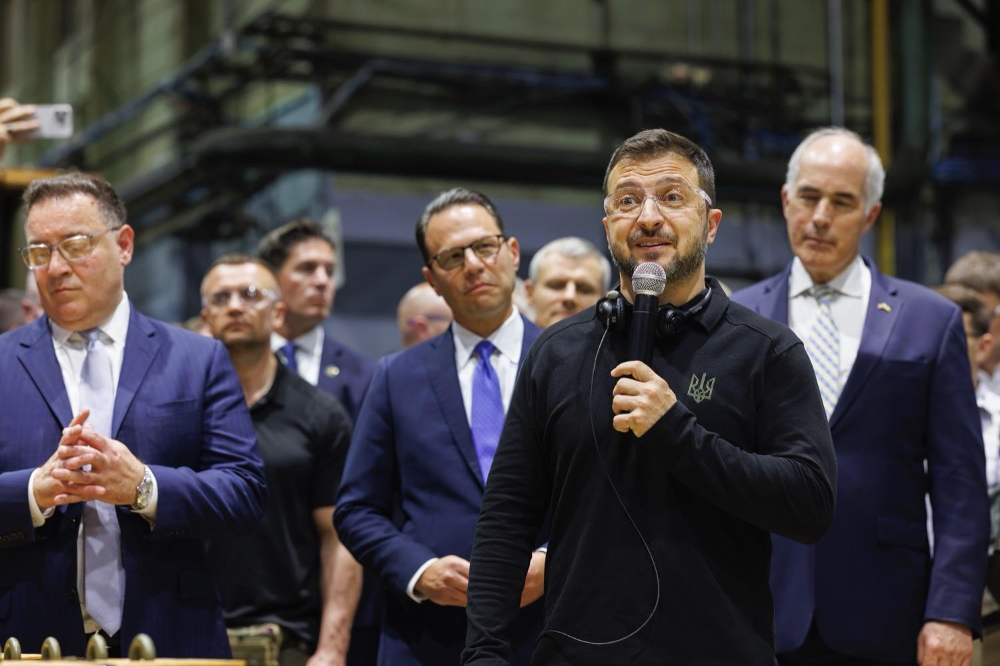

## Claim
Claim: "Ukrainian President Volodymyr Zelenskyy engaged in election interference by campaigning in Pennsylvania for Kamala Harris ahead of the US presidential election in 2024."

## Actions
```
web_search("Volodymyr Zelenskyy Kamala Harris Pennsylvania 2024")
```

## Evidence
### Evidence from `web_search`
Newsweek reports that JD Vance accused Volodymyr Zelenskyy of campaigning for Kamala Harris during the 2024 presidential race, mentioning a visit by Zelenskyy to a munitions plant in Scranton, Pennsylvania, in September 2024 (, ). House Republicans are investigating whether Zelensky's appearance was an improper use of tax dollars. See: [https://www.newsweek.com/volodymyr-zelensky-jd-vance-campaign-kamala-harris-2024-election-2038060](https://www.newsweek.com/volodymyr-zelensky-jd-vance-campaign-kamala-harris-2024-election-2038060).

NBC News reports that Zelenskyy visited a munitions factory in Scranton, Pennsylvania, which some Republicans viewed as a signal of which way he wants the November election to go. Kamala Harris is scheduled to meet with Zelenskyy at the White House. See: [https://www.nbcnews.com/politics/2024-election/zelenskyys-meeting-harris-spat-trump-reveal-growing-partisan-divide-uk-rcna172648](https://www.nbcnews.com/politics/2024-election/zelenskyys-meeting-harris-spat-trump-reveal-growing-partisan-divide-uk-rcna172648). ABC News reports on Vice President Kamala Harris meeting with Ukrainian President Volodymyr Zelenskyy to discuss the war with Russia (, ). The article mentions Zelenskyy's visit to Washington and his meetings with U.S. lawmakers. See: [https://abcnews.go.com/Politics/harris-standing-zelenskyy-indirectly-jabs-trump-vance-ukraine/story?id=114219628](https://abcnews.go.com/Politics/harris-standing-zelenskyy-indirectly-jabs-trump-vance-ukraine/story?id=114219628).


## Elaboration
The evidence indicates that Volodymyr Zelenskyy visited a munitions plant in Scranton, Pennsylvania, and met with Kamala Harris. Some Republicans, including JD Vance, have suggested that these actions constitute campaigning for Harris. However, the evidence does not explicitly state that Zelenskyy was campaigning for Harris. It only mentions that some viewed his actions as a signal of his preference in the upcoming election.

The evidence also mentions that House Republicans are investigating whether Zelensky's appearance was an improper use of tax dollars. This suggests that there is a debate over the nature of Zelenskyy's actions and whether they constitute election interference.

To fully verify the claim, more information is needed. Specifically, it would be helpful to know the details of Zelenskyy's statements and actions during his visit to Pennsylvania and his meeting with Harris. It would also be helpful to know the outcome of the House Republicans' investigation.


## Actions
```
web_search("Volodymyr Zelenskyy Scranton Pennsylvania speech")
image_search("Volodymyr Zelenskyy Scranton Pennsylvania")
```

## Evidence
### Evidence from `web_search`
Volodymyr Zelenskyy visited the Scranton Army Ammunition Plant in Pennsylvania in September 2024, where he thanked the workforce for their support and emphasized the partnership between Ukraine and the U.S. (, , , ). He also met with Matt Cartwright, a Democrat, and was scheduled to meet with President Joe Biden and Vice President Kamala Harris (). The U.S. Army website published an article on September 22, 2024, reporting on Zelenskyy's visit. See: [https://www.army.mil/article/279907/ukrainian_president_zelenskyy_praises_scranton_dod_for_role_supporting_ukraine](https://www.army.mil/article/279907/ukrainian_president_zelenskyy_praises_scranton_dod_for_role_supporting_ukraine) and [https://whyy.org/articles/ukraine-president-volodymyr-zelenskyy-visits-scranton-pennsylvania-ammunition-factory/](https://whyy.org/articles/ukraine-president-volodymyr-zelenskyy-visits-scranton-pennsylvania-ammunition-factory/).


### Evidence from `image_search`
From [Source](https://penncapital-star.com/government-politics/shapiro-casey-meet-with-zelenskyy-at-scranton-pennsylvania-ammunitions-factory/): 
Content: Penn Capital-Star reports that Volodymyr Zelenskyy visited a munitions factory in Scranton, Pennsylvania. 


## Elaboration
The evidence confirms that Zelenskyy visited a munitions factory in Scranton, Pennsylvania, in September 2024. During this visit, he thanked the workforce and emphasized the partnership between Ukraine and the U.S. He also met with a Democrat, Matt Cartwright, and was scheduled to meet with President Biden and Vice President Harris. However, the evidence does not show that Zelenskyy campaigned for Kamala Harris.


## Final Judgement
The evidence shows that Zelenskyy visited a munitions factory in Pennsylvania and met with Kamala Harris, but there is no evidence that he campaigned for her. Therefore, the claim is not factually accurate. `false`

### Verdict: FALSE

### Justification
The claim is false. While Volodymyr Zelenskyy visited a munitions factory in Scranton, Pennsylvania, and met with Kamala Harris, there is no evidence to suggest that he was campaigning for her or engaging in election interference. News reports indicate that Zelenskyy's visit was focused on thanking the workforce and emphasizing the partnership between Ukraine and the U.S. [Newsweek](https://www.newsweek.com/volodymyr-zelensky-jd-vance-campaign-kamala-harris-2024-election-2038060) and [NBC News](https://www.nbcnews.com/politics/2024-election/zelenskyys-meeting-harris-spat-trump-reveal-growing-partisan-divide-uk-rcna172648) reported on the visit and the political interpretations of it.
