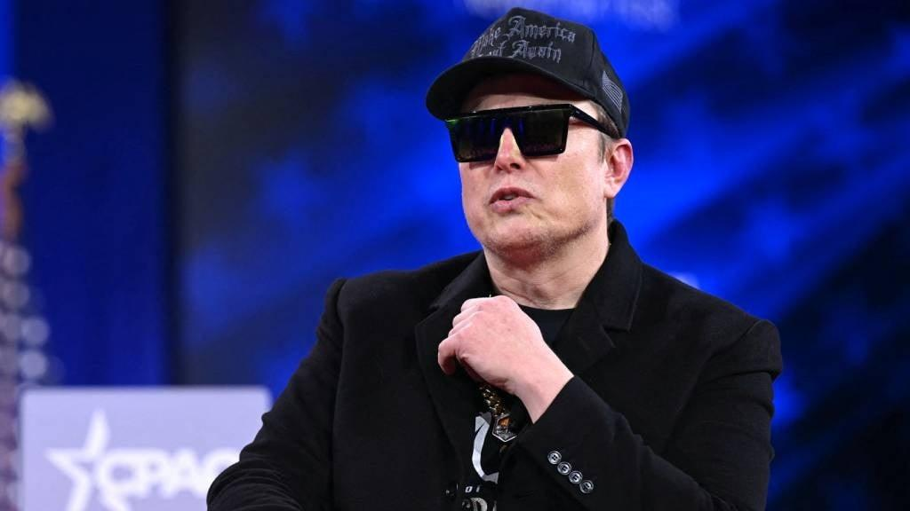

## Claim
Claim: "In February 2025 Elon Musk posted on X that he is planning to suspend Ukraine President Volodymyr Zelenskyy’s X account."

## Actions
```
web_search("Elon Musk Volodymyr Zelenskyy X account suspension")
```

## Evidence
### Evidence from `web_search`
Al Jazeera ([https://www.aljazeera.com/economy/2025/2/21/musk-vows-to-fix-x-after-polls-show-high-support-for-ukraines-zelenskyy](https://www.aljazeera.com/economy/2025/2/21/musk-vows-to-fix-x-after-polls-show-high-support-for-ukraines-zelenskyy)) and News24 ([https://www.news24.com/world/ironic-elon-musk-vows-to-fix-x-after-polls-show-high-support-for-ukraine-president-zelensky-20250221](https://www.news24.com/world/ironic-elon-musk-vows-to-fix-x-after-polls-show-high-support-for-ukraine-president-zelensky-20250221)) reported on February 21, 2025, that Elon Musk made statements on X regarding Ukrainian President Volodymyr Zelenskyy, including claims about Zelenskyy's potential loss in an election. The articles also mention Musk's criticism of X's fact-checking tool and his alignment with Donald Trump's views.

The Independent ([https://www.independent.co.uk/news/world/americas/us-politics/elon-musk-x-ukraine-trump-zelensky-b2702216.html](https://www.independent.co.uk/news/world/americas/us-politics/elon-musk-x-ukraine-trump-zelensky-b2702216.html)) reported that Musk accused Zelenskyy of "feeding off the dead bodies of Ukrainian soldiers" on X. The article also mentions Musk's inaccurate claims on X. The articles include images of Elon Musk , , and .


## Elaboration
The evidence indicates that Elon Musk made statements on X regarding Volodymyr Zelenskyy in February 2025. However, the provided sources do not explicitly state that Musk planned to suspend Zelenskyy's X account. Instead, the evidence mentions Musk's criticism of Zelenskyy and his alignment with Donald Trump's views.

The Independent ([https://www.independent.co.uk/news/world/americas/us-politics/elon-musk-x-ukraine-trump-zelensky-b2702216.html](https://www.independent.co.uk/news/world/americas/us-politics/elon-musk-x-ukraine-trump-zelensky-b2702216.html)) reported that Musk accused Zelenskyy of "feeding off the dead bodies of Ukrainian soldiers" on X.

Therefore, the claim cannot be verified based on the provided evidence.


## Final Judgement
The search results confirm that Elon Musk made statements on X regarding Volodymyr Zelenskyy in February 2025. However, the provided sources do not explicitly state that Musk planned to suspend Zelenskyy's X account. The evidence mentions Musk's criticism of Zelenskyy, but not a suspension plan.

`false`

### Verdict: FALSE

### Justification
While Elon Musk made statements about Volodymyr Zelenskyy on X in February 2025, as reported by sources like [Al Jazeera](https://www.aljazeera.com/economy/2025/2/21/musk-vows-to-fix-x-after-polls-show-high-support-for-ukraines-zelenskyy) and [The Independent](https://www.independent.co.uk/news/world/americas/us-politics/elon-musk-x-ukraine-trump-zelensky-b2702216.html), there is no evidence in the provided search results to support the claim that he planned to suspend Zelenskyy's X account.
