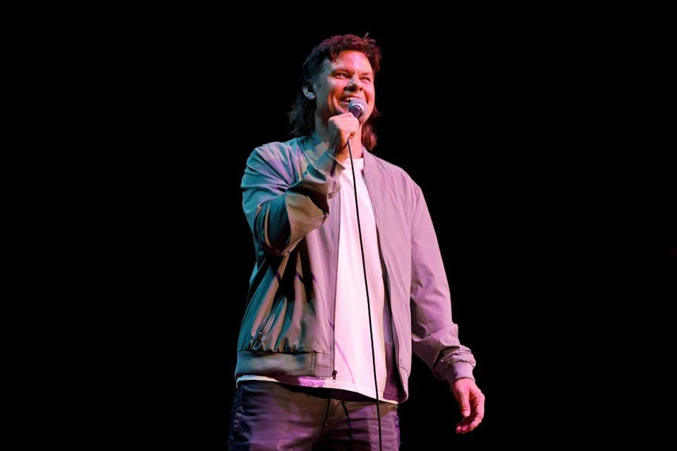

## Claim
Claim: "In an interview with podcaster Theo Von in August 2024, Donald Trump criticized British Prime Minister Keir Starmer over a 100-year deal between the U.K. and Ukraine."

## Actions
```
web_search("Donald Trump Theo Von interview August 2024 Keir Starmer Ukraine deal")
```

## Evidence
### Evidence from `web_search`
The University of California, Berkeley, published an article on January 29, 2025, discussing a video of Donald Trump criticizing Keir Starmer, with the audio being AI-generated and overlaid onto a video interview with Theo Von on August 21, 2024. Neither Trump nor Von discussed the UK or Ukraine in the original video ([https://www.ischool.berkeley.edu/news/2025/hany-farid-discusses-circulating-trump-video-criticizing-keir-starmer](https://www.ischool.berkeley.edu/news/2025/hany-farid-discusses-circulating-trump-video-criticizing-keir-starmer)).

Grabien published a fact check on February 5, 2025, stating that Donald Trump did not criticize Keir Starmer over a 100-year deal between the U.K. and Ukraine in an interview with Theo Von in August 2024 ([https://news.grabien.com/wire-fact-check-no-donald-trump-did-not-criticize-keir-starmer-over-a-100-y](https://news.grabien.com/wire-fact-check-no-donald-trump-did-not-criticize-keir-starmer-over-a-100-y)). A Yahoo article discusses an interview with Donald Trump on Theo Von's podcast, which does not mention Keir Starmer or a deal between the U.K. and Ukraine  ([https://www.yahoo.com/entertainment/thats-down-dirty-donald-trump-170420799.html](https://www.yahoo.com/entertainment/thats-down-dirty-donald-trump-170420799.html)).


## Elaboration
The evidence indicates that the claim is false. Multiple sources confirm that Donald Trump did not criticize Keir Starmer regarding a deal between the U.K. and Ukraine in his August 2024 interview with Theo Von. One source explicitly states that the audio was AI-generated and overlaid onto the video.


## Final Judgement
The claim is demonstrably false. Multiple sources, including a fact-check from Grabien and an article from the University of California, Berkeley, confirm that the audio of Trump criticizing Starmer was AI-generated and not part of the original interview. The Yahoo article about the interview also does not mention the topics in the claim.

`false`

### Verdict: FALSE

### Justification
The claim is false. Multiple sources, including a fact-check from Grabien ([https://news.grabien.com/wire-fact-check-no-donald-trump-did-not-criticize-keir-starmer-over-a-100-y](https://news.grabien.com/wire-fact-check-no-donald-trump-did-not-criticize-keir-starmer-over-a-100-y)) and an article from the University of California, Berkeley ([https://www.ischool.berkeley.edu/news/2025/hany-farid-discusses-circulating-trump-video-criticizing-keir-starmer](https://www.ischool.berkeley.edu/news/2025/hany-farid-discusses-circulating-trump-video-criticizing-keir-starmer)), confirm that the audio of Trump criticizing Starmer was AI-generated and not part of the original interview.
