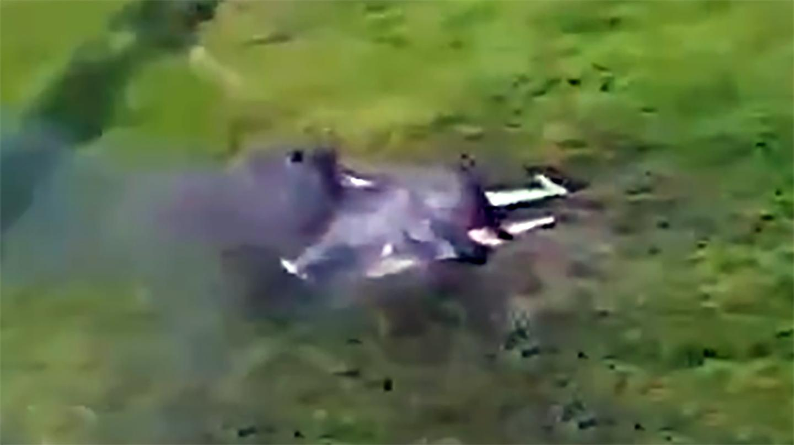
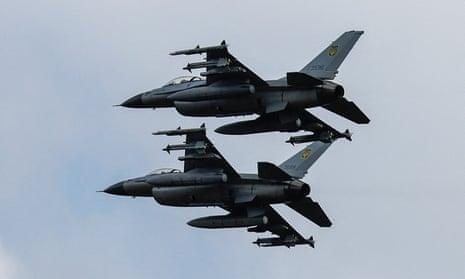
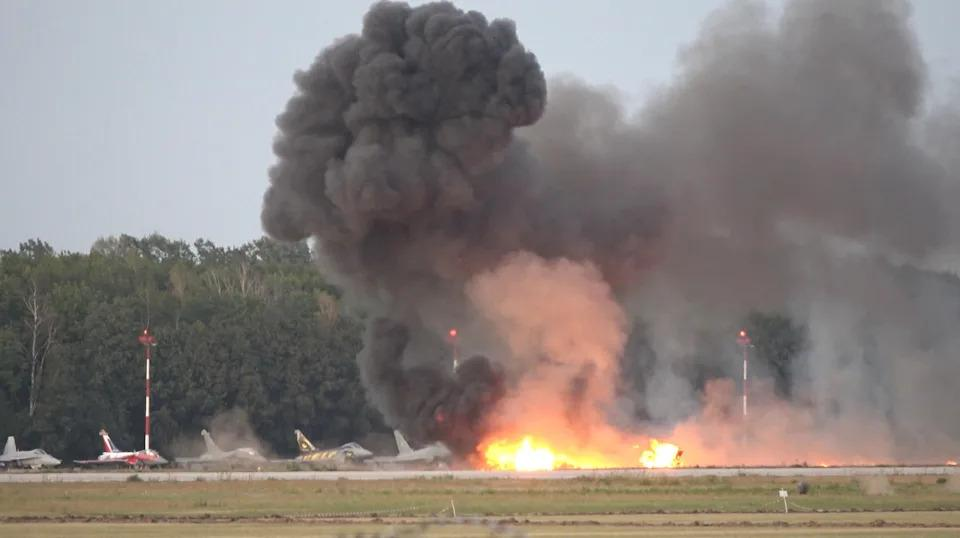
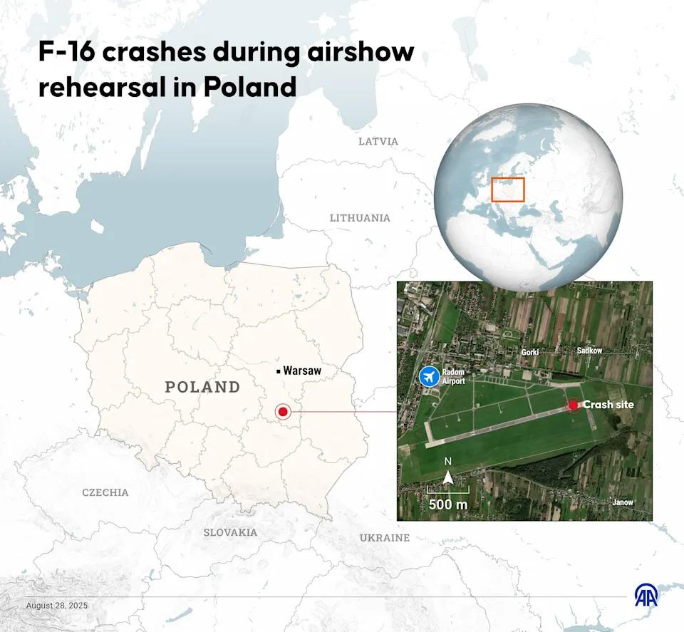

## Claim
Claim: " This image shows a US F-16 fighter jet which was shot down in August 2024 in airspace over the Black Sea after refusing to obey Russian orders."

## Actions
```
web_search("F-16 shot down Black Sea August 2024")
image_search("F-16 shot down Black Sea")
```

## Evidence
### Evidence from `web_search`
Defense News reports that an F-16 jet crashed during a Russian missile attack, killing the pilot. The article was published on August 29, 2024. The War Zone discusses claims of a Ukrainian F-16 shooting down a Russian Su-35S Flanker, mentioning an F-16 pilot who died in August 2024. The Guardian published an article on August 28, 2024, discussing the Ukraine war and mentioning that F-16s were used to shoot down Russian missiles.

The sources are: [https://www.defensenews.com/global/europe/2024/08/29/ukraine-f-16-jet-crashes-during-russian-attack-killing-pilot/](https://www.defensenews.com/global/europe/2024/08/29/ukraine-f-16-jet-crashes-during-russian-attack-killing-pilot/), [https://www.twz.com/air/claims-swirl-around-russian-su-35s-flanker-shootdown](https://www.twz.com/air/claims-swirl-around-russian-su-35s-flanker-shootdown), and [https://www.theguardian.com/world/article/2024/aug/28/ukraine-war-briefing-zelenskiy-says-f16s-shooting-down-russian-missiles](https://www.theguardian.com/world/article/2024/aug/28/ukraine-war-briefing-zelenskiy-says-f16s-shooting-down-russian-missiles).     


### Evidence from `image_search`
NPR discusses an F-16 warplane crash. () The South China Morning Post published an article about Ukraine destroying a Russian fighter jet. ()

*   [https://www.npr.org/2024/08/30/g-s1-20234/ukraine-f16-warplane-crash](https://www.npr.org/2024/08/30/g-s1-20234/ukraine-f16-warplane-crash)
*   [https://www.scmp.com/news/world/russia-central-asia/article/3308983/ukraine-destroys-russia-fighter-jet-missile-sea-drone-world-first-says-kyiv-military](https://www.scmp.com/news/world/russia-central-asia/article/3308983/ukraine-destroys-russia-fighter-jet-missile-sea-drone-world-first-says-kyiv-military)


## Elaboration
The evidence confirms that an F-16 jet crashed in August 2024, as reported by Defense News and NPR. However, the provided evidence does not specify the cause of the crash, nor does it mention the Black Sea or Russian orders.

The image shows a jet on fire, which could be an F-16, but the evidence does not confirm the type of jet in the image. The claim's assertion that the jet was shot down after refusing Russian orders is not supported by the evidence.

Therefore, the claim is not supported by the evidence. More information is needed to verify the cause of the crash and the circumstances surrounding it.


## Actions
```
web_search("F-16 crash Black Sea Russia Ukraine")
```

## Evidence
### Evidence from `web_search`
Yahoo News reports that an F-16 crashed during an air show preparation in Poland on August 28, 2025, killing the pilot. (, ) CNN reports that a Ukrainian F-16 pilot was killed in a crash after a Russian aerial assault on June 29, 2025. () PBS NewsHour reports that an F-16 donated by Western partners crashed during a Russian missile attack on August 29, 2024, and the pilot died. () None of the sources mention the Black Sea or Russian orders.


## Elaboration
The evidence indicates that F-16s have crashed in different circumstances. One crashed during an air show preparation in Poland in August 2025, another during a Russian aerial assault on June 29, 2025, and a third during a Russian missile attack on August 29, 2024. However, none of the provided sources mention the Black Sea or Russian orders, as stated in the claim.

Therefore, the claim is not supported by the evidence.


## Final Judgement
The evidence indicates that F-16s have crashed in different circumstances, but none of the sources mention the Black Sea or Russian orders. The claim is not supported by the evidence. `false`

### Verdict: FALSE

### Justification
The claim is unsubstantiated. While there are reports of F-16 crashes, including one during a Russian missile attack in August 2024, none of the provided evidence supports the claim that an F-16 was shot down over the Black Sea after refusing Russian orders. The evidence includes reports from [Defense News](https://www.defensenews.com/global/europe/2024/08/29/ukraine-f-16-jet-crashes-during-russian-attack-killing-pilot/), [PBS NewsHour](https://www.pbs.org/newshour/world/ukraine-receives-first-f-16-fighter-jets-from-western-allies), and [Yahoo News](https://www.yahoo.com/news/f-16-crashes-during-airshow-150000777.html), but none of these sources corroborate the specific details of the claim.
