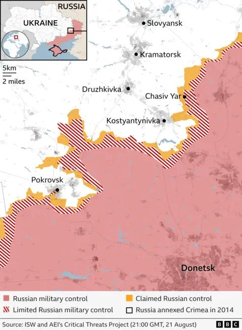
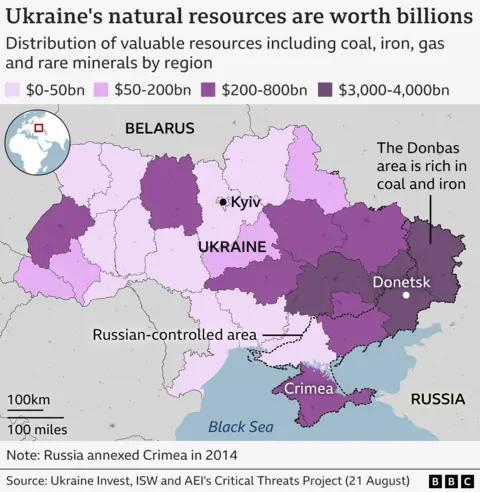

## Claim
Claim: "In early 2025, Ukraine and Russia had reached a peace deal in their years-long war."

## Actions
```
web_search("Ukraine Russia peace deal 2025")
web_search("Ukraine Russia war end date")
```

## Evidence
### Evidence from `web_search`
The Guardian published an article on August 21, 2025, discussing Trump's involvement in peace talks between Russia and Ukraine, including a meeting between Trump and Zelenskyy on August 18, 2025, and a planned trilateral meeting with Putin and Zelenskyy (). CNN published an article on August 19, 2025, discussing the difference between a ceasefire and a peace deal in the context of the war between Ukraine and Russia (<image:0>, , , , ).

Wikipedia discusses peace negotiations in the Russian invasion of Ukraine, mentioning a timeline of the war, including events up to December 2024, and a section on January 2025 - May 2025. It also mentions that in December 2024, Donald Trump began a push for peace negotiations between Russia and Ukraine.

*   [https://www.theguardian.com/us-news/2025/aug/21/trump-ukraine-russia-peace-talks](https://www.theguardian.com/us-news/2025/aug/21/trump-ukraine-russia-peace-talks)
*   [https://en.wikipedia.org/wiki/Peace_negotiations_in_the_Russian_invasion_of_Ukraine](https://en.wikipedia.org/wiki/Peace_negotiations_in_the_Russian_invasion_of_Ukraine)
*   [https://www.cnn.com/2025/08/19/europe/ukraine-ceasefire-peace-deal-difference-analysis-latam-intl](https://www.cnn.com/2025/08/19/europe/ukraine-ceasefire-peace-deal-difference-analysis-latam-intl)


### Evidence from `web_search`
The Wikipedia article on the Russo-Ukrainian War ([https://en.wikipedia.org/wiki/Russo-Ukrainian_War](https://en.wikipedia.org/wiki/Russo-Ukrainian_War)) states that the conflict began in late February 2014 and is ongoing, including the Russian annexation of Crimea and the ongoing Russian occupation of Ukrainian territory. <image:i>, <image:j>, <image:k>, <image:l>, <image:m>, <image:n>. A BBC article ([https://www.bbc.com/news/articles/c0l0k4389g2o](https://www.bbc.com/news/articles/c0l0k4389g2o)) discusses the ongoing war, mentioning that no peace deal has been reached despite efforts by US President Donald Trump. The article includes maps showing changes in Russian military control in Ukraine from February 2022 to August 2025. , , , .

Newsweek reports that Ukrainian President Volodymyr Zelensky said he sees the war ending in 2025 ([https://www.newsweek.com/zelensky-sees-timeline-end-ukraine-war-2046992](https://www.newsweek.com/zelensky-sees-timeline-end-ukraine-war-2046992)). 


## Elaboration
The evidence indicates that no peace deal was reached between Ukraine and Russia in early 2025. While there were peace talks and negotiations, including efforts by Donald Trump, the war was ongoing as of August 2025. The BBC article explicitly states that no peace deal had been reached.


## Final Judgement
The evidence suggests that while peace negotiations were underway, no peace deal was reached between Ukraine and Russia in early 2025. The BBC article confirms the war was ongoing in August 2025.

`false`

### Verdict: FALSE

### Justification
The claim is false. While there were peace talks and negotiations, including efforts by Donald Trump, no peace deal was reached between Ukraine and Russia in early 2025. The war was ongoing as of August 2025, according to a BBC article ([https://www.bbc.com/news/articles/c0l0k4389g2o](https://www.bbc.com/news/articles/c0l0k4389g2o)).
