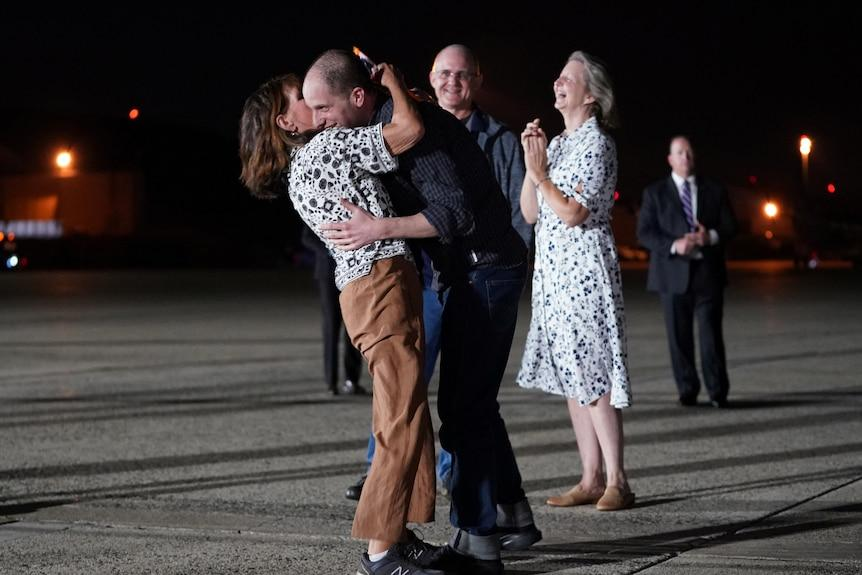
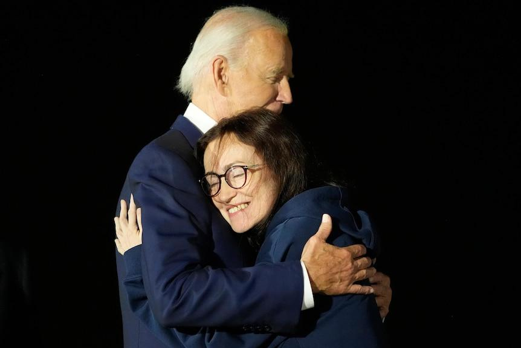

## Claim
Claim: "In August 2024 U.S. President Joe Biden boarded an empty plane after three freed Americans arrived back in the U.S. and exited the aircraft."

## Actions
```
web_search("Joe Biden empty plane August 2024")
web_search("Joe Biden freed Americans plane August 2024")
```

## Evidence
### Evidence from `web_search`
On August 3, 2024, The Times of India published an article discussing whether Joe Biden entered an empty plane carrying American prisoners from Russia, stating that Biden remained on the plane for about two minutes to thank the flight crew (). Yahoo News reported that on August 1, 2024, President Joe Biden boarded a plane after three freed Americans arrived back in the U.S. ().

The Guardian reported on August 1, 2024, that Joe Biden and Kamala Harris greeted the freed Americans upon their arrival in the US (, ).


### Evidence from `web_search`
CBS News ([https://www.cbsnews.com/news/us-russia-prisoner-swap-biden-harris-welcome-paul-whelan-evan-gershkovich/](https://www.cbsnews.com/news/us-russia-prisoner-swap-biden-harris-welcome-paul-whelan-evan-gershkovich/)) reported that President Biden and Vice President Harris welcomed three Americans released by Russia on August 1, 2024, at Joint Base Andrews in Maryland. The article includes images of Biden greeting the freed Americans. , 

ABC News ([https://www.abc.net.au/news/2024-08-02/biden-meets-with-freed-americans-in-major-russia-prisoner-swap/104174404](https://www.abc.net.au/news/2024-08-02/biden-meets-with-freed-americans-in-major-russia-prisoner-swap/104174404)) also reported on August 2, 2024, that Joe Biden welcomed home three Americans released in a prisoner swap with Russia. The plane landed in Maryland, and Biden and Kamala Harris met the plane. , ,  The U.S. Air Force ([https://www.af.mil/News/Article-Display/Article/3860680/americans-released-from-russian-custody-arrive-at-joint-base-andrews/](https://www.af.mil/News/Article-Display/Article/3860680/americans-released-from-russian-custody-arrive-at-joint-base-andrews/)) provided photos of President Joe Biden and Vice President Kamala Harris welcoming the freed Americans at Joint Base Andrews on August 1, 2024. , , , 


## Elaboration
The claim is partially supported by the evidence. Multiple sources confirm that President Biden welcomed the freed Americans upon their arrival in the U.S. on August 1, 2024. However, the evidence does not explicitly state that Biden boarded an empty plane after the freed Americans exited. The Times of India article mentions Biden remained on the plane for about two minutes to thank the flight crew, but it does not specify if the plane was empty. Therefore, the claim is partially verified.


## Final Judgement
The claim is partially supported by the evidence. Multiple sources confirm that President Biden welcomed the freed Americans upon their arrival in the U.S. on August 1, 2024. However, the evidence does not explicitly state that Biden boarded an empty plane after the freed Americans exited. The Times of India article mentions Biden remained on the plane for about two minutes to thank the flight crew, but it does not specify if the plane was empty.

`false`

### Verdict: FALSE

### Justification
The claim is partially supported. Multiple sources, including CBS News ([https://www.cbsnews.com/news/us-russia-prisoner-swap-biden-harris-welcome-paul-whelan-evan-gershkovich/](https://www.cbsnews.com/news/us-russia-prisoner-swap-biden-harris-welcome-paul-whelan-evan-gershkovich/)) and ABC News ([https://www.abc.net.au/news/2024-08-02/biden-meets-with-freed-americans-in-major-russia-prisoner-swap/104174404](https://www.abc.net.au/news/2024-08-02/biden-meets-with-freed-americans-in-major-russia-prisoner-swap/104174404)), confirm that President Biden welcomed the freed Americans on August 1, 2024. However, the evidence does not explicitly state that Biden boarded an empty plane after the freed Americans exited.
