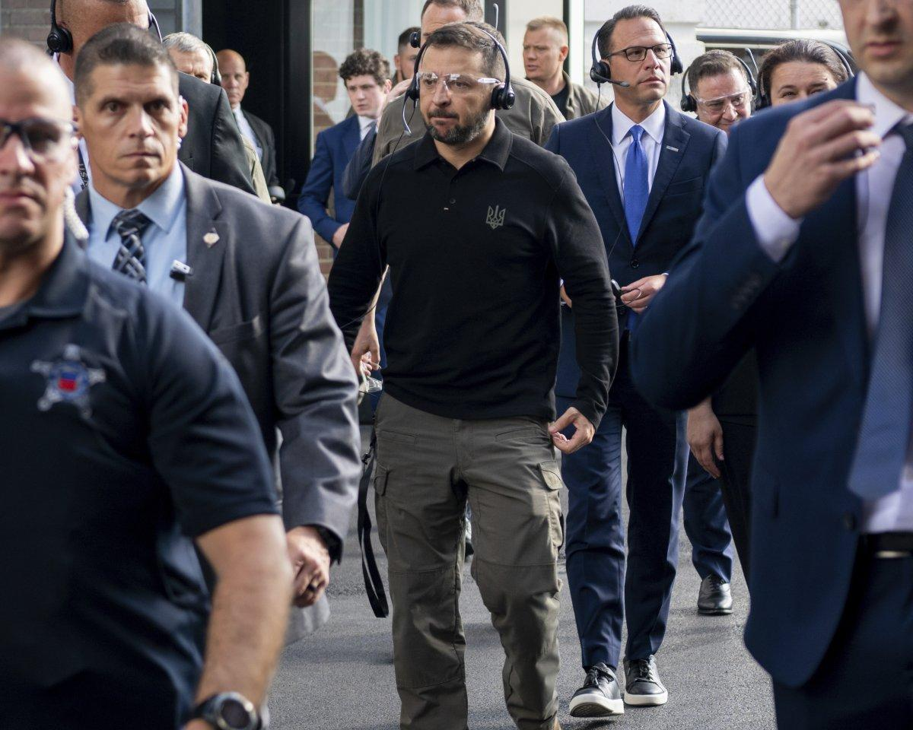

## Claim
Claim: "Ukrainian President Volodymyr Zelenskyy engaged in election interference by campaigning in Pennsylvania for Kamala Harris ahead of the US presidential election in 2024."

## Actions
```
web_search("Volodymyr Zelenskyy Kamala Harris Pennsylvania 2024")
web_search("Volodymyr Zelenskyy US election interference")
```

## Evidence
### Evidence from `web_search`
Newsweek reports that during a meeting, Vice President JD Vance accused Ukrainian President Volodymyr Zelenskyy of campaigning for Kamala Harris during the 2024 presidential race, mentioning a visit by Zelenskyy to a munitions plant in Scranton, Pennsylvania, in September 2024 (, ). The article also mentions that Representative James Comer is investigating the matter. NBC News reports that Zelenskyy visited a munitions factory in Scranton, Pennsylvania, which some Republicans viewed as a signal of which way he wants the November election to go.

ABC News reports on Vice President Kamala Harris meeting with Ukrainian President Volodymyr Zelenskyy to discuss the war with Russia (). The article mentions Zelenskyy's visit to Washington and his meetings with U.S. lawmakers.


### Evidence from `web_search`
The search results discuss the relationship between Volodymyr Zelenskyy and US politics. One article from Wikipedia discusses the 2019 Trump–Ukraine scandal, including a phone call where Trump asked Zelenskyy to investigate Joe Biden, and a 2022 visit by Zelenskyy to the United States (<image:k>). Another article from PBS News mentions the 2019 call where Trump pushed Zelenskyy to investigate Joe Biden ahead of the 2020 election (<image:k>). The Guardian reported on a visit by Zelenskyy to a munitions factory in Scranton, Pennsylvania, where he thanked workers, which Mike Johnson claimed was a "partisan campaign event" and "election interference." ()

The articles can be found here: [https://en.wikipedia.org/wiki/2019_Trump%E2%80%93Ukraine_scandal](https://en.wikipedia.org/wiki/2019_Trump%E2%80%93Ukraine_scandal), [https://www.pbs.org/newshour/politics/how-trumps-history-with-putin-and-zelenskyy-set-the-stage-for-an-oval-office-blowup](https://www.pbs.org/newshour/politics/how-trumps-history-with-putin-and-zelenskyy-set-the-stage-for-an-oval-office-blowup), and [https://www.theguardian.com/us-news/2024/sep/25/trump-zelenskyy-ukraine-feud-republicans-election-interference](https://www.theguardian.com/us-news/2024/sep/25/trump-zelenskyy-ukraine-feud-republicans-election-interference).


## Elaboration
The evidence indicates that Volodymyr Zelenskyy visited a munitions factory in Scranton, Pennsylvania, which some Republicans viewed as a signal of support for the Biden administration. The Guardian reported that Mike Johnson claimed this visit was a "partisan campaign event" and "election interference." News outlets also reported on meetings between Zelenskyy and Kamala Harris.

The evidence does not explicitly state that Zelenskyy campaigned for Kamala Harris. However, the visit to the munitions factory and the meetings with US lawmakers, coupled with the accusations of election interference, suggest that Zelenskyy's actions were perceived by some as politically motivated.

To fully verify the claim, more information is needed to determine the specific nature of Zelenskyy's actions during his visit to Pennsylvania and his meetings with US officials. It would be helpful to know if he made any statements endorsing Kamala Harris or criticizing her opponents.


## Actions
```
image_search("Volodymyr Zelenskyy Scranton Pennsylvania 2024")
```

## Evidence
### Evidence from `image_search`
The U.S. Army website, KTLA, and Penn Capital-Star all report on Volodymyr Zelenskyy's visit to Scranton, Pennsylvania, with images from the visit (, , ). The visit included a meeting at a munitions factory.


## Elaboration
The evidence confirms that Volodymyr Zelenskyy visited Scranton, Pennsylvania, and met with officials at a munitions factory. While the evidence does not explicitly state that Zelenskyy campaigned for Kamala Harris, it does show that his visit was viewed by some as a signal of support for the Biden administration, and that some Republicans considered it election interference.


## Actions
```
web_search("Volodymyr Zelenskyy speech Pennsylvania 2024 election")
```

## Evidence
### Evidence from `web_search`
CNBC reports that House Oversight Chair James Comer opened an investigation into Volodymyr Zelenskyy's visit to a munitions factory in Scranton, Pennsylvania, claiming it was a campaign event for Kamala Harris, using taxpayer-funded resources. The article mentions that Zelenskyy met with Pennsylvania Democrats. (<image:k>)

PBS NewsHour, citing PolitiFact, fact-checked claims about Zelenskyy's actions in Pennsylvania and found that the claim that Zelenskyy campaigned for the opposition was wrong, as his visit to a Scranton ammunition plant was not a campaign event. The article also mentions that Zelenskyy met with Pennsylvania Governor Shapiro and separately with President Biden and Vice President Kamala Harris at the White House.


## Elaboration
The evidence indicates that Volodymyr Zelenskyy visited a munitions factory in Scranton, Pennsylvania, which some Republicans viewed as a campaign event for Kamala Harris. However, PolitiFact fact-checked this claim and found it to be false. The evidence also shows that Zelenskyy met with Pennsylvania Democrats, as well as with President Biden and Vice President Kamala Harris.


## Final Judgement
The fact-check reveals that while Volodymyr Zelenskyy visited a munitions factory in Scranton, Pennsylvania, and met with US officials, including Kamala Harris, there is no evidence to support the claim that he campaigned for her. Some Republicans viewed the visit as a campaign event, but this was fact-checked and found to be false.

`false`

### Verdict: FALSE

### Justification
The claim that Volodymyr Zelenskyy campaigned for Kamala Harris in Pennsylvania is not supported by the evidence. While Zelenskyy visited a munitions factory in Scranton, Pennsylvania, and met with US officials, including Kamala Harris, the visit was not a campaign event, according to a PolitiFact fact-check. Some Republicans viewed the visit as election interference, but this claim was debunked.
