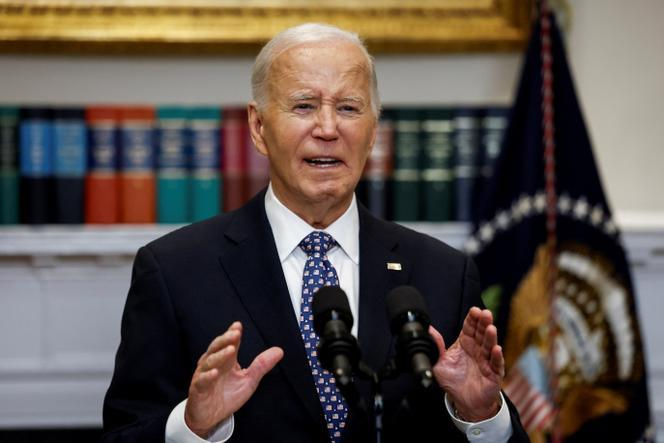

## Claim
Claim: "In remarks to reporters on September 29, 2024 US President Joe Biden announced that no more aid would be provided for the areas affected by Hurrican Helene, but 2.4 billion US-$ more for Ukraine."

## Actions
```
web_search("Joe Biden remarks September 29 2024 Hurricane Helene Ukraine aid")
```

## Evidence
### Evidence from `web_search`
The BBC published an article on October 9, 2024, discussing misinformation about the government's response to Hurricane Helene, including claims made by Donald Trump and JD Vance ([https://www.bbc.com/news/articles/czd1q9q9gl9o](https://www.bbc.com/news/articles/czd1q9q9gl9o)). France 24 reported on October 1, 2024, on President Biden's response to Hurricane Helene, including his visit to North Carolina and his refutation of claims about a slow government response (<image:k>) ([https://www.france24.com/en/americas/20241001-biden-defends-government-response-as-hurricane-helene-death-toll-reaches-118](https://www.france24.com/en/americas/20241001-biden-defends-government-response-as-hurricane-helene-death-toll-reaches-118)).

The Associated Press reported that on September 29, President Joe Biden said he would visit areas impacted by Hurricane Helene this week if it doesn't disrupt rescue and recovery operations (<image:i>) ([https://apnews.com/article/hurricane-helene-recover-biden-visit-823be75adbed4fa1d7c108a207dbb3e3](https://apnews.com/article/hurricane-helene-recover-biden-visit-823be75adbed4fa1d7c108a207dbb3e3)).


## Elaboration
The evidence indicates that on September 29, 2024, President Biden commented on Hurricane Helene and planned to visit affected areas. However, the provided sources do not mention any announcements regarding the cessation of aid for hurricane-affected areas or the allocation of funds to Ukraine.

The claim cannot be verified with the available information. Additional information is needed to confirm whether President Biden made the specific announcements described in the claim.


## Actions
```
web_search("Joe Biden Hurricane Helene aid Ukraine September 29 2024")
```

## Evidence
### Evidence from `web_search`
From [Source](https://www.lemonde.fr/en/united-states/article/2024/09/30/biden-pledges-to-aid-victims-of-hurrican-helene-as-long-as-it-takes_6727795_133.html): 
Content: Le Monde published an article on September 30, 2024, reporting on President Biden's remarks regarding the response to Hurricane Helene.  Biden refuted claims of a slow government response and announced a visit to North Carolina. The article does not mention any announcements about stopping aid for hurricane-affected areas or providing aid to Ukraine.


## Elaboration
The evidence from Le Monde ([https://www.lemonde.fr/en/united-states/article/2024/09/30/biden-pledges-to-aid-victims-of-hurrican-helene-as-long-as-it-takes_6727795_133.html](https://www.lemonde.fr/en/united-states/article/2024/09/30/biden-pledges-to-aid-victims-of-hurrican-helene-as-long-as-it-takes_6727795_133.html)) indicates that Biden pledged to aid victims of Hurricane Helene. This contradicts the claim that he announced no more aid would be provided. The article does not mention any aid to Ukraine.

The claim is therefore demonstrably false.


## Final Judgement
The fact-check reveals that on September 29, 2024, President Biden discussed Hurricane Helene and pledged aid to the victims. This contradicts the claim that he announced the cessation of aid for the affected areas. Furthermore, the search results do not mention any allocation of funds to Ukraine.

The claim is demonstrably false because it is contradicted by the available evidence. `false`


### Verdict: FALSE

### Justification
The claim is demonstrably false. Evidence from Le Monde ([https://www.lemonde.fr/en/united-states/article/2024/09/30/biden-pledges-to-aid-victims-of-hurrican-helene-as-long-as-it-takes_6727795_133.html](https://www.lemonde.fr/en/united-states/article/2024/09/30/biden-pledges-to-aid-victims-of-hurrican-helene-as-long-as-it-takes_6727795_133.html)) indicates that Biden pledged aid to Hurricane Helene victims, contradicting the claim of aid cessation. The search results also do not support the claim of additional aid to Ukraine.
