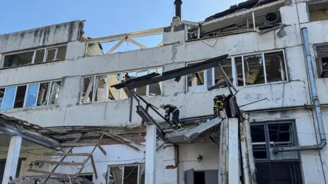

## Claim
Claim: "In February 2025 German Chancellor Olaf Scholz declared a state of emergency in Germany due to US President Donald Trump's peace plan for Ukraine."

## Actions
```
web_search("Olaf Scholz state of emergency Germany Trump Ukraine peace plan")
web_search("Donald Trump Ukraine peace plan February 2025")
```

## Evidence
### Evidence from `web_search`
According to a Politico article, Olaf Scholz was unaware of Donald Trump's peace plan for Ukraine. The article also mentions that Trump announced he would begin immediate negotiations with Russian President Vladimir Putin. German Defense Minister Boris Pistorius criticized Trump’s stance on negotiations with Moscow. ([https://www.politico.eu/article/olaf-scholz-germany-donald-trump-war-in-ukraine-peace-plan/](https://www.politico.eu/article/olaf-scholz-germany-donald-trump-war-in-ukraine-peace-plan/))

Euronews fact-checked a claim that Olaf Scholz declared a state of emergency in Germany due to US-Russia peace talks and found it to be false. The article states that Scholz did not declare a state of emergency, but rather referred to an "emergency situation" ("Notlage") related to the war in Ukraine. ([https://www.euronews.com/my-europe/2025/02/19/fact-check-scholz-did-not-call-for-german-state-of-emergency-over-russia-us-peace-talks](https://www.euronews.com/my-europe/2025/02/19/fact-check-scholz-did-not-call-for-german-state-of-emergency-over-russia-us-peace-talks)) A FRANCE 24 article discussed European leaders' reactions to Donald Trump and Vladimir Putin's agreement to start negotiations regarding the war in Ukraine. German Chancellor Olaf Scholz warned against a "dictated peace". ([https://www.france24.com/en/europe/20250213-ukraine-europe-must-be-involved-peace-talks-say-nato-european-members-russia-trump-rutte](https://www.france24.com/en/europe/20250213-ukraine-europe-must-be-involved-peace-talks-say-nato-european-members-russia-trump-rutte))


### Evidence from `web_search`
The Council on Foreign Relations published a blog post and podcast episode on February 24, 2025, discussing Donald Trump's policy toward Ukraine, including his efforts to end the war and reset relations with Russia. The post also mentions a potential deal where Ukraine would sign over rights to its critical mineral production to the United States without security guarantees. The BBC News article from April 19, 2025, discusses Trump's statements regarding the US's involvement in Russia-Ukraine peace talks and a potential minerals deal between the US and Ukraine , .

A Wikipedia article discusses the 2025 Trump–Zelenskyy Oval Office meeting, which took place on February 28, 2025, at the White House in Washington, D.C.  The meeting involved Donald Trump, JD Vance, Volodymyr Zelenskyy, and other officials and occurred against the backdrop of the ongoing Russo-Ukrainian War.


## Elaboration
The evidence indicates that the claim is false. Euronews fact-checked a similar claim and found it to be untrue; Scholz did not declare a state of emergency. Instead, he referred to an "emergency situation" ("Notlage") related to the war in Ukraine ([https://www.euronews.com/my-europe/2025/02/19/fact-check-scholz-did-not-call-for-german-state-of-emergency-over-russia-us-peace-talks](https://www.euronews.com/my-europe/2025/02/19/fact-check-scholz-did-not-call-for-german-state-of-emergency-over-russia-us-peace-talks)). Furthermore, a Politico article suggests that Scholz was unaware of Trump's peace plan ([https://www.politico.eu/article/olaf-scholz-germany-donald-trump-war-in-ukraine-peace-plan/](https://www.politico.eu/article/olaf-scholz-germany-donald-trump-war-in-ukraine-peace-plan/)).


## Final Judgement
The fact-check reveals that Olaf Scholz did not declare a state of emergency in Germany in February 2025. While there were discussions and reactions to Donald Trump's potential peace plan for Ukraine, Scholz's response was related to the ongoing war, not a state of emergency.

`false`


### Verdict: FALSE

### Justification
The claim is false. Fact-checks and news articles confirm that Olaf Scholz did not declare a state of emergency in Germany in February 2025. Instead, he referred to an "emergency situation" related to the war in Ukraine, and he was reportedly unaware of Donald Trump's peace plan, as indicated by a Politico article ([https://www.politico.eu/article/olaf-scholz-germany-donald-trump-war-in-ukraine-peace-plan/](https://www.politico.eu/article/olaf-scholz-germany-donald-trump-war-in-ukraine-peace-plan/)).
