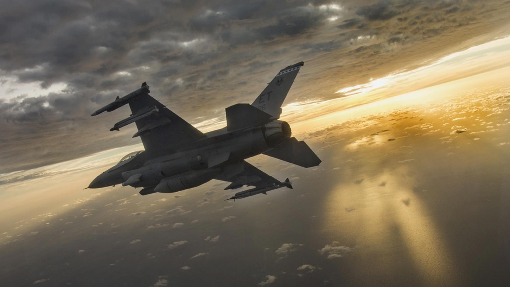
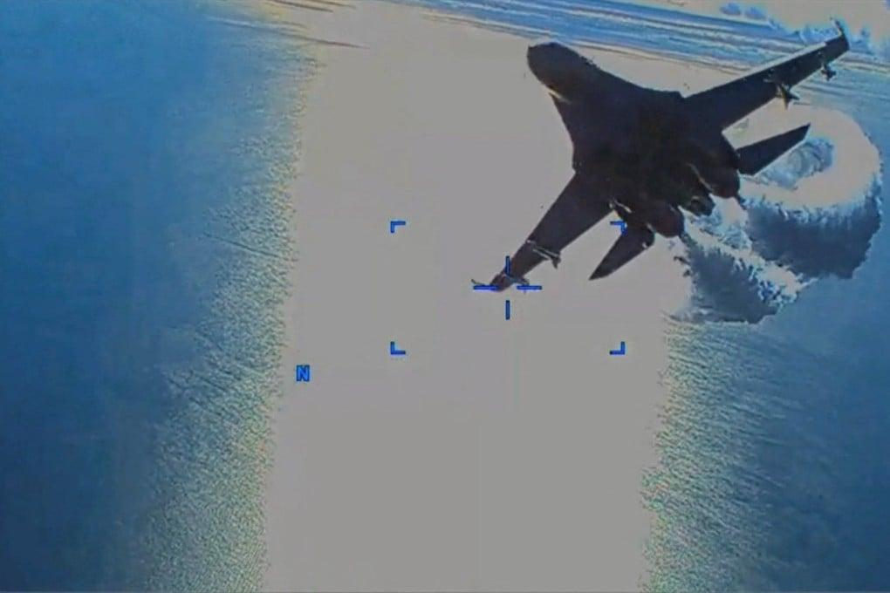

## Claim
Claim: " This image shows a US F-16 fighter jet which was shot down in August 2024 in airspace over the Black Sea after refusing to obey Russian orders."

## Actions
```
image_search("F-16 fighter jet shot down Black Sea")
web_search("F-16 shot down Black Sea August 2024")
```

## Evidence
### Evidence from `image_search`
NPR published an article about an F-16 warplane crash (). The Center for Strategic and International Studies (CSIS) published an article about F-16s and their impact on the war in Ukraine (). The South China Morning Post published an article about Ukraine destroying a Russian fighter jet ().

The provided sources do not contain information about a US F-16 fighter jet being shot down in August 2024 in airspace over the Black Sea after refusing to obey Russian orders.


### Evidence from `web_search`
Defense News reports that an F-16 jet crashed during a Russian missile attack in August 2024, killing the pilot. The War Zone discusses claims of a Ukrainian F-16 shooting down a Russian Su-35S Flanker and mentions the death of an F-16 pilot, Oleksiy Mes, during a Russian aerial barrage in August 2024. The Guardian states that F-16s were used to shoot down Russian missiles.

The sources include images of F-16s (, , , ) and a downed Su-35S ().
*   [https://www.defensenews.com/global/europe/2024/08/29/ukraine-f-16-jet-crashes-during-russian-attack-killing-pilot/](https://www.defensenews.com/global/europe/2024/08/29/ukraine-f-16-jet-crashes-during-russian-attack-killing-pilot/)
*   [https://www.twz.com/air/claims-swirl-around-russian-su-35s-flanker-shootdown](https://www.twz.com/air/claims-swirl-around-russian-su-35s-flanker-shootdown)
*   [https://www.theguardian.com/world/article/2024/aug/28/ukraine-war-briefing-zelenskiy-says-f16s-shooting-down-russian-missiles](https://www.theguardian.com/world/article/2024/aug/28/ukraine-war-briefing-zelenskiy-says-f16s-shooting-down-russian-missiles)


## Elaboration
The evidence suggests that an F-16 jet crashed in August 2024 during a Russian attack, resulting in the pilot's death. There are also claims of Ukrainian F-16s shooting down Russian aircraft. However, the evidence does not support the claim that a US F-16 was shot down in the Black Sea after refusing Russian orders.

The image provided in the claim appears to depict a jet being hit, but the evidence does not confirm the type of aircraft or the circumstances of the event.

Therefore, the claim is not supported by the evidence.


## Final Judgement
The evidence indicates that while F-16s have been involved in incidents, including crashes and combat, there is no evidence to support the specific claim of a US F-16 being shot down in the Black Sea after refusing Russian orders. The image provided does not confirm the type of aircraft or the circumstances of the event.

`false`

### Verdict: FALSE

### Justification
The claim is unsubstantiated. While there are reports of F-16s being involved in incidents, including a crash in August 2024, and claims of Ukrainian F-16s shooting down Russian aircraft, there is no evidence to support the specific claim of a US F-16 being shot down in the Black Sea after refusing Russian orders. The image provided does not confirm the type of aircraft or the circumstances of the event.
