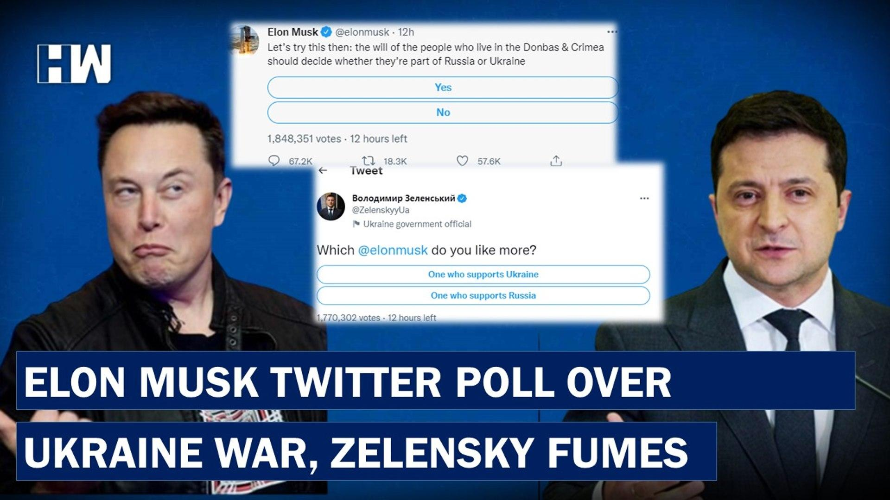
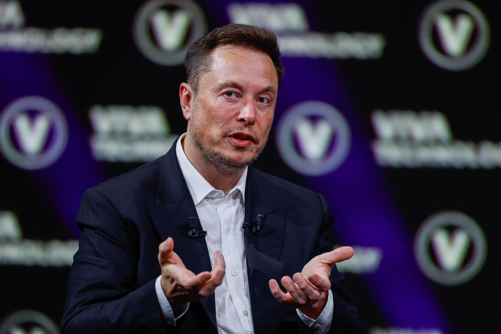
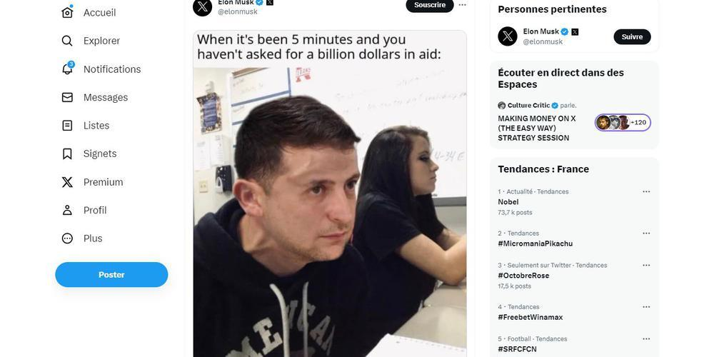

## Claim
Claim: " This image shows a screenshot of an authentic X post from Elon Musk on November 6, 2025 saying 'The last dollar for Zelenskiy'."

## Actions
```
web_search("Elon Musk Zelenskiy last dollar")
image_search("Elon Musk Twitter post Zelenskiy dollar")
```

## Evidence
### Evidence from `web_search`
An AOL article fact-checks the claim that Elon Musk posted "The last dollar for Zelenskiy" and states that the claim is false, with no evidence of Musk posting this. The article includes an image of a purported tweet from Musk with a dollar bill featuring Trump . The article also mentions that Logically Facts debunked the claim.

Politico.eu discusses Elon Musk's meme mocking Ukrainian President Volodymyr Zelenskyy's calls for Western aid. StopFake.org refutes claims that Ukraine stopped using Starlink and insulted Elon Musk.


### Evidence from `image_search`
The search results include a video about Elon Musk's Twitter poll over the Ukraine war from [Dailymotion](https://www.dailymotion.com/video/x8e6mjy) . Reuters published an article on October 2, 2023, about a meme mocking Zelenskyy, which includes a photograph of Elon Musk from [Reuters](https://www.reuters.com/world/europe/ukraines-parliament-taunts-elon-musk-after-meme-mocking-zelenskiy-2023-10-02/) .

Sud Ouest contains an image of an X post from Elon Musk showing a meme with Zelensky from [Sud Ouest](https://www.sudouest.fr/economie/reseaux-sociaux/guerre-en-ukraine-musk-se-moque-de-zelensky-sur-x-kiev-s-agace-16900132.php) .


## Elaboration
The claim is false. An AOL article fact-checked the claim and found no evidence of Elon Musk posting "The last dollar for Zelenskiy." The article includes an image of a purported tweet from Musk with a dollar bill featuring Trump. Other sources confirm Musk has posted memes mocking Zelenskyy.


## Final Judgement
The claim that Elon Musk posted "The last dollar for Zelenskiy" is demonstrably false. Multiple sources, including an AOL article, debunk the claim, stating there is no evidence of Musk posting this. The evidence includes an image of a purported tweet from Musk with a dollar bill featuring Trump.

`false`

### Verdict: FALSE

### Justification
The claim is false. An [AOL article](https://www.aol.com/) fact-checked the claim and found no evidence of Elon Musk posting "The last dollar for Zelenskiy." The article includes an image of a purported tweet from Musk with a dollar bill featuring Trump.
