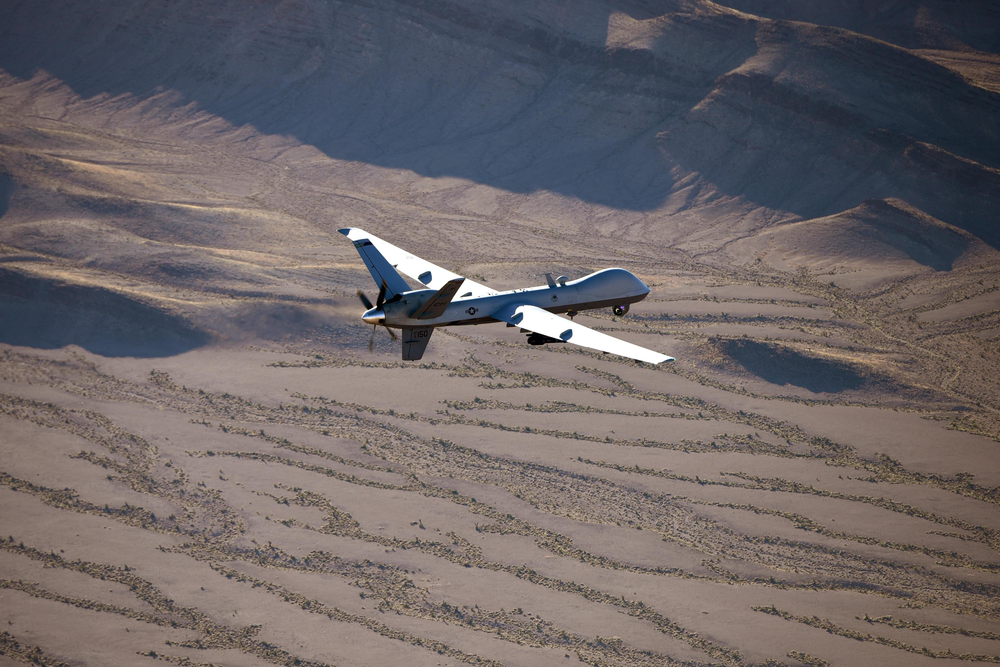

## Claim
Claim: " This image shows a US drone which was shot down in March 2025 by the Houthis using Russian missiles."

## Actions
```
geolocate()
web_search("US drone shot down Houthis March 2025")
```

## Evidence
### Evidence from `geolocate`
The most likely countries where the image was taken are: {'Israel': 0.64, 'Palestine': 0.13, 'United Arab Emirates': 0.12, 'Jordan': 0.08, 'Tunisia': 0.01, 'Albania': 0.0, 'Andorra': 0.0, 'Argentina': 0.0, 'Australia': 0.0, 'Austria': 0.0}

### Evidence from `web_search`
ABC News reports that Houthi militants have shot down six MQ-9 Reaper drones since March 15, 2025, as stated in an article published on April 23, 2025, by Luis Martinez. The Military Times published an article on April 25, 2025, stating that Houthi rebels in Yemen have shot down seven U.S. Reaper drones in recent weeks. The U.S. has been launching daily strikes since March 15, 2025.

Wikipedia discusses the March–May 2025 United States attacks in Yemen, mentioning that the Houthis shot down a US MQ-9 Reaper drone in March 2025. The article also mentions several US airstrikes in Yemen during April 2025, the Red Sea crisis, and the Gaza war. <image:i>, , 


## Elaboration
The evidence suggests that the Houthis shot down a US MQ-9 Reaper drone in March 2025. The web search results confirm this, citing multiple sources. However, the image's geolocation data indicates that the image was most likely taken in Israel.

The claim states that the image shows a US drone shot down by the Houthis. The evidence does not confirm that the image depicts a drone shot down by the Houthis. Therefore, the claim is not supported by the evidence.

The evidence does not provide information about the type of missiles used or the exact location of the incident depicted in the image.


## Final Judgement
The evidence confirms that the Houthis shot down a US drone in March 2025. However, the image's geolocation data indicates that the image was most likely taken in Israel, and there is no evidence to support that the image depicts a drone shot down by the Houthis.

`false`

### Verdict: FALSE

### Justification
The claim is false. While the Houthis did shoot down a US drone in March 2025, the image's geolocation data suggests it was taken in Israel, and there is no evidence to support that the image depicts a drone shot down by the Houthis. The web search results confirm the drone downing by the Houthis, as reported by sources like [ABC News](https://abcnews.go.com/) and [Military Times](https://www.militarytimes.com/).
