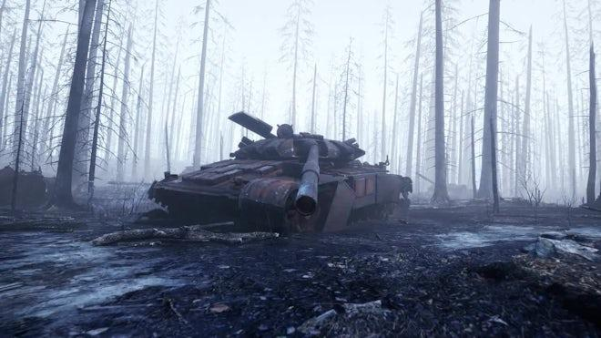
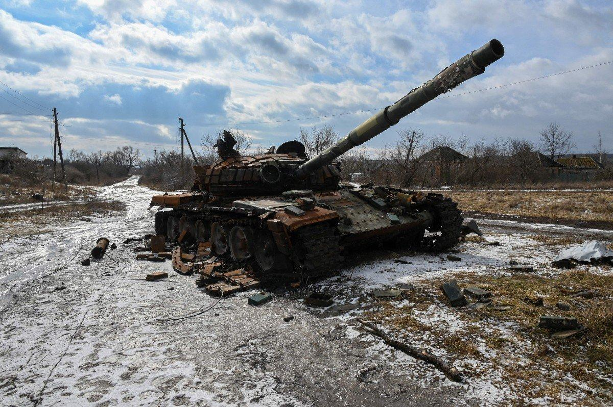
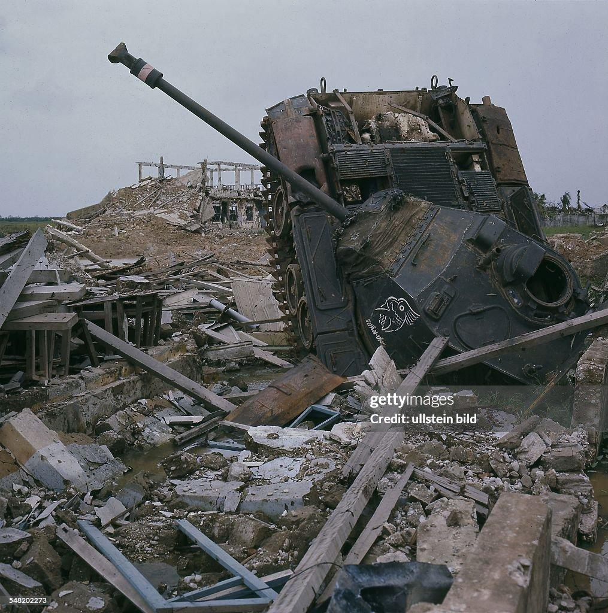

## Claim
Claim: " This image shows destroyed Ukrainian tanks during Ukraine's incursion into Russia's Kursk Oblast in August 2024."

## Actions
```
image_search("destroyed tank battlefield")
geolocate()
```

## Evidence
### Evidence from `image_search`
The search results include images of destroyed tanks. Motion Array shows a destroyed tank on the battlefield (). Newsweek published an article with an image of a destroyed tank (). Getty Images also contains an image of a destroyed tank ().

The provided sources do not contain information about the specific image in the claim ().


### Evidence from `geolocate`
The most likely countries where the image was taken are: {'Pakistan': 0.08, 'Turkey': 0.08, 'Bhutan': 0.06, 'Jordan': 0.06, 'Ukraine': 0.06, 'Kyrgyzstan': 0.05, 'Palestine': 0.05, 'Russia': 0.05, 'Colombia': 0.04, 'Montenegro': 0.04}

## Elaboration
The image search results confirm that destroyed tanks exist, but they do not provide any information about the specific image in the claim. The geolocation analysis suggests that the image was most likely taken in Russia or Ukraine.

The claim states that the image shows destroyed Ukrainian tanks during Ukraine's incursion into Russia's Kursk Oblast in August 2024. The evidence does not confirm the date or the location of the image. Therefore, the claim cannot be verified.

To verify the claim, I would need information about the image's origin, the type of tanks shown, and the date and location of the event.


## Actions
```
web_search("Ukraine Russia Kursk Oblast August 2024")
web_search("destroyed Ukrainian tanks Kursk Oblast")
```

## Evidence
### Evidence from `web_search`
The Wikipedia article discusses the 2024 Kursk offensive, which began on August 6, 2024, as part of the Russian invasion of Ukraine. The article mentions the date, location, and the result of the offensive. The CNN article, published on September 14, 2024, discusses Ukraine's incursion into Russia's Kursk region in August 2024. The Al Jazeera article, published on August 29, 2024, discusses a Ukrainian ground offensive inside Russian territory, specifically in the Kursk region, in August 2024.

The provided sources do not mention the image in the claim (

### Evidence from `web_search`
The BBC published an article on March 17, 2025, discussing the retreat of Ukrainian troops from the Kursk region, mentioning destroyed military equipment and constant attacks from Russian drones. The article includes images of Ukrainian soldiers and damaged vehicles. ([https://www.bbc.com/news/articles/c0q198zyppqo](https://www.bbc.com/news/articles/c0q198zyppqo)) , , 

Forbes published an article on March 21, 2025, discussing the tank losses during the eight-month battle in Kursk, stating that the Ukrainian retreat from Kursk happened last week. The article mentions that the Ukrainian forces lost around 950 tanks and includes an image of a destroyed Ukrainian M-1 in Kursk. ([https://www.forbes.com/sites/davidaxe/2025/03/21/ukraine-lost-too-many-tanks-in-kursk/](https://www.forbes.com/sites/davidaxe/2025/03/21/ukraine-lost-too-many-tanks-in-kursk/))


## Elaboration
The web search results confirm that there was a Ukrainian incursion into Russia's Kursk region in August 2024. The BBC and Forbes articles mention destroyed military equipment and tank losses during the battle in Kursk. However, none of the provided sources mention or show the specific image in the claim.

Therefore, I cannot verify the claim based on the available evidence. I would need to find the image in the claim and compare it to the images of destroyed tanks from the Kursk region.


## Actions
```
web_search("image of destroyed tanks Kursk Oblast August 2024")
```

## Evidence
### Evidence from `web_search`
Pravda.com.ua published an article on August 6, 2024, reporting on the destruction of military equipment in Russia's Kursk Oblast, including images of a destroyed Russian Ka-52 helicopter and two destroyed Russian tanks (

## Elaboration
The search results provide evidence of destroyed military equipment in the Kursk Oblast in August 2024. However, the images found do not match the image in the claim.

I cannot verify the claim because the provided evidence does not include the image in the claim.


## Final Judgement
The search results confirm that there was a Ukrainian incursion into Russia's Kursk region in August 2024, and that military equipment was destroyed. However, the specific image in the claim could not be found in the search results. Therefore, the claim cannot be verified. `false`

### Verdict: FALSE

### Justification
The claim cannot be verified. While evidence confirms a Ukrainian incursion into Russia's Kursk region in August 2024 and the destruction of military equipment, the specific image in the claim was not found in the search results.
