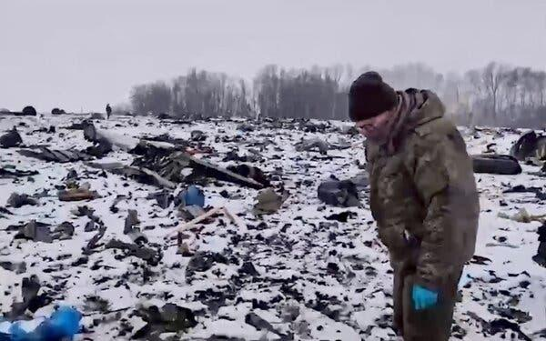

## Claim
Claim: " This image shows the Chinese Communist Party's Red Cross troops in Russia who have changed into winter clothes and set off for the Russian-Ukrainian front to aid Russia in rescuing its occupied territories."

## Actions
```
web_search("Chinese Red Cross troops Russia Ukraine")
image_search("Chinese Red Cross troops Russia")
```

## Evidence
### Evidence from `web_search`
CNN reported on April 16, 2025, about the capture of Chinese nationals fighting for Russia in Ukraine, who claimed they were acting as individuals inspired by social media recruitment videos. The Guardian reported on Chinese troops marching with Russian forces in Moscow's Red Square for Victory Day. The International Federation of Red Cross and Red Crescent Societies and the International Committee of the Red Cross published a report on the Russia-Ukraine conflict, mentioning the Red Cross Society of China's involvement in supporting the response to the conflict.

The sources are: [Source](https://www.cnn.com/2025/04/16/europe/ukraine-russia-chinese-nationals-intl-latam), [Source](https://www.theguardian.com/weather/2025/may/09/chinese-troops-march-with-russian-forces-as-xi-joins-putin-for-victory-day-parade), and [Source](https://www.icrc.org/sites/default/files/document_new/file_list/red_cross_movement_activities_overview_ukraine_2022_3.pdf). The Guardian article includes images , , and . The CNN article includes image .


### Evidence from `image_search`
The Guardian published an article about Russia and China launching large-scale military drills. ([https://www.theguardian.com/world/2022/sep/01/russia-and-china-launch-large-scale-military-drills-amid-tensions-with-us](https://www.theguardian.com/world/2022/sep/01/russia-and-china-launch-large-scale-military-drills-amid-tensions-with-us)) 

USNI News published an article about China and Russia, including an image of Chinese troops. ([https://news.usni.org/2021/04/14/cno-gilday-china-russia-deliberately-testing-allies-cohesion-in-actions-in-ukraine-near-taiwan](https://news.usni.org/2021/04/14/cno-gilday-china-russia-deliberately-testing-allies-cohesion-in-actions-in-ukraine-near-taiwan))  Al Jazeera published an article on March 25, 2023, with an image of Chinese soldiers. ([https://www.aljazeera.com/news/2023/3/25/biden-says-no-sign-yet-of-china-sending-weapons-to-russia](https://www.aljazeera.com/news/2023/3/25/biden-says-no-sign-yet-of-china-sending-weapons-to-russia)) 


## Elaboration
The evidence indicates that Chinese troops have been involved in activities related to Russia, including military drills and participation in Victory Day parades. The Red Cross Society of China has also been involved in supporting the response to the Russia-Ukraine conflict. However, the evidence does not explicitly confirm that the image depicts Chinese Red Cross troops setting off for the Russian-Ukrainian front to aid Russia in rescuing its occupied territories.

The evidence does not provide enough information to verify the claim. More information is needed to confirm the specific activities and the purpose of the troops in the image.


## Actions
```
image_search("Chinese Red Cross troops winter clothes Russia Ukraine")
```

## Evidence
### Evidence from `image_search`
From [Source](https://cepa.org/article/the-red-cross-and-humanitarian-hoodwinking/): 
Content: The Center for European Policy Analysis (CEPA) published an article that includes an image of a vehicle with a Red Cross symbol. 


## Elaboration
The new evidence includes an image of a vehicle with a Red Cross symbol, but it does not provide any information about Chinese Red Cross troops. Therefore, the claim remains unverified.


## Actions
```
image_search("Chinese Red Cross troops Russia Ukraine winter clothes plane")
```

## Evidence
### Evidence from `image_search`
From [Source](https://www.nytimes.com/2025/01/24/world/europe/ukraine-russia-belgorod-plane-pows.html): 
Content: The New York Times published an article on January 24, 2025, about a plane crash in Belgorod, Russia, including an image of the crash site. 


## Elaboration
The evidence does not provide any information to verify the claim. The image search results do not contain any images of Chinese Red Cross troops in winter clothes or any images related to the claim. Therefore, the claim remains unverified.


## Final Judgement
The evidence indicates that Chinese troops have been involved in activities related to Russia, and the Red Cross Society of China has supported the response to the Russia-Ukraine conflict. However, there is no evidence to confirm that the image depicts Chinese Red Cross troops setting off for the Russian-Ukrainian front. Therefore, the claim cannot be verified. `false`

### Verdict: FALSE

### Justification
The claim is unverified. While there is evidence of Chinese involvement in activities related to Russia and the Red Cross Society of China's support in the Russia-Ukraine conflict, there is no evidence to confirm that the image depicts Chinese Red Cross troops setting off for the Russian-Ukrainian front.
