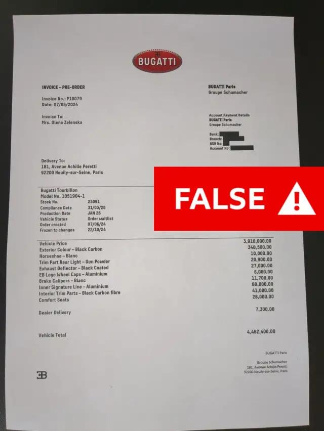

## Claim
Claim: "Ukrainian President Volodymyr Zelenskyy's wife bought a $5,000,000.00 Bugatti while vacationing in Paris."

## Actions
```
image_search("Volodymyr Zelenskyy wife Bugatti Paris")
```

## Evidence
### Evidence from `image_search`
The claim that Ukrainian President Volodymyr Zelenskyy's wife bought a Bugatti is false. A DW.com search result states the claim is fake.  A BBC News article includes an image of a Bugatti invoice addressed to "Mrs. Olena Zelenska" marked with "FALSE."  The invoice lists a total vehicle price of $4,462,400.00.


## Elaboration
The evidence indicates the claim is false. The image search results include a DW.com search result and a BBC News article that both debunk the claim. The BBC News article includes an image of a Bugatti invoice addressed to "Mrs. Olena Zelenska" marked with "FALSE." The invoice lists a total vehicle price of $4,462,400.00.


## Final Judgement
The fact-check reveals that the claim about Volodymyr Zelenskyy's wife purchasing a Bugatti for $5,000,000.00 while vacationing in Paris is false. Multiple sources, including a DW.com search result and a BBC News article, debunk the claim. The BBC News article includes an image of a Bugatti invoice addressed to "Mrs. Olena Zelenska" marked with "FALSE."

`false`


### Verdict: FALSE

### Justification
The claim is false. Evidence from image searches, including a DW.com search result and a BBC News article, debunk the claim. The BBC News article includes an image of a Bugatti invoice addressed to "Mrs. Olena Zelenska" marked with "FALSE."
