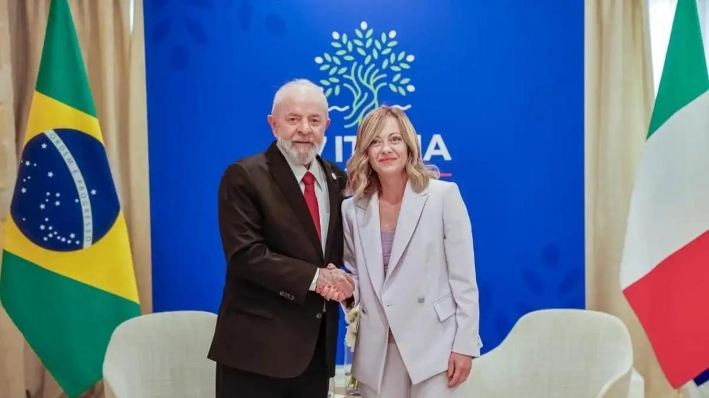
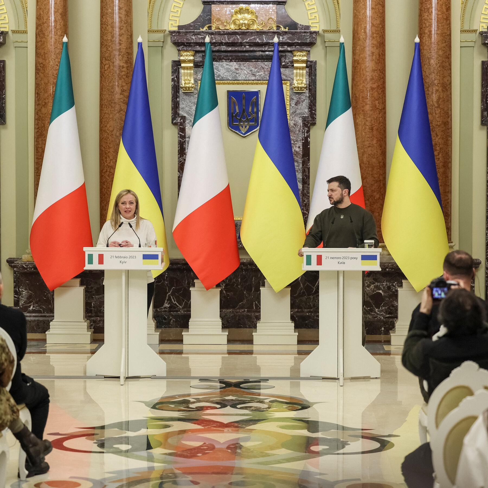
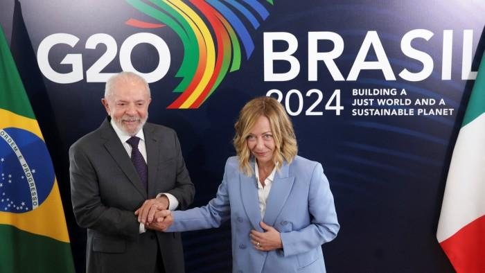
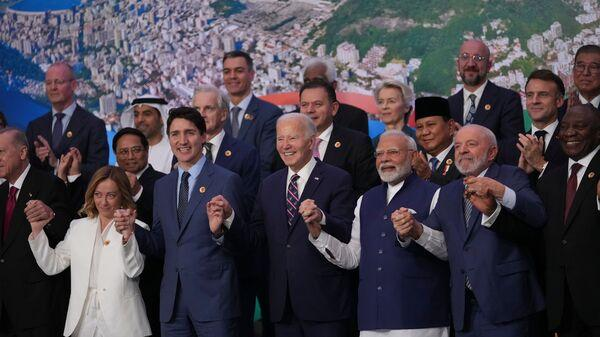

## Claim
Claim: "Italian Prime Minister Giorgia Meloni condemned the US-Ukrainian bombing of Russia at the G20 summit in Rio de Janeiro in November 2024."

## Actions
```
image_search("Giorgia Meloni G20 Rio de Janeiro November 2024")
image_search("G20 summit Rio de Janeiro November 2024 Ukraine Russia")
```

## Evidence
### Evidence from `image_search`
Il Sole 24 Ore published an image of Giorgia Meloni at the G20 summit (). The search result from italianismo.com.br shows a picture of Giorgia Meloni ().


### Evidence from `image_search`
From [Source](https://www.reuters.com/world/rio-de-janeiro-host-g20-summit-2024-2023-05-09/): 
Content: The Reuters article, published on May 9, 2023, states that Rio de Janeiro will host the G20 summit in 2024. 


## Elaboration
1.  The evidence confirms that Rio de Janeiro hosted the G20 summit in 2024.
2.  The images show Giorgia Meloni at the G20 summit.
3.  The evidence does not contain any information about Giorgia Meloni's statements regarding the US-Ukrainian bombing of Russia.

Insufficient information to verify the claim.


## Actions
```
image_search("Giorgia Meloni G20 summit Russia Ukraine")
```

## Evidence
### Evidence from `image_search`
From [Source](https://www.nytimes.com/2023/02/21/world/europe/giorgia-meloni-ukraine-kyiv-russia.html): 
Content: The New York Times published an article on February 21, 2023, about Giorgia Meloni and Ukraine. 


## Elaboration
1.  The new evidence shows that Giorgia Meloni has been involved in discussions about Ukraine.
2.  However, the evidence does not provide any information about her statements at the G20 summit in Rio de Janeiro in November 2024.
3.  The claim cannot be verified due to the lack of information about Meloni's stance on the US-Ukrainian bombing of Russia at the G20 summit.


## Actions
```
image_search("Giorgia Meloni G20 summit Rio de Janeiro November 2024 Russia Ukraine")
```

## Evidence
### Evidence from `image_search`
The search results confirm the G20 summit took place in Rio de Janeiro in November 2024 (). Images from oglobo.globo.com, the Financial Times (), and livemint.com () show Giorgia Meloni at the summit.


## Elaboration
1.  The evidence confirms that the G20 summit took place in Rio de Janeiro in November 2024 and that Giorgia Meloni attended.
2.  However, the evidence does not provide any information about Meloni's statements regarding the US-Ukrainian bombing of Russia at the summit.
3.  The claim remains unverified due to the lack of specific information about Meloni's statements.


## Final Judgement
The evidence confirms that the G20 summit took place in Rio de Janeiro in November 2024 and that Giorgia Meloni attended. However, there is no evidence to support the claim that she condemned the US-Ukrainian bombing of Russia at the summit.

`false`

### Verdict: FALSE

### Justification
The claim is unverified. While the G20 summit did take place in Rio de Janeiro in November 2024, and Giorgia Meloni attended, there is no evidence in the provided sources to support the assertion that she condemned the US-Ukrainian bombing of Russia at the summit.
