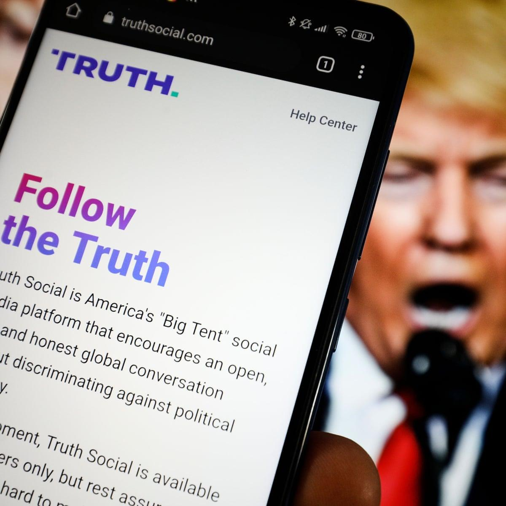
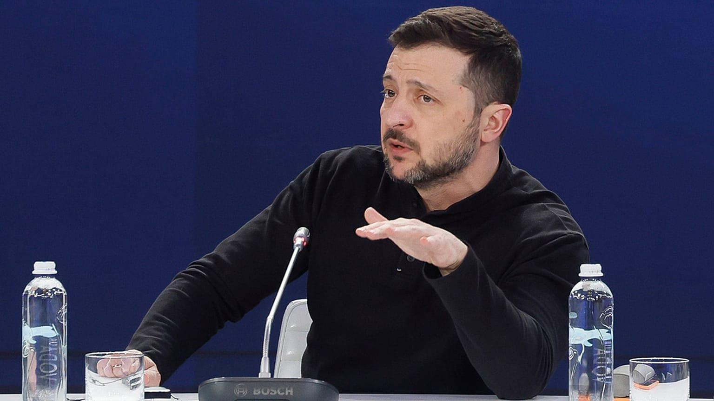
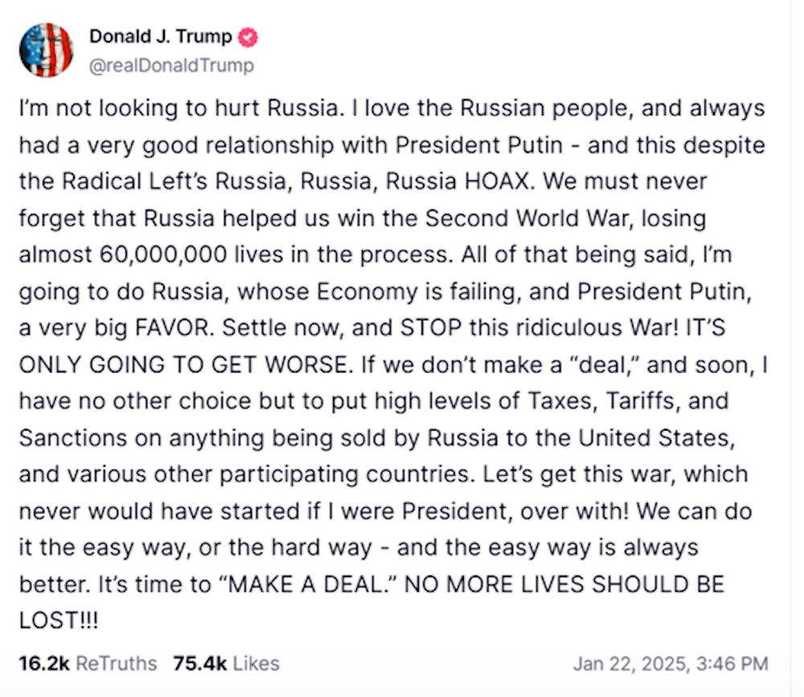

## Claim
Claim: "In February 2025 Ukrainian President Volodymyr Zelenskyy blocked access to US President Donald Trump's social media platform Truth Social across Ukraine."

## Actions
```
image_search("Volodymyr Zelenskyy Donald Trump Truth Social")
```

## Evidence
### Evidence from `image_search`
The search results include articles from PBS NewsHour ([Source](https://www.pbs.org/newshour/politics/trump-calls-ukraines-zelenskyy-a-dictator-tensions-rise-over-russia-war)), NPR ([Source](https://www.npr.org/2025/02/28/nx-s1-5313079/trump-zelenskyy-meeting)), and Al Jazeera ([Source](https://www.aljazeera.com/news/2025/2/21/us-president-trumps-claims-about-zelenskyy-and-ukraine-fact-checked)). All sources contain images of Volodymyr Zelenskyy and Donald Trump (, , ).


## Elaboration
The search results confirm that Volodymyr Zelenskyy and Donald Trump have interacted. However, the evidence does not contain any information about Zelenskyy blocking access to Truth Social in Ukraine.

Insufficient information to verify the claim.


## Actions
```
image_search("Truth Social Ukraine ban")
image_search("Zelenskyy Truth Social")
```

## Evidence
### Evidence from `image_search`
The Guardian published an article about Truth Social, Donald Trump's social media platform (). Euronews reports that Zelenskyy has not banned Trump's Truth Social platform (). The Conversation published an article that includes a screenshot of a Truth Social post by Donald Trump ().

The articles are available at the following URLs: [https://www.theguardian.com/media/2022/mar/16/truth-social-donald-trump-failing-anti-twitter-platform](https://www.theguardian.com/media/2022/mar/16/truth-social-donald-trump-failing-anti-twitter-platform), [https://www.euronews.com/my-europe/2025/02/26/zelenskyy-hasnt-banned-trumps-truth-social-platform](https://www.euronews.com/my-europe/2025/02/26/zelenskyy-hasnt-banned-trumps-truth-social-platform), and [https://theconversation.com/trumps-vision-of-a-peace-deal-for-ukraine-is-limited-to-a-ceasefire-and-its-not-even-clear-if-kyiv-or-moscow-are-going-to-play-ball-248319](https://theconversation.com/trumps-vision-of-a-peace-deal-for-ukraine-is-limited-to-a-ceasefire-and-its-not-even-clear-if-kyiv-or-moscow-are-going-to-play-ball-248319).


### Evidence from `image_search`
From [Source](https://www.pbs.org/newshour/politics/trump-slams-zelenskyy-on-truth-social-for-saying-the-end-of-the-russia-war-is-still-very-very-far-away): 
Content: PBS NewsHour published an article with an image of Donald Trump and Volodymyr Zelenskyy. 


## Elaboration
The evidence indicates that Zelenskyy did not ban Trump's Truth Social platform. A Euronews article explicitly states this.


## Final Judgement
The search results show that Zelenskyy did not block access to Truth Social in Ukraine. Therefore, the claim is demonstrably false. `false`

### Verdict: FALSE

### Justification
The claim is false. Evidence from Euronews ([Source](https://www.euronews.com/my-europe/2025/02/26/zelenskyy-hasnt-banned-trumps-truth-social-platform)) indicates that Zelenskyy did not ban Trump's Truth Social platform.
