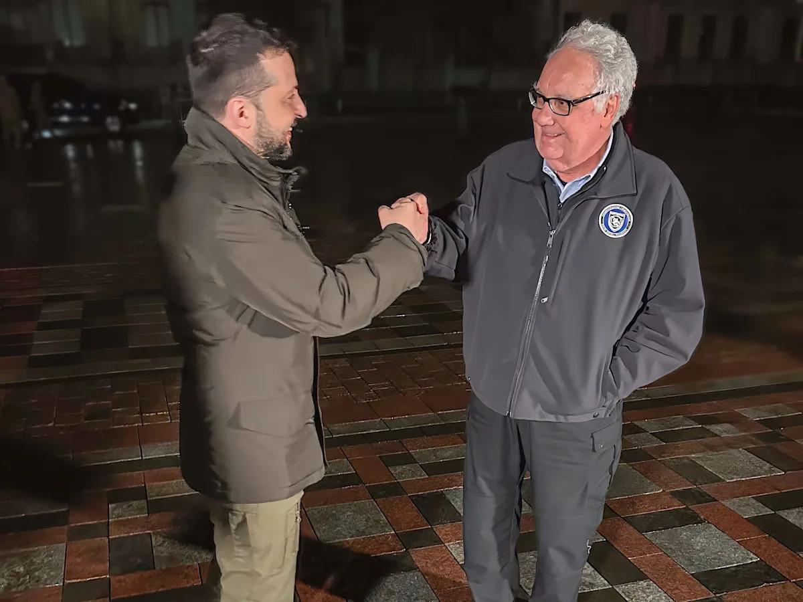
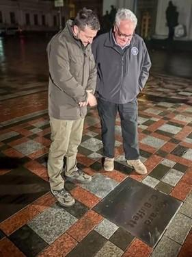

## Claim
Claim: "Warren Buffett has given more than $500 million to Ukraine since 2022."

## Actions
```
image_search("Warren Buffett Ukraine aid 2022")
```

## Evidence
### Evidence from `image_search`
The search results include a CNBC article with no content ([Source](https://www.cnbc.com/2022/06/13/buffetts-son-donates-2point7-million-to-ukraine-after-zelenskyy-meeting.html)). A Yahoo News article features an image of Howard Buffett, Warren Buffett's son, with Ukrainian President Volodymyr Zelenskyy () ([Source](https://news.yahoo.com/warren-buffets-son-howard-given-115843841.html)).

Reuters published an article on September 20, 2023, about Warren Buffett warning against Ukraine fatigue () ([Source](https://www.reuters.com/world/europe/us-philanthropist-buffett-warns-against-ukraine-fatigue-2023-09-20/)).


## Elaboration
The evidence suggests that Warren Buffett's son, Howard Buffett, has been involved in providing aid to Ukraine. However, the evidence does not provide any information about the amount of money Warren Buffett has personally donated to Ukraine.

The Reuters article mentions Warren Buffett warning against Ukraine fatigue, which implies his concern for the ongoing situation, but it does not confirm any specific donations.

Therefore, the claim cannot be verified with the available information. The amount of money Warren Buffett has given to Ukraine since 2022 is not mentioned in the provided evidence.


## Actions
```
image_search("Warren Buffett Ukraine donation amount")
```

## Evidence
### Evidence from `image_search`
Business Insider reports that Howard Buffett has given $500 million to Ukraine ([Source](https://www.businessinsider.com/howard-buffett-gives-500-million-to-ukraine)). The search result from victoryharvest.com.ua features an image of Howard Buffett with Volodymyr Zelenskyy ([Source](https://www.victoryharvest.com.ua/en/news/velikij-drug-ukrayini-govard-baffet-nadaye-500-miljoniv-gumanitarnoyi-dopomogi)).  


## Elaboration
The evidence indicates that Howard Buffett, Warren Buffett's son, has donated $500 million to Ukraine ([https://www.businessinsider.com/howard-buffett-gives-500-million-to-ukraine](https://www.businessinsider.com/howard-buffett-gives-500-million-to-ukraine)). However, the claim states that Warren Buffett has given more than $500 million.

Since the evidence only mentions Howard Buffett's donation, the claim is not supported.


## Final Judgement
The fact-check reveals that while Warren Buffett's son, Howard Buffett, has donated $500 million to Ukraine, there is no evidence to support the claim that Warren Buffett himself has given more than $500 million. The search results confirm Howard Buffett's donation but do not provide information about Warren Buffett's personal contributions.

The claim is not supported by the available evidence, as it is Howard Buffett, not Warren Buffett, who has donated $500 million. Therefore, the claim is not factually accurate. `false`


### Verdict: FALSE

### Justification
The claim is false. While Warren Buffett's son, Howard Buffett, has donated $500 million to Ukraine, there is no evidence to support the claim that Warren Buffett has personally donated more than that amount. The evidence, including a Business Insider article ([https://www.businessinsider.com/howard-buffett-gives-500-million-to-ukraine](https://www.businessinsider.com/howard-buffett-gives-500-million-to-ukraine)), focuses on Howard Buffett's contributions, not Warren Buffett's.
