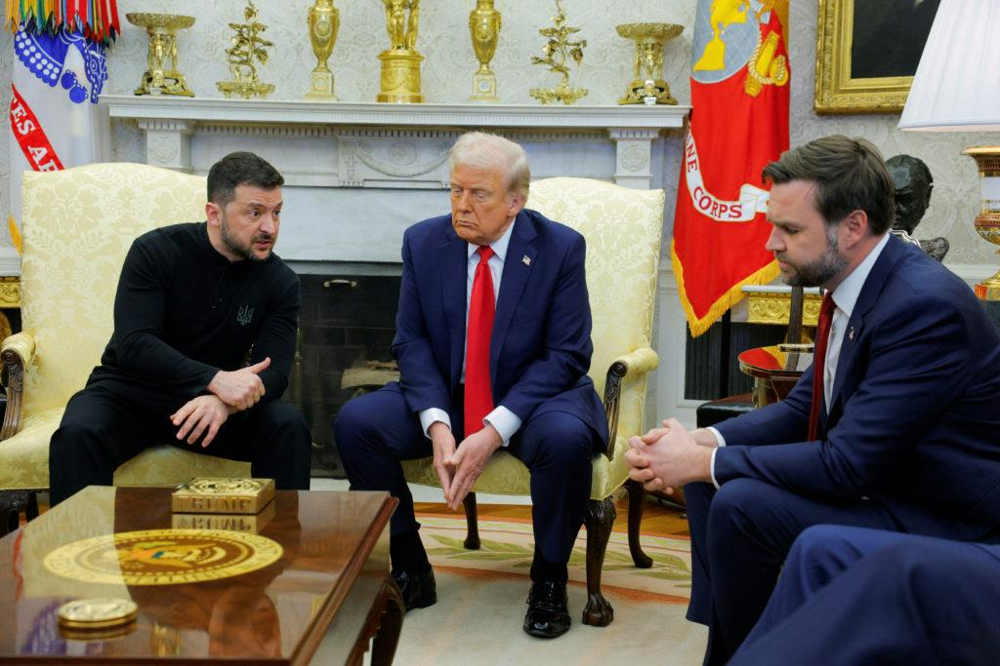
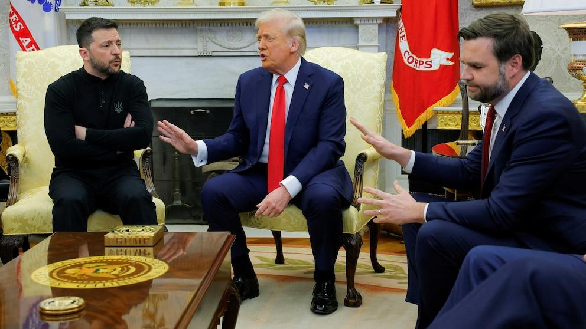
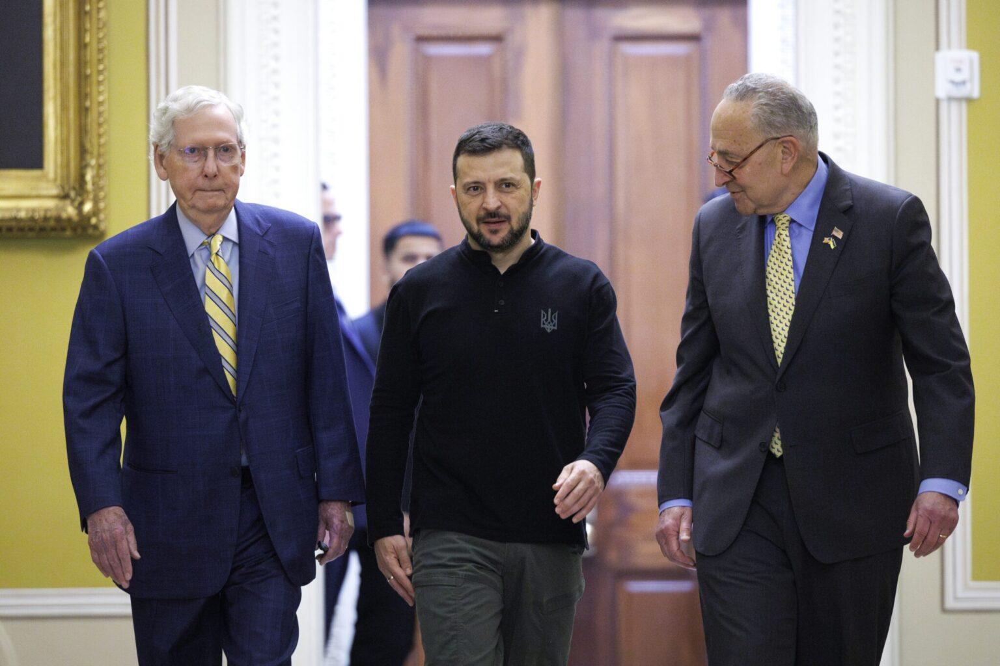

## Claim
Claim: "On Feb. 28, 2025, before a meeting with U.S. President Donald Trump, Ukraine President Volodymyr Zelenskyy met with Democrats."

## Actions
```
image_search("Volodymyr Zelenskyy Donald Trump meeting February 2025")
image_search("Volodymyr Zelenskyy meeting Democrats February 2025")
```

## Evidence
### Evidence from `image_search`
The North Dakota Monitor ([Source](https://northdakotamonitor.com/2025/02/28/repub/trump-zelenskyy-clash-in-oval-office-blowup-over-peace-negotiations/)) provides an image of a meeting between Donald Trump and Volodymyr Zelenskyy.  PBS.org ([Source](https://www.pbs.org/newshour/politics/fact-checking-trump-and-vances-attacks-on-ukrainian-president-zelenskyy)) also provides an image of a meeting between Donald Trump and Volodymyr Zelenskyy. 

NPR ([Source](https://www.npr.org/2025/08/17/nx-s1-5505319/european-leaders-zelenskyy-trump)) contains an image of Donald Trump and Volodymyr Zelenskyy. 


### Evidence from `image_search`
ABC News provides an image of a meeting between Volodymyr Zelenskyy and Donald Trump (). Disputed Questions includes an image of a meeting with Volodymyr Zelenskyy from February 28, posted by Chris Murphy ().

The Arkansas Advocate published an image of Volodymyr Zelenskyy with Chuck Schumer and Mitch McConnell ().


## Elaboration
The evidence confirms that Volodymyr Zelenskyy met with Donald Trump on February 28, 2025, as indicated by multiple images from various news sources ([Source](https://northdakotamonitor.com/2025/02/28/repub/trump-zelenskyy-clash-in-oval-office-blowup-over-peace-negotiations/)). Additionally, the evidence shows that Zelenskyy met with Democrats on the same day. Chris Murphy posted an image of a meeting with Zelenskyy on February 28 ([Source]()). Furthermore, an image from The Arkansas Advocate shows Zelenskyy with Chuck Schumer, a Democrat ([Source]()). Therefore, the claim is verified.


## Final Judgement
The evidence confirms that Volodymyr Zelenskyy met with Donald Trump on February 28, 2025, and also met with Democrats on the same day. Multiple sources provide images of these meetings, supporting the claim's accuracy.

`true`

### Verdict: TRUE

### Justification
The claim is supported by evidence. Multiple sources, including the North Dakota Monitor ([Source](https://northdakotamonitor.com/2025/02/28/repub/trump-zelenskyy-clash-in-oval-office-blowup-over-peace-negotiations/)), show that Zelenskyy met with Donald Trump on February 28, 2025. Additionally, images from Chris Murphy and The Arkansas Advocate ([Source]()) confirm Zelenskyy's meetings with Democrats on the same day.
